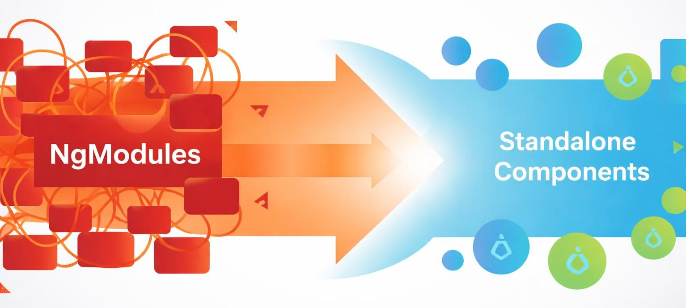

# Angular 19 Standalone Migration — Demo Overview

**Why are we doing this?** New Angular versions require standalone components — `NgModule` is legacy as of Angular 17+ and unsupported for new APIs (`@defer`, signal inputs, etc.) in Angular 19.

---

## What I know about this project

**Project**: ZAC — Dutch municipal case management system (Angular 19 frontend + Kotlin/WildFly backend)

**Migration task**: Convert remaining `standalone: false` components to Angular 19 standalone. Already 20 done, 134 remaining (as of 2026-03-24).

---

## What the demo will show

The migration plan (`.claude/commands/migrate-ng19-standalone-components.md`) is a living runbook with 3 phases:

| Phase                    | What happens                                                                                                                                 |
| ------------------------ | -------------------------------------------------------------------------------------------------------------------------------------------- |
| **A — Analyse & branch** | Check Collaboration/Claims branch, Check open PRs, pick the right next component, create a branch                                            |
| **B — TDD loop**         | Read component → analyse template → write spec → baseline green → ask permission → migrate → clean module → tests pass → lint → commit claim |
| **C — Ship**             | Update plan MD, browser verify, propose PR (title + body for approval), push                                                                 |

**Key guardrails I strictly follow:**

- Never auto-commit or auto-push
- Always wait for explicit user approval before `gh pr create`
- No `any` anywhere — zero exceptions
- Use protected/private functions where possible
- No `NO_ERRORS_SCHEMA` in specs
- Skip `shared/material-form-builder/` (ATOS form builder, being phased out)
- TDD: spec baseline must be green _before_ migration starts

**Next target**: TBD — `/admin` lazy-load is complete (the intermediate goal), so we'll pick the next module together.
