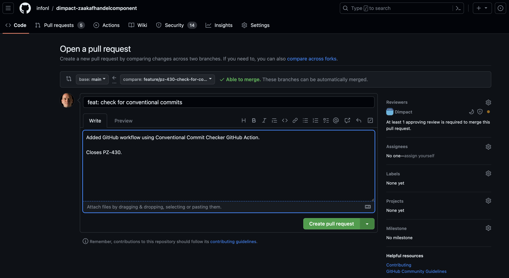

# Contribution guidelines

We welcome contributions from the open source community.
If you want to contribute, we ask you to follow these guidelines.
Please reach out to [us](https://github.com/infonl/dimpact-zaakafhandelcomponent/discussions) if you have questions or wish to contribute.

## Code of conduct

Please follow our [Code of Conduct](./CODE_OF_CONDUCT.md) when contributing.

## Coding conventions

We use the following code and API conventions:
- [Kotlin Coding Conventions](https://kotlinlang.org/docs/coding-conventions.html)
- [REST API URI Naming Conventions and Best Practices](https://restfulapi.net/resource-naming/)
- [Paging in REST API](./docs/development/paging.md)

## License

The license information for this project can be found in [LICENSE.md](LICENSE.md).
We use [SPDX](https://spdx.dev/) license identifiers in source code files.

When adding a new source code file or modifying an existing one as a Lifely/INFO developer, please update the `SPDX` license identifier accordingly:

### Adding a new source code file

For most source code files (e.g. `.ts`, `.js`, `.kt` and `.java` files) please add the following SPDX license identifier to the top of the file:

```
/*
 * SPDX-FileCopyrightText: <YYYY> Lifely
 * SPDX-License-Identifier: EUPL-1.2+
 */
```

Where `<YYYY>` is the current year. E.g. `2024`.

For other file types (e.g. `.html` and `.xml` files) please add the following SPDX license identifier to the top of the file:

```
 <!--
  ~ SPDX-FileCopyrightText: <YYYY> Lifely
  ~ SPDX-License-Identifier: EUPL-1.2+
  -->
```

Finally, for e.g. `.sh` files please add:

```
#
# SPDX-FileCopyrightText: <YYYY> Lifely
# SPDX-License-Identifier: EUPL-1.2+
#
```

Tip: configure your IDE to automatically add these headers to new source code files.
For example, in IntelliJ IDEA please follow the instructions on https://www.jetbrains.com/help/idea/copyright.html.

### Modifying an existing source code file

If the file does not already include `Lifely` in the copyright text, please update the SPDX license identifier 
on the top of the file by adding a `, <YYYY> Lifely` to the `SPDX-FileCopyrightText` identifier where `<YYYY>` is the current year. E.g.:

```
/*
 * SPDX-FileCopyrightText: 2021 Atos, 2024 Lifely
 * SPDX-License-Identifier: EUPL-1.2+
 */
```

Note that each contributor should only be mentioned once in an SPDX header, where we use the convention that the year 
indicates the _initial_ year when a contribution was made by that contributor.

## Conventional Commits

We use [Conventional Commits](https://www.conventionalcommits.org) for our commit messages.
Specifically we use the following format for our commit messages:

```
<type>[optional scope]: <description>

[body]

[footer]
```

When you create a Pull Request (PR) please follow the following instructions to comply to our Conventional Commits guidelines:
1. Make sure the PR title complies to: `<type>[optional scope]: <description>`. E.g. `feat: add new feature`.
2. In the PR body fill in the body consisting of one line of text. E.g. `Added new exciting feature.`
3. In the footer reference the JIRA issue (typically a subtask) number from the
    [PodiumD Zaak JIRA project](https://dimpact.atlassian.net/jira/software/c/projects/PZ/) as follows:
    `Solves PZ-XXX`, where `XXX` is the JIRA issue number.

For example:



We use the [Conventional Commits GitHub Action](https://github.com/agenthunt/conventional-commit-checker-action) to check
if a new PR complies to our Conventional Commits guidelines described above.

This plugin unfortunately only checks on PR creation time and not when you merge your PR.
So when merging a PR in GitHub using Squash and Merge please copy the PR body into the
GitHub Squash and Merge description text area.
