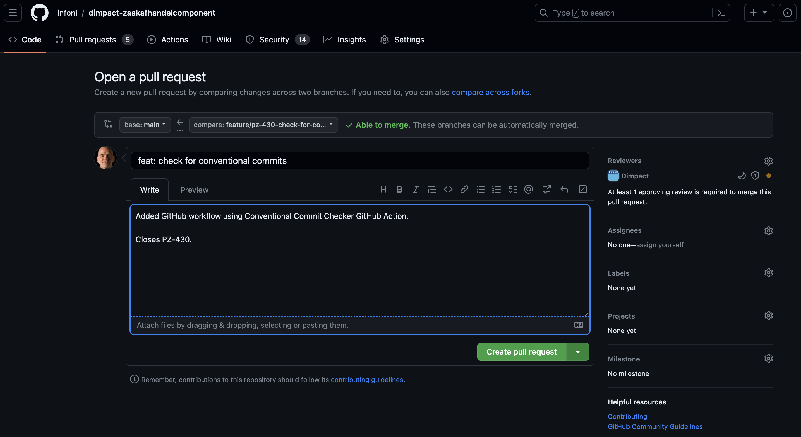

# Contribution guidelines

We, the maintainers of this project, value your input, enjoy feedback and welcome improvements to this open source project.
We welcome contributions from everyone in the open source community.

We are unfortunately not set up to review external pull requests. 
Please create an issue in this GitHub repository, if you have a suggestion to extend or improve this project. 
If there is enough interest, we may change this process in future.

If you want to contribute, we ask you to follow these guidelines.
Please reach out to [us](https://github.com/infonl/dimpact-zaakafhandelcomponent/discussions) if you have questions or wish to contribute.

## Code of conduct

We are committed to maintaining a welcoming, inclusive, and respectful environment. 
Please read and follow our [Code of Conduct](CODE_OF_CONDUCT.md) to ensure a positive experience for everyone.

## Problems, suggestions and questions

You do not need to change any of our code or documentation to be a contributor. 
Many contributors add to software by reporting problems, suggesting changes or asking simple and difficult questions. 
To suggest a change or report a problem you can create a [GitHub issue](https://help.github.com/articles/creating-an-issue/) for this project.
To ask questions, you can [create a new discussion](https://docs.github.com/en/discussions/collaborating-with-your-community-using-discussions/participating-in-a-discussion) in this project.

Please share your proposals for new code or documentation in an issue first, so that we can discuss them.
We are especially interested in ways this project could be extended or adapted to support broader use.

## Coding conventions

We use the following code and API conventions:
- [Kotlin Coding Conventions](https://kotlinlang.org/docs/coding-conventions.html)
- [REST API URI Naming Conventions and Best Practices](https://restfulapi.net/resource-naming/)
- [Paging in REST API](./docs/development/paging.md)

## License

The license information for this project can be found in [LICENSE.md](LICENSE.md).
We use [SPDX](https://spdx.dev/) license identifiers in source code files.

When adding a new source code file or modifying an existing one as a INFO.nl developer, please update the `SPDX` license identifier accordingly:

### Adding a new source code file

For most source code files (e.g. `.ts`, `.js`, `.kt` and `.java` files) please add the following SPDX license identifier to the top of the file:

```
/*
 * SPDX-FileCopyrightText: <YYYY> INFO.nl
 * SPDX-License-Identifier: EUPL-1.2+
 */
```

Where `<YYYY>` is the current year. E.g. `2024`.

For other file types (e.g. `.html` and `.xml` files) please add the following SPDX license identifier to the top of the file:

```
 <!--
  ~ SPDX-FileCopyrightText: <YYYY> INFO.nl
  ~ SPDX-License-Identifier: EUPL-1.2+
  -->
```

Finally, for e.g. `.sh` files please add:

```
# SPDX-FileCopyrightText: <YYYY> INFO.nl
# SPDX-License-Identifier: EUPL-1.2+
```

Tip: configure your IDE to automatically add these headers to new source code files.
For example, in IntelliJ IDEA please follow the instructions on https://www.jetbrains.com/help/idea/copyright.html.

### Modifying an existing source code file

If the file does not already include `INFO.nl` in the copyright text, please update the SPDX license identifier 
on the top of the file by adding a `, <YYYY> INFO.nl` to the `SPDX-FileCopyrightText` identifier where `<YYYY>` is the current year. E.g.:

```
/*
 * SPDX-FileCopyrightText: 2021 Atos, 2024 INFO.nl
 * SPDX-License-Identifier: EUPL-1.2+
 */
```

Note that each contributor should only be mentioned once in an SPDX header, where we use the convention that the year 
indicates the _initial_ year when a contribution was made by that contributor.

### Checking for SPDX license identifiers and (optionally) adding them in bulk

We automatically check for SPDX license identifiers in our source code with a GitHub workflow that uses the
[Skywalking Eyes](https://github.com/apache/skywalking-eyes) GitHub Action.

Using the Skywalking Eyes configuration file in our codebase you can also run this check locally, and optionally
add SPDX license identifiers to files that are missing them.
Please see https://github.com/apache/skywalking-eyes for instructions.

## TypeScript conventions

We use TypeScript strict mode. The following rules are enforced and must **never** be bypassed:

- **No `any`** — do not use `any`, `as any`, or any of the following escape hatches:
  - `eslint-disable-next-line @typescript-eslint/no-explicit-any`
  - `eslint-disable @typescript-eslint/no-explicit-any`
  - `// @ts-ignore`

When test code needs access to a private or protected member, use a properly typed alternative:
- Cast to the concrete class: `(component as MyComponent)["privateMember"]`
- Use `Object.defineProperty` to override a readonly field
- Use `jest.spyOn` on the prototype

## Conventional Commits

We use [Conventional Commits](https://www.conventionalcommits.org) for our commit messages.
Specifically we use the following format for our commit messages:

```
<type>[optional scope]: <description>

[body]

[footer]
```

When you create a Pull Request (PR) please follow the following instructions to comply to our Conventional Commits guidelines:
1. Make sure the PR title complies to: `<type>[optional scope]: <description>`. E.g. `feat: add new feature`.
2. In the PR body fill in the body consisting of one line of text. E.g. `Added new exciting feature.`
3. In the footer reference the JIRA issue (typically a subtask) number from the
    [PodiumD Zaak JIRA project](https://dimpact.atlassian.net/jira/software/c/projects/PZ/) as follows:
    `Solves PZ-XXX`, where `XXX` is the JIRA issue number.

For example:



We use the [Conventional Commits GitHub Action](https://github.com/agenthunt/conventional-commit-checker-action) to check
if a new PR complies to our Conventional Commits guidelines described above.

This plugin unfortunately only checks on PR creation time and not when you merge your PR.
So when merging a PR in GitHub using Squash and Merge please copy the PR body into the
GitHub Squash and Merge description text area.
