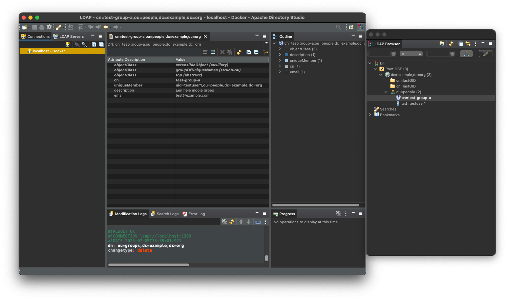

# Docker Compose setup

The ZAC Docker Compose setup runs various services required by ZAC.
It was created to be able to run ZAC locally for development purposes.
For general ZAC installation instructions please see the [INSTALL.md](INSTALL.md) file.

The setup consists of a [docker-compose.yml](../docker-compose.yaml) file as well as various data import scripts.

This setup was initially based on https://github.com/generiekzaakafhandelcomponent/gzac-docker-compose and credits go out to Valtimo for this.
It was extended and made specific for the needs of ZAC.

## Prerequisites

- [Docker Desktop](https://docs.docker.com/desktop/install/)
- [Docker Compose](https://docs.docker.com/compose/install/)

## Starting up

From the root folder of this repository execute the following command:

```
docker compose up -d
```

The following services will be started:

| Service                                         | Mapped port |
| ----------------------------------------------- | :---------: |
| BRP Proxy                                       |    5001     |
| GBA Mock                                        |    5010     |
| Keycloak                                        |    8081     |
| Keycloak database (postgres)                    |      -      |
| Open Klant                                      |    8002     |
| Open Zaak                                       |    8001     |
| Open Zaak database (postgis)                    |      -      |
| Objecten API                                    |    8010     |
| Objecten API database (postgis)                 |      -      |
| Objecttypen API                                 |    8011     |
| Objecttypen API database (postgres)             |      -      |
| Redis                                           |      -      |
| Solr                                            |    8983     |
| Open Policy Agent                               |    8181     |
| OpenLDAP                                        |      -      |
| VNG Referentielijsten (VRL)                     |    8020     |
| VNG Referentielijsten (VRL) database (postgres) |    54321    |
| ZAC database (postgres)                         |    54320    |

Note that it may take a while for all services to start up completely.
You can check the logs of the various Docker containers if you want to see the status.

## The various Docker containers

### PostgreSQL ZAC database

ZAC requires a PostgreSQL database with two database schemas. This is automatically created by the Docker Compose file.
If you need to manually insert or change data in the ZAC database:

1. Using a PostgreSQL database client connect to the ZAC database using `jdbc:postgresql://localhost:54320/zac`
2. Log in using the database admin credentials that can be found in the Docker Compose file.
3. You should see the following database schemas:
    - `zaakafhandelcomponent`
    - `flowable`
4. After ZAC has started up the first time it should have created the required database tables and initial data.

### Keycloak

The Keycloak configuration required by ZAC is automatically imported using the included JSON realm file.

To log in to the Keycloak Admin Console:

1. Go to: http://localhost:8081/auth/admin
2. Log in with the Keycloak admin credentials that can be found in the Docker Compose file.

ZAC uses the imported `zaakafhandelcomponent` Keycloak realm.

After making changes in Keycloak you can make a new realm export thereby overriding the existing `realm.json` file to
be automatically imported.
When you do so beware of the following:

1. Make sure to select `Export groups and roles` and `Export clients` in the export dialog.
2. After you have exported the realm JSON file make the following manual changes in the file:
    1. In the LDAP configuration set the dummy value of the `bindCredential` attribute to `admin`.
       This is because the Keycloak export realm functionality does not export secrets like this.
    2. Do the same for the `secret` attribute in the `zaakafhandelcomponent` client configuration and set this to: `keycloakZaakafhandelcomponentClientSecret`.

#### Roles

All required roles are already included in the Keycloak realm. No need to create them manually.

#### Users

1. Apart from the Keycloak admin user, the following test users are included in OpenLDAP
    - `testuser1`
2. OpenLDAP also contains the following groups:
    - `test-group-a`
3. You can sync these LDAP users and groups into Keycloak from the User Federation section in the Keycloak Admin Console.
4. For now first you need to manually set the `Bind Credential` in `User Federation` - `ldap`. This is not imported from the JSON realm file yet.
5. Now select `Synchronize all users`.
6. Then in `Mappers` - `Groups` select `Sync LDAP Groups To Keycloak`.
7. Make sure that all imported users at least have the `zaakafhandelcomponent_user` role assigned.
8. For a ZAC admin the following user roles are required:
    - `zaakafhandelcomponent_user`
    - `beheerder`
    - `domein_elk_zaaktype`

### OpenLDAP

OpenLDAP is used by ZAC to authenticate users and to retrieve group information.

ZAC requires OpenLDAP to have the additional RFC2307BIS LDAP schema (e.g. for the `GroupOfUniqueNames` object class).
You can use an LDAP client such as [Apache Directory Studio](https://directory.apache.org/studio/) to create users and groups and update the `zac-ldap-setup.ldif` file.
To do the latter, connect Apache Directory Studio to your local OpenLDAP server on `localhost:1389` and then right-click on the `dc=example,dc=org` section and select `Export - LDIF Export...`.

ZAC requires that each user is part of an (LDAP) group where the `uniqueMember` attributes in this group use the `cn` attribute to identify a member and not the `uid`.
E.g.: `uniqueMember: cn=testuser1,ou=people,dc=example,dc=org`.

Note that at the moment ZAC only allows one DN which is used for both users and groups.

The LDIF import contains the following test users which can be used to log in to ZAC:

| Test user name | Password  | Email                          | Group        |
| -------------- | --------- | ------------------------------ | ------------ |
| testuser1      | testuser1 | testuser1@team-dimpact.info.nl | test-group-a |
| testuser2      | testuser2 | testuser2@team-dimpact.info.nl | test-group-a |

Please change the email addresses of the test users to your own domain.



### VNG Referentielijsten (=VRL)

The VRL database is automatically created by the Docker Compose file and (test) data as required by ZAC is automatically imported.

### Open Klant

Basic configuration required by ZAC is automatically imported into the Open Klant database from the Docker Compose file.
Also, a superuser account for the Open Klant UI on http://localhost:8002 is created automatically with username 'admin' and password 'admin'.

## Stopping

1. Stop ZAC.
2. Stop the Docker containers by executing the command: `docker compose down`.

## Updating the VNG-Referentielijsten Docker Images

We host the VNG-Referentielijsten images on our own Github Packages because they do no support multiple OS architectures. To update these, follow these steps:

1. Check out https://github.com/VNG-Realisatie/VNG-referentielijsten.git
2. Go to the repo directory.
3. `docker login ghcr.io -u <your github user>` to login to GitHub
4. `docker run --privileged --rm tonistiigi/binfmt --install amd64,arm64` to install the environments to emulate.
5. `docker buildx create --name mybuilder --bootstrap --use` to create and select a builder to build images for multiple architextures.
6. `docker buildx build --push --tag ghcr.io/infonl/vng-referentielijsten:<tag> --platform linux/arm64,linux/amd64 --no-cache .` This will build and push the new version to github. Remember to update the used version in the docker-compose file.
