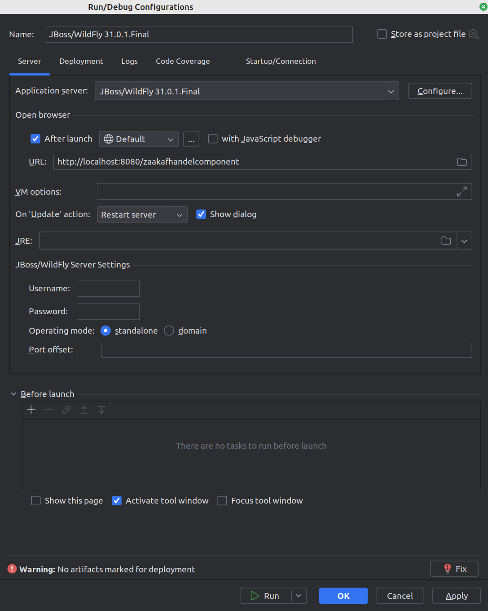
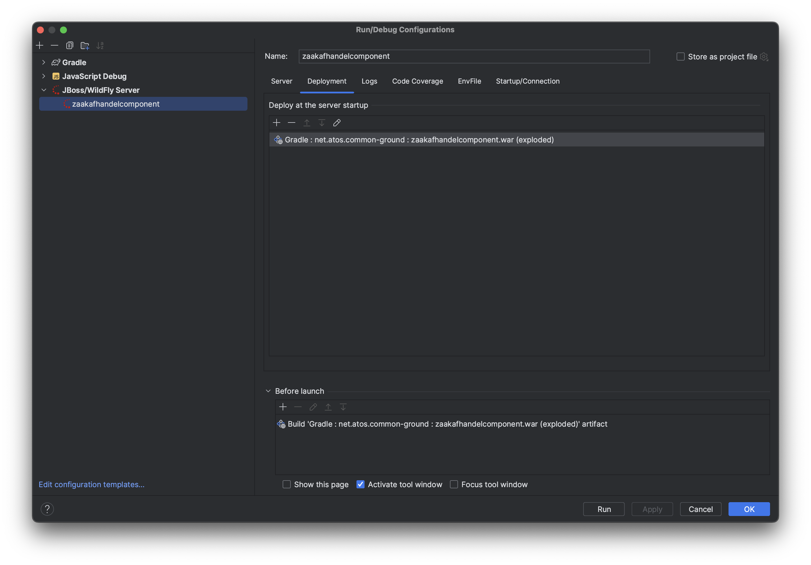
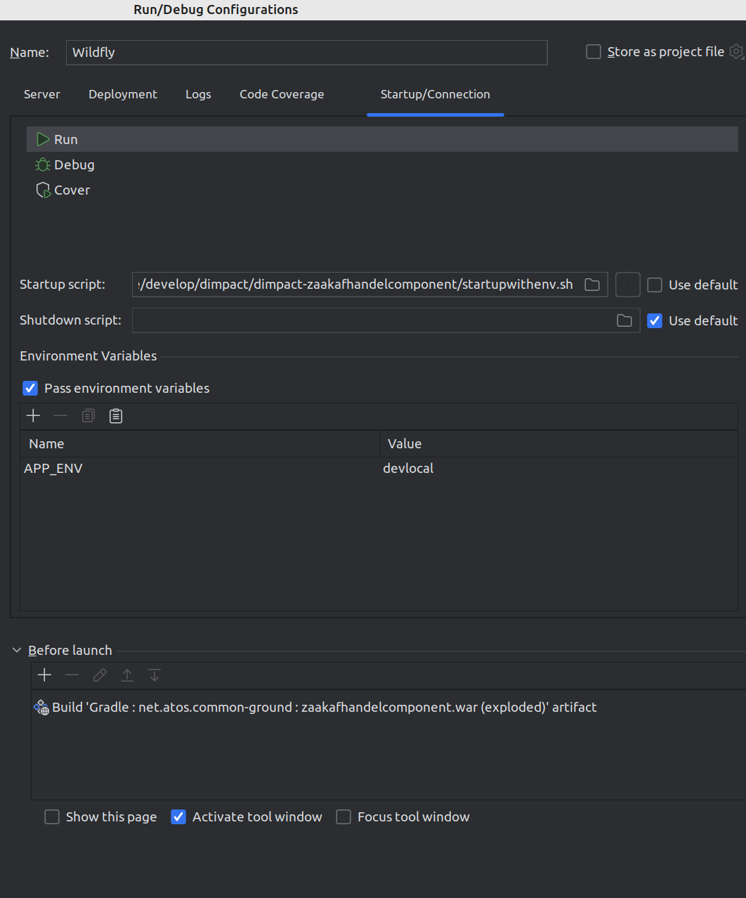

# Installation

These instructions describe how to build, install and run the `zaakafhandelcomponent (ZAC)` software _for developers_.
General ZAC usage instructions may be found in the [README.md](../../README.md) file.

## Build the software

### Prerequisites

- Java JDK 21 (we use the `Temurin` distribution)

### Gradle build

The software is built using Gradle and for the final step using Maven.
Both a Gradle and a Maven wrapper are included in the source code, so you do not need to install either Gradle or Maven yourself.

This builds all the software, including the Java backend as well as the TypeScript frontend (using `npm`), runs all unit tests
and packages the built software first into a WAR archive and then finally by invoking a Maven command from Gradle into a
[WildFly application server](https://www.wildfly.org/) bootable fat-JAR. This last step uses [Galleon](https://docs.wildfly.org/galleon/).

All generated artifacts by Gradle are placed into the `build` folder while the final WildFly bootable JAR is placed in the
`target` folder. The reason why we use Maven for this last step is because there is unfortunately no Gradle alternative for the
[WildFly Maven Plugin](https://docs.wildfly.org/wildfly-maven-plugin).

If you want to skip running the unit tests, use the following command:

```shell
./gradlew build -x test
```

### Build the Docker image

To build the ZAC Docker image using the generated JAR archive from the previous step, use the following command:

```shell
./gradlew buildDockerImage
```

## Run the software

There are various ways to run ZAC locally.
- For local backend development purposes we recommend to run ZAC from the IntelliJ IDE.
- For local frontend development and testing purposes we recommend to run ZAC in a Docker container.
- For local e2e testing you can follow the [end-to-end-testing](end-to-end-testing.md) documentation.

### Prerequisites

- Access to all services (such as Keycloak, Open Zaak, etc) that are required by ZAC.
You either run these locally (using [Docker Compose](installDockerCompose.md)) or on a central development environment.
- Environment variables required by ZAC. See the section below.

#### Environment variables

ZAC requires a number of environment variables to be set. These are documented in the [.env.example](../../.env.example) file.

These can be set in various ways. The options are:
-   1Password: Use the [1Password CLI extensions](https://developer.1password.com/docs/cli/).
-   Env file: Create an `.env` file based on the [.env.example](../../.env.example) example and use the https://github.com/Ashald/EnvFile IntelliJ plugin to read all required environment variables from your local `.env` file.
-   Or alternatively, when running ZAC in IntelliJ, in `Startup/Connection` add all required ZAC environment variables to the `Debug` configuration.

We prefer to use the 1Password CLI extensions as it is the most secure and enables you to
centrally manage these variables for all developers.
It requires you to have configured all environment variables in a 1Password Vault shared with all developers.
In the section below we describe how to use the 1Password CLI extensions when running ZAC from IntelliJ.

### Run ZAC in IntelliJ

We use the IntelliJ WilldFly extension which is only available in the IntelliJ Enterprise Edition.

When opening the ZAC project in IntelliJ make sure to select 'Open as Gradle project'.

#### Prerequisites

First you will need to set up IntelliJ for ZAC:
1. Install and use the correct JDK distribution (see above).
2. Follow the [local WildFly instructions](../../scripts/wildfly/README.md) and install `WildFly`.
3. Enable the built-in IntelliJ WildFly extension if not already enabled (note that this requires the IntelliJ Enterprise Edition).
4. Create a run configuration using the WildFly extension for ZAC using the `JBoss/Wildfly Server - local` template.
   Select `Application server` - `Configure` and point it to your local Wildfly installation which you set up in the previous step.
   
5. Configure the Wildfly configuration as follows:
   
6. Add the 'exploded zaakafhandelcomponent WAR' artifact to the deployment:
   
7. The KVK integration of ZAC is based on the [KVK API](https://developers.kvk.nl/).
   By default, (depending on your environment variables; see below) ZAC integrates with the [KVK test environment](https://developers.kvk.nl/documentation/testing).
   If you run ZAC from IntelliJ this requires a number of certificates to be added to your local Java keystore. Please follow the instructions on: https://developers.kvk.nl/documentation/install-tls-certificate.

##### Use the 1Password CLI extensions in IntelliJ

1. Install the [1Password CLI extensions](https://developer.1password.com/docs/cli/)
2. In IntelliJ edit the WildFly Runtime configuration that was created in the previous step:
3. Uncheck the `use default` for the startup script and select the `startupwithenv.sh` script from the project root.
4. Next add a new env var called `APP_ENV` and set the value to `devlocal`.

See the screenshot below:


Now when starting up ZAC from IntelliJ the `startupwithenv.sh` script will set the required environment variables
using the 1Password CLI extensions.

#### Starting up ZAC

1. To start up ZAC from IntelliJ, select the IntelliJ configuration created above and run it (normally in `Debug` mode).
2. After starting up ZAC you should see something like this in IntelliJ:
   
3. After logging in using one of the available test users you should see the ZAC UI:
   

### Run ZAC in a Docker container

As an alternative to running ZAC in IntelliJ you can also run ZAC in a Docker container.
There are several ways to do this.

#### Run ZAC in a Docker container using Docker Compose

If you also wish to run all services that are required by
ZAC locally, the easiest way is to use our Docker Compose setup with can also run ZAC.
Please see the [Docker Compose instructions](installDockerCompose.md) for more information.

#### Run ZAC in a Docker container by itself

As an alternative to run ZAC as a Docker container by itself you use the following command:

```shell
docker run -p 8080:8080 --env-file .env --name zaakafhandelcomponent zaakafhandelcomponent:latest
```

Or run one of the official ZAC Docker images from the [ZAC GitHub Packages Container Registry](https://github.com/infonl/dimpact-zaakafhandelcomponent/pkgs/container/zaakafhandelcomponent):

```shell
docker run -p 8080:8080 --env-file .env --name zaakafhandelcomponent ghcr.io/infonl/zaakafhandelcomponent:main-75
```

Be aware that you will need to set the ZAC environment variables according to your needs.

## Miscellaneous

### Updating the Solr search index

When running ZAC locally (and not in Kubernetes) the ZAC Solr search index is not automatically regularly updated.

In order to see content in e.g. the 'werklijsten' in ZAC you will need to update the Solr search index manually whenever you have changed relevant content.
For example to (re)index all 'zaken' and 'taken' do the following from a local command line (or paste the URLs in your browser):

1. Mark all 'zaken' ready for reindexing: `curl http://localhost:8080/rest/indexeren/herindexeren/ZAAK`
2. Mark all 'taken' ready for reindexing: `curl http://localhost:8080/rest/indexeren/herindexeren/TAAK`
3. (Re)index all (first 100) 'zaken' and 'taken': `curl http://localhost:8080/rest/indexeren/100`

### Generating Swagger UI documentation for the ZAC backend API

In order to generate the Swagger UI documentation for the ZAC backend API, use the following command:

```shell
./gradlew generateSwaggerUI
```

The Swagger UI documentation is generated in the `build/swagger-ui-zaakafhandelcomponent` folder.

This task is currently not run automatically as part of `./gradlew build`.
