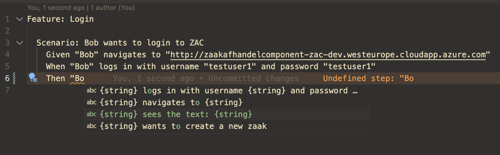

# Cucumber

We use cucumber to write reusable tests in human readable format (Gherkin) for e2e tests.

## Running tests

First make sure to install all the dependencies by running the following command in the src/main/e2e folder:

```npm install```

To run the tests you can use the following command in the src/main/e2e folder:

```npm run e2e```

## Writing tests

We have predefined steps that you can use to write tests. You can find them in the [src/main/e2e/step-definitions](../../src/e2e/step-definitions) folder. each file in this folder represents a specific domain, like "zaak" is meant for non reusables steps that are specific to the "zaak" domain. steps in common are meant to be reusable across domains.


In a .feature file you should be able to write out tests based on the predefined steps with auto complete.



### Writing cucumber tests in intellij

You need to make sure to install the [cucumber.js](https://plugins.jetbrains.com/plugin/7418-cucumber-js) plugin.

Then you will have all the autocomplete features available to you

### Writing cucumber tests in vscode

You need to make sure to install the official [cucumber](https://marketplace.visualstudio.com/items?itemName=CucumberOpen.cucumber-official) plugin.

Then you will have all the autocomplete features available to you

### Running e2e tests locally

Running e2e tests locally unfortunately requires some extra steps to make it work with our current setup. This is because docker containers can't communicate with the host machine using localhost. To make this work we need to add an entry to the /etc/hosts file on your machine. This is only needed when running the tests locally. When running the tests in the pipeline this is not needed.

#### Steps to Add host.docker.internal Entry to /etc/hosts File
When working with Docker, adding host.docker.internal to your /etc/hosts file allows Docker containers to access services running on the host machine. Follow these steps to add this entry:

1. Open the /etc/hosts File:
   - You need administrative privileges to edit the /etc/hosts file.
   - Open the file in a text editor of your choice. For example, using vim, you would use the following command:
    ```bash
        sudo vim /etc/hosts 
    ```
2. Add the host.docker.internal Entry:
   - In the /etc/hosts file, add a new line to link host.docker.internal to the IP address of your host machine. This is typically 127.0.0.1 (localhost).
   - The entry should look like this:
    ```csharp
        # ZAC
        127.0.0.1 host.docker.internal
    ```
   - Save the file and exit the text editor.
3. Verify the Entry:

   - After adding the entry, you can verify it by running a command that references host.docker.internal from within a Docker container. For example, using a simple ping test:
    ```bash 
        docker run --rm alpine ping -c 4 host.docker.internal
    ```
This command runs a temporary Alpine Linux container and pings host.docker.internal four times. Successful ping responses indicate that the entry is correctly configured.

#### Steps to run the tests locally

`docker-compose.yml`
- replace the follwoing values in the `docker-compose.yml` file:

under services -> keycloack -> command 
```diff 
-      - CONTEXT_URL=http://host.docker.internal:8080
+      - CONTEXT_URL=http://host.docker.internal:8080
```

under services -> zac -> environment 
```diff
-      - "--hostname-url=http://host.docker.internal:8081"
+      - "--hostname-url=http://host.docker.internal:8081"
```
