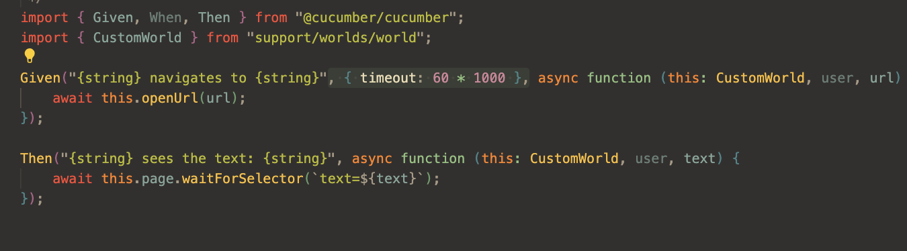

# Cucumber

We use cucumber to write reusable tests in human readable format (Gherkin) for e2e tests.

## Running tests

First make sure to install all the dependencies by running the following command in the src/main/e2e folder:

```npm install```

To run the tests you can use the following command in the src/main/e2e folder:

```npm run e2e```

## Writing tests

We have predefined steps that you can use to write tests. You can find them in the [src/main/e2e/step-definitions](../../src/e2e/step-definitions) folder. each file in this folder represents a specific domain, like "zaak" is meant for non reusables steps that are specific to the "zaak" domain. steps in common are meant to be reusable across domains.


In a .feature file you should be able to write out tests based on the predefined steps with auto complete.


### Writing cucumber tests in intellij

You need to make sure to install the [cucumber.js](https://plugins.jetbrains.com/plugin/7418-cucumber-js) plugin.

Then you will have all the autocomplete features available to you

### Writing cucumber tests in vscode

You need to make sure to install the official [cucumber](https://marketplace.visualstudio.com/items?itemName=CucumberOpen.cucumber-official) plugin.

Then you will have all the autocomplete features available to you

### Running e2e tests locally

Running e2e tests locally unfortunately requires some extra steps to make it work with our current setup. please don't commit any of these changes, create a stash of it instead so you can easily apply it when needed.

The different docker containers need to be able to communicate with each other. This is not possible when you use localhost. You need to use the host.docker.internal hostname instead.

`docker-compose.yml`
- replace all the "localhost" with "host.docker.internal"

`realm.json`
```diff
      "redirectUris": [
        "http://localhost:8080/*",
-       "http://localhost:4200/*",
+       "http://localhost:4200/*",
+       "http://host.docker.internal:8080/*",
+       "http://host.docker.internal:4200/*"
      ],
      "webOrigins": [
        "http://localhost:8080",
-       "http://localhost:4200"
+       "http://localhost:4200",
+       "http://host.docker.internal:8080",
+       "http://host.docker.internal:4200"
      ],
```

`start-docker-comose.sh`

```diff
    export E2E_TEST_USER_1_USERNAME=testuser1
    export E2E_TEST_USER_1_PASSWORD=testuser1
-   export ZAC_URL=http://localhost:8080
+   export ZAC_URL=http://host.docker.internal:8080

```