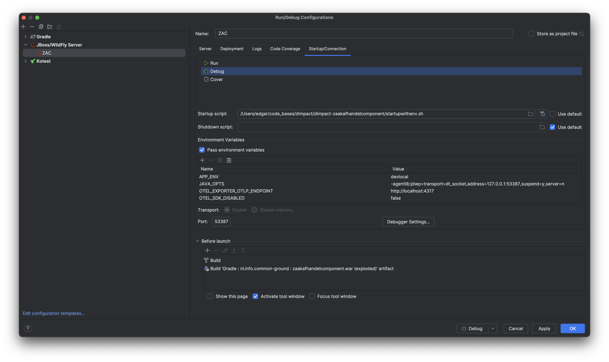

# IDE Configuration

## IntelliJ IDEA

### Code style settings

#### Java

1. Open your Intellij Idea settings
2. Navigate to Editor -> Code Style -> Java
3. From Scheme options select Import Scheme -> Eclipse XML Profile

4. Open `./config/zac.xml` from the project root
5. Save the configuration
6. Install [Spotless Gradle plugin](https://plugins.jetbrains.com/plugin/18321-spotless-gradle)
7. Open Settings and navigate to Keymap.
8. Search for "spotless" and select "Reformat File with Spotless" action

9. Add the default Reformat (Crtl+Alt+L / ⌘⌥L) and Optimise imports (Ctrl+Alt+O / ⌘⌥O) shortcuts 
10. Select "Remove" from the next Warning dialog for both shortcuts

11. Make sure "Optimize imports on the fly" is turned off
 

### Run ZAC in IntelliJ

#### Prerequisites
* Correct JDK distribution (see [above](#prerequisites))
* [Local WildFly installation](../../scripts/wildfly/README.md).
* IntelliJ [WilldFly plugin](https://plugins.jetbrains.com/plugin/20219-wildfly) which is only available in the IntelliJ Enterprise Edition.
* The [1Password CLI extensions](https://developer.1password.com/docs/cli/)
* ZAC project imported/open in IntelliJ via 'Open as Gradle project'.

#### Setup Wildfly for ZAC
1. Enable the built-in IntelliJ WildFly extension if not already enabled (it requires the IntelliJ Enterprise Edition).
2. Create a run configuration (`IntelliJ IDEA - Settings... - Build, Execution, Deployment - Application Servers`) using the WildFly extension for ZAC using the `JBoss/Wildfly Server - Final` template.
   Select `Application server` - `Configure` and point it to your local Wildfly installation in the project root.
   Do not change the automatically detected libraries!
   
3. Change the Wildfly configuration as follows:
   
4. Add the 'exploded zaakafhandelcomponent WAR' artifact to the deployment:
   
5. Configure 1Password CLI extensions to populate the required environment variables in Startup/Connection.
   Uncheck the `use default` for the startup script and select the `startupwithenv.sh` script from the project root (or `startupwithenv.bat` for windows).
   Next add a new env var called `APP_ENV` and set the value to `devlocal`.
   
6. If you wish to enable Open Telemetry tracing from ZAC set the `SUBSYSTEM_OPENTELEMETRY__SAMPLER_TYPE` environment 
   variable to `on` (it is turned off by default).
   
7. Make sure you configured 1Password startup script for both `Run` and `Debug`

#### KVK integration
The KVK integration of ZAC is based on the [KVK API](https://developers.kvk.nl/).
By default, (depending on your environment variables; see below) ZAC integrates with the [KVK test environment](https://developers.kvk.nl/documentation/testing).
If you run ZAC from IntelliJ the [KVK certificates](../../certificates/kvk) need to be added to your local Java keystore.

Please follow the instructions on: https://developers.kvk.nl/documentation/install-tls-certificate.

#### SmartDocuments integration

When running ZAC from IntelliJ, and if you wish to integrate with a real SmartDocuments environment 
(using the SmartDocuments ZAC environment variables), you will need to add the 
[SmartDocuments SSL certificate](../../certificates/smartdocuments) to your local Java keystore.

#### Starting up ZAC

1. To start up ZAC from IntelliJ, select the IntelliJ configuration created above and run it (normally in `Debug` mode).
2. After starting up ZAC you should see something like this in IntelliJ:
   
3. After logging in using one of the available test users you should see the ZAC UI:
   
