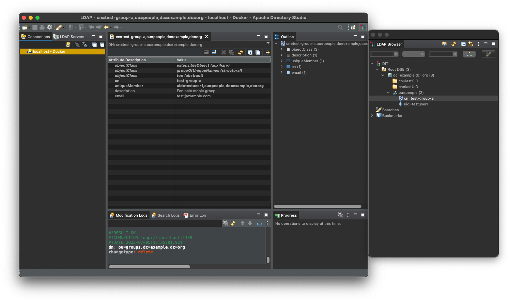

# Docker Compose setup

The ZAC Docker Compose setup runs various services required by ZAC and optionally can also run ZAC itself as a Docker container.
It was created to be able to run ZAC locally for development and testing purposes.
For general ZAC installation instructions please see the [INSTALL.md](INSTALL.md) file.

The setup consists of a [docker-compose.yml](../docker-compose.yaml) file as well as various data import scripts.

This setup was initially based on https://github.com/generiekzaakafhandelcomponent/gzac-docker-compose and credits go out to Valtimo for this.
It was extended and made specific for the needs of ZAC.

## Prerequisites

- [Docker Desktop](https://docs.docker.com/desktop/install/)
- [Docker Compose](https://docs.docker.com/compose/install/)
- [1Password CLI extensions](https://developer.1password.com/docs/cli/) (optional)
- On Windows: to run .sh scripts use [git bash](https://gitforwindows.org/)
- On Linux: run [setup-linux.sh script](../../scripts/docker-compose/setup-linux.sh)

## Starting Docker Compose

### Running all required services but not ZAC itself

This starts up all required services (like Keycloak, Open Zaak, etc) but does not start ZAC itself.
From the root folder of this repository execute the following command:

```
./start-docker-compose.sh
```

This will run Docker Compose (using `docker compose up -d`) and uses the 1Password CLI extensions
to retrieve certain environment variables from 1Password.

Please see the [Docker Compose](../../docker-compose.yaml) file for the services that will be started.
Note that it may take a while for all services to start up completely.
You can check the logs of the various Docker containers if you want to see the status.

### Other options

Please consult the help of the `start-docker-compose.sh` script for more options including the option to also
start up ZAC or even build the ZAC Docker Image first beforehand:

```
./start-docker-compose.sh -h
```

### Notes

#### Using the latest version of ZAC

Currently, our ZAC Docker Compose file contains a reference to a specific version of the ZAC Docker image.
In order to use the latest ZAC Docker Image you can specify a ZAC Docker Image by setting the `ZAC_DOCKER_IMAGE`
environment variable.
You can find the latest released version of the ZAC Docker Image on:
https://github.com/infonl/dimpact-zaakafhandelcomponent/pkgs/container/zaakafhandelcomponent

#### Docker container logs

Note that it takes some time for ZAC to start up completely. You can see progress by checking the ZAC Docker container logs:

```
docker logs -f zac
```

## The various Docker containers

This section contains some specific information about some of the Docker containers used in our Docker Compose setup.

### PostgreSQL ZAC database

ZAC requires a PostgreSQL database with two database schemas. This is automatically created by the Docker Compose file.
If you need to manually insert or change data in the ZAC database:

1. Using a PostgreSQL database client connect to the ZAC database using `jdbc:postgresql://localhost:54320/zac`
2. Log in using the database admin credentials that can be found in the Docker Compose file.
3. You should see the following database schemas:
    - `zaakafhandelcomponent`
    - `flowable`
4. After ZAC has started up the first time it should have created the required database tables and initial data.

### Keycloak

The Keycloak configuration required by ZAC is automatically imported using the included JSON realm file.

To log in to the Keycloak Admin Console:

1. Go to: http://localhost:8081/auth/admin
2. Log in with the Keycloak admin credentials that can be found in the Docker Compose file.

ZAC uses the imported `zaakafhandelcomponent` Keycloak realm.

After making changes in Keycloak you can make a new realm export thereby overriding the existing `realm.json` file to
be automatically imported.
When you do so beware of the following:

1. Make sure to select `Export groups and roles` and `Export clients` in the export dialog.
2. After you have exported the realm JSON file make the following manual changes in the file:
    1. In the LDAP configuration set the dummy value of the `bindCredential` attribute to `admin`.
       This is because the Keycloak export realm functionality does not export secrets like this.
    2. Do the same for the `secret` attribute in the `zaakafhandelcomponent` client configuration and set this to: `keycloakZaakafhandelcomponentClientSecret`.

#### Roles

All required roles are already included in the Keycloak realm. No need to create them manually.

#### Users

1. Apart from the Keycloak admin user, the following test users are included in OpenLDAP
    - `testuser1`
2. OpenLDAP also contains the following groups:
    - `test-group-a`
3. You can sync these LDAP users and groups into Keycloak from the User Federation section in the Keycloak Admin Console.
4. For now first you need to manually set the `Bind Credential` in `User Federation` - `ldap`. This is not imported from the JSON realm file yet.
5. Now select `Synchronize all users`.
6. Then in `Mappers` - `Groups` select `Sync LDAP Groups To Keycloak`.
7. Make sure that all imported users at least have the `zaakafhandelcomponent_user` role assigned.
8. For a ZAC admin the following user roles are required:
    - `zaakafhandelcomponent_user`
    - `beheerder`
    - `domein_elk_zaaktype`

### OpenLDAP

OpenLDAP is currently used by ZAC to sync users and groups to/from Keycloak but will be phased out soon.

ZAC requires OpenLDAP to have the additional RFC2307BIS LDAP schema (e.g. for the `GroupOfUniqueNames` object class).
You can use an LDAP client such as [Apache Directory Studio](https://directory.apache.org/studio/) to create users and groups and update the `zac-ldap-setup.ldif` file.
To do the latter, connect Apache Directory Studio to your local OpenLDAP server on `localhost:1389` and then right-click on the `dc=example,dc=org` section and select `Export - LDIF Export...`.

ZAC requires that each user is part of an (LDAP) group where the `uniqueMember` attributes in this group use the `cn` attribute to identify a member and not the `uid`.
E.g.: `uniqueMember: cn=testuser1,ou=people,dc=example,dc=org`.

Note that at the moment ZAC only allows one DN which is used for both users and groups.

The LDIF import contains a number of test users which can be used to log in to ZAC.
You may wish to change the email addresses of the test users to your own domain.



### Open Klant

Basic configuration required by ZAC is automatically imported into the Open Klant database from the Docker Compose file.
Also, a superuser account for the Open Klant UI on http://localhost:8002 is created automatically with username 'admin' and password 'admin'.

## Stopping

1. Stop ZAC (only if you are running ZAC separately and not as part of the Docker Compose setup)
2. Stop all Docker containers by executing the command: `./stop-docker-compose.sh` from the root folder of this project.

## Cleaning up

We use Docker volumes to persist data between restarts of certain Docker containers in order to speed up
subsequent startups.

Sometimes it is needed to clean up these volumes to start with a clean slate.
To do so run the Docker Compose start script with the `-d` option:

```
./start-docker-compose.sh -d
```
