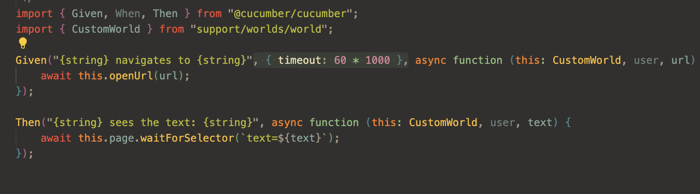
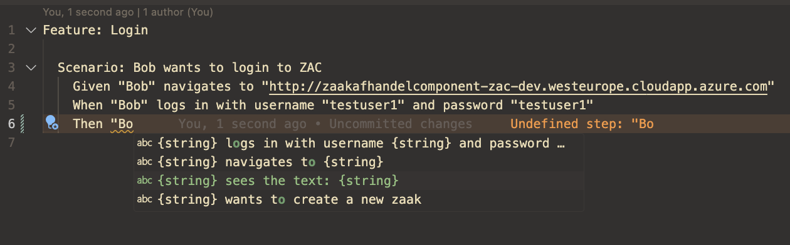
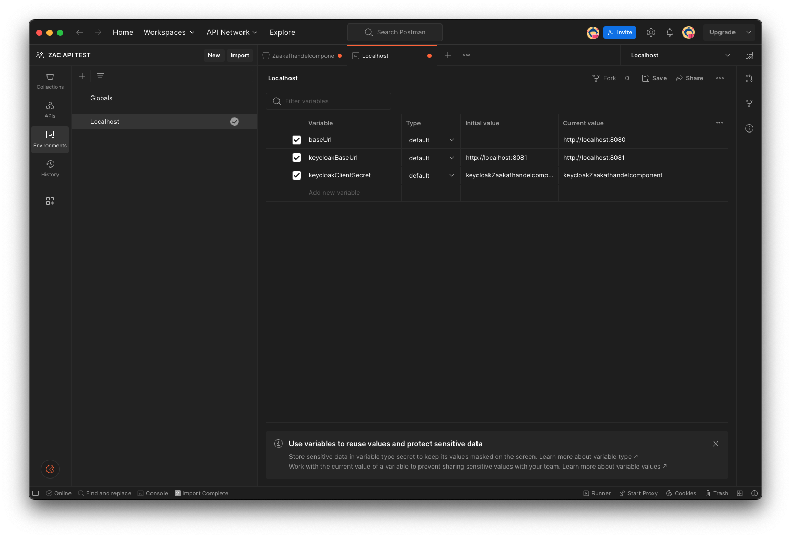
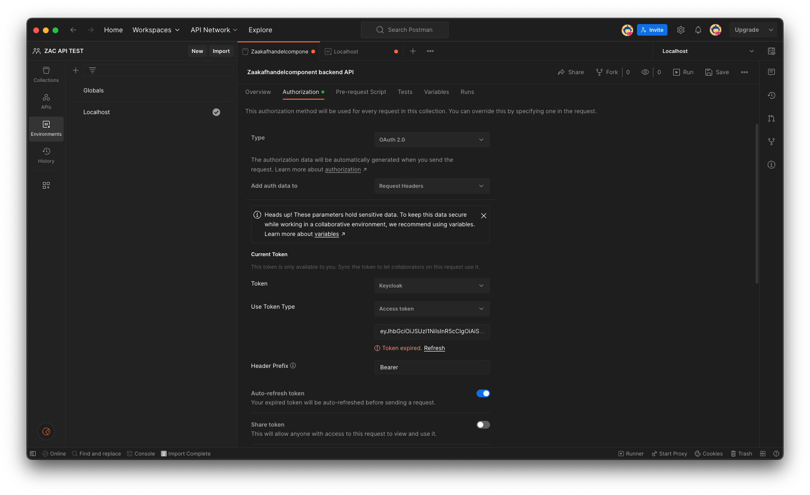
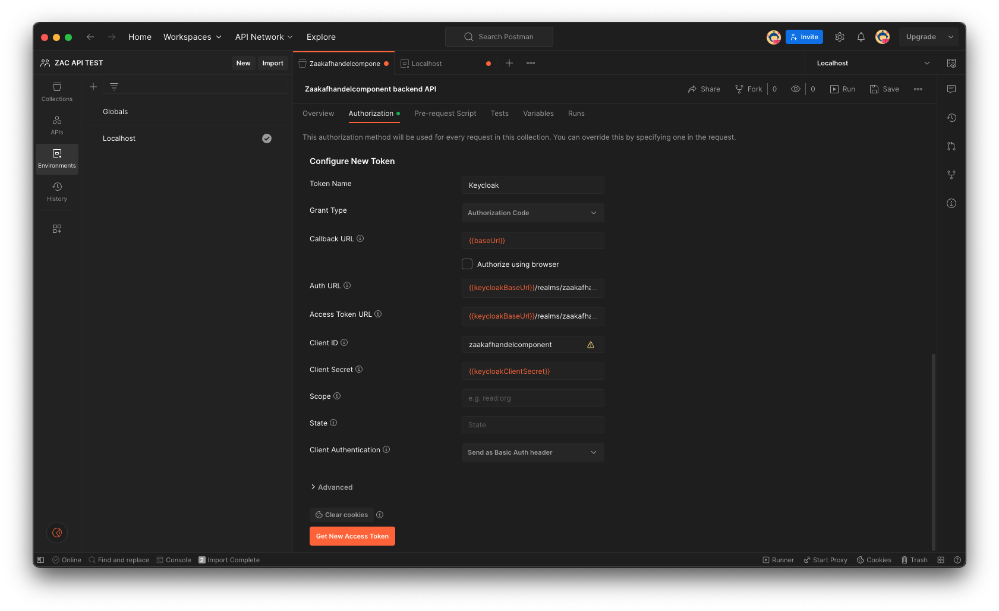

# Testing ZAC

## Unit tests

Both backend and frontend unit tests are run as part of the `test` phase in the normal Gradle build.
You can run them separately using the following command:

```shell
./gradlew test --info
```

## Integration tests

Our integration tests use the [TestContainers framework](https://testcontainers.com/) together
with our [Docker Compose set-up](installDockerCompose.md) to run all required services (Keycloak, Open Zaak, etc)
as well as ZAC itself as a Docker container.
This set-up makes it relatively slow to run the integration tests and for this reason they are not run as part of
the standard Gradle `test` phase and normal Gradle build.

If you wish to run the integration tests you can use the following command:

```shell
./gradlew itest --info
```

It is also possible to run the integration tests from inside your IDE (we use IntelliJ IDEA).
To do this you will first need to do the following:

1. Start Docker.
2. Build the ZAC Docker image using the following command:
    ```shell
    ./gradlew buildDockerImage
    ```
3. If BAG integration is part of the test suite: create a 'run configuration' in your IDE where the following two environment variables are set: `BAG_API_CLIENT_MP_REST_URL` and `BAG_API_KEY`.
4. Run the integration tests from your IDE using this run configuration.

Running the integration tests will first start up all required services (Keycloak, Open Zaak, etc) as Docker containers using our [Docker Compose file](installDockerCompose.md),
then start up ZAC as Docker container and finally run the integration tests.

## End-to-end (e2e) tests

Our end-to-end tests use the [Playwright e2e test framework](https://playwright.dev/).
We use [Cucumber](https://cucumber.io/) to write reusable end-to-end tests in human-readable format using [Gherkin syntax](https://cucumber.io/docs/gherkin/).

### Running the e2e tests

The end-to-end tests are located in the `src/e2e` folder.
You can use the `start-e2e-xxx` scripts in the root folder of this project to run the e2e tests.

### Writing e2e tests

We have predefined steps that you can use to write tests. You can find them in the [src/main/e2e/step-definitions](../../src/e2e/step-definitions) folder. each file in this folder represents a specific domain, like "zaak" is meant for non reusables steps that are specific to the "zaak" domain. steps in common are meant to be reusable across domains.


In a .feature file you should be able to write out tests based on the predefined steps with auto complete.


### Using the right selectors in the e2e tests

For selecting elements in our end-to-end (e2e) tests, we follow best practices from [Testing Library](https://testing-library.com/docs/queries/about/#priority). This ensures that our tests reflect real user interactions and are more resilient to UI changes.

The categories we use for selecting an element:

1. Queries accesible for everyone
   
    We prioritize queries like getByRole, getByText, getByLabel, which mimic how users interact with the UI (e.g., buttons, text inputs). These ensure our tests are aligned with user experience.

3. Semantic Queries
   
    These selectors are based on accessible properties such as aria-label or aria-role, helping us target elements that are meaningful for screen readers and assistive technologies.

5. ID Selectors

    We avoid using id selectors or data-testid in most cases as they can be less stable and a user cannot see the id of a element which goes against testing regulations. IDs are prone to being altered during development making tests fragile and hard to maintain.

### Generating e2e tests with playwright codegen

You can use the playwright codegen tool to generate e2e tests. This is a great way to get started with e2e tests. You 
can find more information about this tool [here](https://playwright.dev/docs/codegen).

you can run the following command to generate a test with taking the test environment as a base:

```shell
npx playwright codegen https://zaakafhandelcomponent-zac-dev.dimpact.lifely.nl
```

This will open a chrome window, will record all your clicks, and will generate code that you can copy paste into your cucumber test.

#### Writing Cucumber tests in IntelliJ

You need to make sure to install the [cucumber.js](https://plugins.jetbrains.com/plugin/7418-cucumber-js) plugin.

Then you will have all the autocomplete features available to you

#### Writing Cucumber tests in VSCode

You need to make sure to install the official [cucumber](https://marketplace.visualstudio.com/items?itemName=CucumberOpen.cucumber-official) plugin.

Then you will have all the autocomplete features available to you

### Running e2e tests locally

Running e2e tests locally unfortunately requires some extra steps to make it work with our current setup. This is because docker containers can't communicate with the host machine using localhost. To make this work we need to add an entry to the /etc/hosts file on your machine. This is only needed when running the tests locally. When running the tests in the pipeline this is not needed.

#### Steps to Add host.docker.internal Entry to /etc/hosts File
When working with Docker, adding host.docker.internal to your /etc/hosts file allows Docker containers to access services running on the host machine. Follow these steps to add this entry:

1. Open the /etc/hosts File:
    - You need administrative privileges to edit the /etc/hosts file.
    - Open the file in a text editor of your choice. For example, using vim, you would use the following command:
    ```bash
        sudo vim /etc/hosts
    ```
2. Add the host.docker.internal Entry:
    - In the /etc/hosts file, add a new line to link host.docker.internal to the IP address of your host machine. This is typically 127.0.0.1 (localhost).
    - The entry should look like this:
    ```csharp
        # ZAC
        127.0.0.1 host.docker.internal
    ```
    - Save the file and exit the text editor.
3. Verify the Entry:

    - After adding the entry, you can verify it by running a command that references host.docker.internal from within a Docker container. For example, using a simple ping test:
    ```bash
        docker run --rm alpine ping -c 4 host.docker.internal
    ```
This command runs a temporary Alpine Linux container and pings host.docker.internal four times. Successful ping responses indicate that the entry is correctly configured.

#### Steps to run the tests locally

`docker-compose.yml`
- replace the follwoing values in the `docker-compose.yml` file:

under services -> keycloack -> command
```diff
-      - "--hostname-url=http://localhost:8081"
+      - "--hostname-url=http://host.docker.internal:8081"
```

under services -> zac -> environment
```diff
-      - CONTEXT_URL=http://localhost:8080
+      - CONTEXT_URL=http://host.docker.internal:8080
```

## GitHub Action Tests
As GitHub pipelines are code as well, we should make an attempt to test their
behaviour before any changes are pushed to the GitHub repository, before it
breaks the build itself.

For simple testing we use the ACT framework. Please refer to [scripts/github/README.md](../../scripts/github/README.md).
This contains the details on how to run ACT tests.

## Manual tests

### Using Postman

Using [Postman](https://www.postman.com/) you can test ZAC by sending HTTP requests to the ZAC backend API.
This way you can test a locally running ZAC or you can test ZAC running on e.g. the TEST environment. Be aware that by doing so, depending on the requests you send, you can be changing data and state in ZAC.

#### Set up Postman for ZAC

As a Lifely developer you can use our shared Postman ZAC collection in our [ZAC API TEST Postman team workspace](https://zaakafhandelcomponent.postman.co/workspace/aec6c5c4-affd-490b-9c81-e8b1cf339d22).
Alternatively you can set up a Postman collection yourself using the instructions below.

To use our shared Postman collection you need to be a member of our Zaakafhandelcomponent Postman team (max 3 members for the free Postman version).

##### Import ZAC OpenAPI spec

1. Make sure your locally cloned ZAC Git repo is up-to-date, and you have recently run a build (see [INSTALL.md](INSTALL.md) for instructions).
2. In Postman select ‘File - Import’ and select [the generated OpenAPI YAML spec file](../../build/generated/openapi/META-INF/openapi/openapi.yaml).
3. Select to create a new Postman Collection.

##### Create environment(s)

Create a Postman environment (e.g. “Localhost”) with the following variables:

| Variable             |        Description         |        Value for ZAC on localhost         |
|----------------------|:--------------------------:|:-----------------------------------------:|
| baseUrl              |        ZAC base URL        |           http://localhost:8080           |
| keycloakBaseUrl      |     Keycloak base URL      |           http://localhost:8081           |
| keycloakClientSecret | Keycloak ZAC client secret | keycloakZaakafhandelcomponentClientSecret |

Also see:



When testing ZAC running on a different environment please set the values accordingly.

##### Set up OAuth2 authorization using Keycloak

Next in the collection you have created set up authorization at the top level of this collection. Use the following settings in the Authorization tab:

| Variable              |                                     Value                                      |
|-----------------------|:------------------------------------------------------------------------------:|
| Type                  |                                     Oauth2                                     |
| Add auth data to      |                                Request headers                                 |
| Header prefix         |                                     Bearer                                     |
| Auto-refresh token    |                                    enabled                                     |
| Use token type        |                                  Access token                                  |
| Token name            |                                    Keycloak                                    |
| Grant type            |                               Authorization code                               |
| Callback URL          |                                  {{baseUrl}}                                   |
| Auth URL              | {{keycloakBaseUrl}}/realms/zaakafhandelcomponent/protocol/openid-connect/auth  |
| Access Token URL      | {{keycloakBaseUrl}}/realms/zaakafhandelcomponent/protocol/openid-connect/token |
| Client ID             |                             zaakafhandelcomponent                              |
| Client secret         |                            {{keycloakClientSecret}}                            |
| Scope                 |                                     openid                                     |
| State                 |                                    (empty)                                     |
| Client authentication |                           Send as basic auth header                            |

Also see:




##### Generate access token

1. In the authorization tab click ‘Get New Access Token’
2. Log in to ZAC using the appropriate (test) user account.
3. Now you should be able to any send requests to ZAC defined in the Postman collection.
