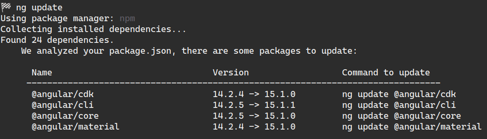

# Updating dependencies

This document describes how to update dependencies in ZAC and (OpenAPI) API specifications used by ZAC.

## Updating dependencies in ZAC

This is normally done by Renovate using the installed github app in in the project.
This includes updating of backend (Java), frontend (TypeScript) as well as GitHub Action and Docker dependencies.

## Updating docker-compose images

This is done by Renovate and its configuration file renovate.json. The version restrictions are following PodiumD 2.0 development. 

### Renovate configuration

The configuration inherits from base settings provided by Renovate, which lay the groundwork for handling updates in a standardized manner. It includes logic to handle major version updates separately and automerges certain updates to reduce manual interventions.

* Pinning Docker Digests: This strategy involves locking Docker images to specific digests. Pinned digests help eliminate the risk of unexpected updates that could introduce breaking changes or vulnerabilities, as you always use a known working image version.
* Scheduled Digest Updates: Even with pinned digests, it's important to periodically update them to include the latest security patches and features. Therefore, Renovate is configured to check for and apply digest updates weekly during the first week of each month's weekends. These digest updates are configured to be automerged. 

## Updating (OpenAPI) API specifications used by ZAC

ZAC integrates with various components and external services using APIs.
Most of these APIs are defined by OpenAPI specifications.
These [OpenAPI](https://www.openapis.org/) specifications are used in the ZAC build process to automatically generate ZAC client code
(with a few exceptions).
The OpenAPI specifications that are used for this client code generation can be found
in the [api-secs](../../src/main/resources/api-specs) folder.

To update these OpenAPI specification, follow these steps:

1. Obtain the version (YAML file) of the OpenAPI specification in question.
   1. For the ZGW APIs you can find these specifications from a running OpenZaak instance
by following the `Components` links on the OpenZaak homepage.
   2. Now follow the `API specificaties` link.
   3. Now manually append the string `openapi.yaml` to the URL in the browser. The URL will now be
something like: `https://<open-zaak-url>/zaken/api/v1/schema/openapi.yaml` and press enter.
   4. A download of the OpenAPI specification will start.
2. Replace the existing OpenAPI specification in the [api-secs](../../src/main/resources/api-specs) folder with the new version.
3. Do a diff of the newly generated OpenAPI specification with the current version and make sure that
any manual changes that were made to the current version are also made to the new version (if they still apply).
These manual changes are indicated with a code comment containing the term `Lifely`.
Some of these manual changes include:
   1. Added `readOnly: false` attributes to properties that were missing a setter (or constructor) in the generated
Java client code but which need to be set by ZAC.
   2. Added empty values to certain enumerations to allow for empty (string) values in the HTTP responses
of certain OpenZaak requests.
4. Regenerate the Java client code. This can be done by running the following Gradle task:
   ```shell
   ./gradlew clean generateJavaClients
   ```
   This will generate the Java client code in the [src/generated](../../src/generated) subfolders.
5. Check if ZAC still compiles and runs correctly and all automated tests succeed.
6. Manually test the functionality that uses the updated API where automated test coverage is lacking.

## Updating fonts and icons

ZAC uses the [Material Design Icons](https://materialdesignicons.com/) and [Google Fonts](https://fonts.google.com/) libraries, but we host them locally to prevent external dependencies.

The css of all icons and fonts is located in [src/main/app/src/styles.less](../../src/main/app/src/styles.less) file.
All assets are located in the [src/main/app/src/assets](../../src/main/app/src/assets) folder.

When updating the icons or fonts, make sure to update the css and assets accordingly. We only load in the fonts we actually need so we are not sending unnecessary data to the client.

If you need a new font-weight for example, you can find the css and assets for the roboto font here [https://fonts.googleapis.com/css?family=Roboto](https://fonts.googleapis.com/css?family=Roboto), then you can copy paste the css and download the assets and add them to the project.

## Upgrade WildFly application server

ZAC runs in the WildFly Java application server. To upgrade the WildFly version, follow these steps:

1. Check the WildFly release notes.
2. Upgrade WildFly in the [Maven build file](../../pom.xml). This is the actual WildFly that gets used in the ZAC Docker Image. Also check if the Maven WildFly plugins we use need to be updated. 
3. The WildFly version from the [Maven build file](../../pom.xml) will be used by [the WildFly install script](../../scripts/wildfly/install-wildfly.sh). 
4. Check if [WildFly's Galleon tooling](https://github.com/wildfly/galleon) needs to be updated. This is used to configure the locally
installed WildFly. To upgrade override the Galleon files in [the Galleon install folder](../../scripts/wildfly/galleon) with the new version. 
5. Re-install your local WildFly version using the WildFly install script.
6. If you have configured your IntelliJ IDE to run ZAC in WildFly update the IntelliJ WildFly run configuration using the instructions in [INSTALL.md](INSTALL.md).
7. In the [Gradle Versions Catalog file](../../gradle/libs.versions.toml) manually upgrade all the 'dependencies provided by Wildfly' that are used in the [Gradle build file](../../build.gradle.kts).
These need to be in sync with the ones provided by the used version of WildFly.
8. Test ZAC thoroughly to make sure everything still works both by running ZAC locally (in IntelliJ and in Docker Compose)
and performing manual testing as well as by running our automated tests. 
9. Once everything works tell all your co-developers to upgrade their local WildFly installations and IntelliJ WildFly configurations as well.

## Upgrading Angular

Renovate creates pull requests for all Angular dependencies that are behind, but Angular dependencies have to be updated in a specific order and angular provides migration tools with `ng update`.

So for Angular dependencies we have to update them manually and commit them to the repository, then Renovate will remove its pull requests.

### Prerequisites

You need the Angular command line tools. You can install Angular CLI `ng` in several different ways: 
```bash
    # On Mac
    brew install angular-cli
    
    # install Angular CLI locally
    npm install -g @angular/cli`
    
    # run Angular CLI as remote package
    npx @angular/cli ng
```

### Update Angular dependencies

Run the following command to update Angular dependencies from the [ZAC frontend folder](../../src/main/app):

```bash
    ng update
```
This command will check whatever angular packages are behind and could result in a list of packages to update like:



Then you can run one of the commands in the list like:

```bash
    ng update @angular/core
```

Make sure to commit every update command you run with a format like:

```bash
    git add .
    git commit -m "update @angular/core to [version]"
```

## Upgrading Helm Chart README

```bash
    ./gradlew buildHelmChartReadme

    # Review and add changes
    git co -b feature/PZ-<number>-update-helm-chart-readme
    git add -p charts/zac/README.md
   
    # Commit and push the changes
    git commit -m 'Update Helm Chart README'
    git push origin feature/PZ-<number>-update-helm-chart-readme
```
