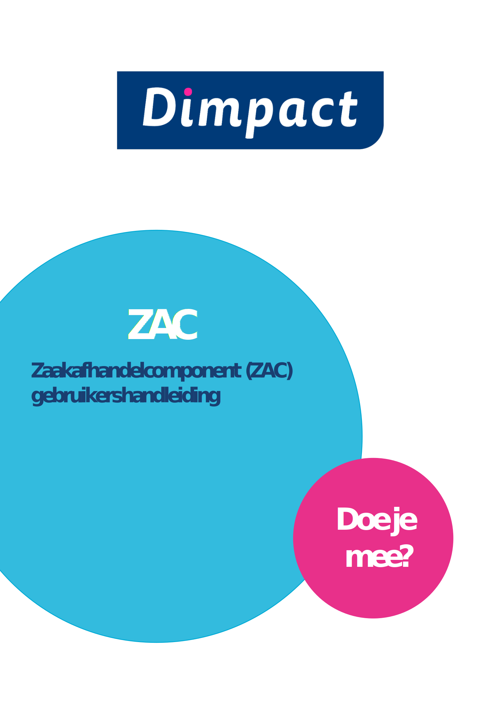

***
> **Colofon**  
> Datum : 19-8-2024  
> Versie :   1.6.0  
> Verandering : vertaling naar Markdown  
> Project referentie : ZAC  
> Toegangsrechten : Alleen lezen  
> Status : Definitief  
> Redacteur : Karin Masselink  
> Auteur(s) : Roy Buis, Camiel Braun  
****

Versiegeschiedenis:

| 0.1   | Initiële versie                                                                                                                            |
|-------|--------------------------------------------------------------------------------------------------------------------------------------------|
| 0.2   | Update nav sprints opgeleverd op 30-11-2022, 14-12-2022, 11-1-2023, 25-1-2023                                                              |
| 1.0   | Update nav sprints opgeleverd op 9-2-2023 en 23-2-2023  Heropenen zaak, Zaak koppelen, Werking van de taak: Advies extern toegevoegd |
| 1.1   | Update nav sprints opgeleverd op 8-3-2023 en 22-3-2023                                                                                     |
| 1.2   | Update nav sprints opgeleverd op 5-4-2023 en 19-4-2023                                                                                     |
| 1.3   | Update nav sprints opgeleverd op 3-5-2023 en 31-5-2023                                                                                     |
| 1.4   | Update format wijziging en redigeerwerk van 29-8-2023                                                                                      |
| 1.5   | Update nav sprints opgeleverd van 10-2023 tot 27-05-2024                                                                                   |
| 1.5.1 | Update zoekfunctie bedrijf en rechtspersoon                                                                                                |
| 1.6.0 | Gebruikershandleiding geconverteerd naar Markdown                                                                                          |

# Inhoud

[*Zaakafhandelcomponent*](#zaakafhandelcomponent)
- [Wat is de zaakafhandelcomponent?](#wat-is-de-zaakafhandelcomponent)
- [Indeling van de ZAC](#indeling-van-de-zac)
- [Rollen en rechten](#rollen-en-rechten)

[*Profiel*](#profiel)
- [Uitloggen](#uitloggen)
- [Signaleringen](#signaleringen)

[*Werklijsten*](#werklijsten)
- [Werking van de werklijsten](#werking-van-de-werklijsten)
- [Gegevenskolommen aanpassen](#gegevenskolommen-aanpassen)
- [Filteren en sorteren](#filteren-en-sorteren)
- [Overzicht werklijsten](#overzicht-werklijsten)

[*Werk verdelen*](#werk-verdelen)
- [Werking van verdelen](#werking-van-verdelen)
- [Werk vrijgeven](#werk-vrijgeven)

[*Dashboard*](#dashboard)
- [Werking dashboard](#werking-dashboard)
- [Overzicht kaarten](#overzicht-kaarten)
    - [Werklijstkaarten](#werklijstkaarten)
    - [Signaleringskaarten](#signaleringskaarten)
- [Dashboard instellen](#dashboard-instellen)

[*Zaak aanmaken*](#zaak-aanmaken)

[*Zaak behandelen*](#zaak-behandelen)
- [Overzicht](#overzicht)
- [Zaakgegevens bewerken](#zaakgegevens-bewerken)
- [Locatie vastleggen](#locatie-vastleggen-of-wijzigen)
- [Zaak opschorten](#zaak-opschorten)
- [Zaak verlengen](#zaak-verlengen)
- [Zaak acties](#zaak-acties)
    - [Ontvangstbevestiging sturen](#ontvangstbevestiging-sturen)
    - [E-mail versturen](#e-mail-versturen)
    - [Document maken](#document-maken)
    - [Document toevoegen](#document-toevoegen)
    - [Document verzenden](#document-verzenden)
    - [Zaak afbreken](#zaak-afbreken)
    - [Intake afronden](#intake-afronden)
    - [Initiator toekennen](#initiator-toekennen)
    - [Betrokkene toevoegen](#betrokkene-toevoegen)
    - [BAG-object toevoegen](#bag-object-toevoegen)
- [Taken](#taken)
    - [Werking van taken](#werking-van-taken)
    - [Starten van taken](#starten-van-taken)
    - [Inzien en behandelen van taken](#inzien-en-behandelen-van-taken)
    - [Werking van de Taak: Aanvullende informatie](#werking-van-de-taak-aanvullende-informatie)
    - [Werking van de Taak: Advies intern](#werking-van-de-taak-advies-intern)
    - [Werking van de Taak: Goedkeuren](#werking-van-de-taak-goedkeuren)
    - [Werking van de Taak: Advies extern](#werking-van-de-taak-advies-extern)
    - [Werking van de Taak: Document verzenden](#werking-van-de-taak-document-verzenden)
- [Zaak koppelen](#zaak-koppelen)
    - [Werking van zaakrelaties](#werking-van-zaakrelaties)
    - [Zaak koppelen om een zaakrelatie te leggen](#zaak-koppelen-om-een-zaakrelatie-te-leggen)
    - [Inzien gekoppelde zaken](#inzien-gekoppelde-zaken)
    - [Ontkoppelen zaken](#ontkoppelen-zaken)
    - [Zaak afhandelen](#zaak-afhandelen)
    - [Besluit vastleggen](#besluit-vastleggen)
    - [Besluit wijzigen](#besluit-wijzigen)
    - [Besluit intrekken](#besluit-intrekken)
    - [Zaak afhandelen](#zaak-afhandelen)
- [Zaak heropenen](#zaak-heropenen)

[*Persoons-/bedrijfspagina*](#persoons-bedrijfspagina)

[*BAG-object pagina*](#bag-object-pagina)

[*Documenten*](#documenten)
- [Overzicht](#overzicht)
- [Document verplaatsen](#document-verplaatsen)
- [Document ontkoppelen](#document-ontkoppelen)
- [Documenten raadplegen](#documenten-raadplegen)
- [Document bewerken](#document-bewerken)
- [Metadata bewerken](#metadata-bewerken)
- [Document ondertekenen](#document-ondertekenen)
- [Document converteren naar PDF](#document-converteren-naar-pdf)
- [Document verwijderen](#document-verwijderen)

[*Notities*](#notities)
- [Notitie aanmaken](#notitie-aanmaken)
- [Notitie bewerken](#notitie-bewerken)
- [Notitie verwijderen](#notitie-verwijderen)

[*Zoeken*](#zoeken)
- [Werking van zoeken op zaken](#werking-van-zoeken-op-zaken)
- [Werking zoeken van personen](#werking-zoeken-van-personen)
- [Werking zoeken van bedrijven](#werking-zoeken-van-bedrijven)
- [Werking zoeken van BAG-objecten](#werking-zoeken-van-bag-objecten)

[*Goed om te weten*](#goed-om-te-weten)
- [Indicaties](#indicaties)

#  Zaakafhandelcomponent

## Wat is de Zaakafhandelcomponent?

Deze handleiding beschrijft het gebruik van de Zaakafhandelcomponent (ZAC) voor gebruikers die een rol hebben bij het behandelen van zaken en het beheer van de werkvoorraad.

De ZAC is een applicatie waarmee zaken volledig behandeld kunnen worden, van registratie tot en met afhandeling. De applicatie bevat functionaliteit en procesflow voor medewerkers en wordt gebruikt in een moderne architectuur waarin het gebruik maakt van centrale registers en authentieke bronnen. De ZAC slaat daarbij geen gegevens over zaken, documenten, besluiten en basisregistraties als personen en bedrijven zelf op, maar gebruikt hiervoor altijd de bijbehorende bron.

De behandeling van zaken wordt voor een deel bepaald door parameters die in de ZAC per zaaktype zijn ingesteld zoals de doorlooptijd van de zaak en de taken en standaard ingevulde waarden in bepaalde velden. Deze instellingen worden gedaan in de Zaakafhandel-parameters waar in deze handleiding soms naar verwezen wordt met de verkorte naam ‘zaps’.

## Indeling van de ZAC

Na het inloggen wordt standaard het persoonlijke dashboard van de gebruiker geopend. Vanuit het dashboard kan een zaak of een taak geopend worden.
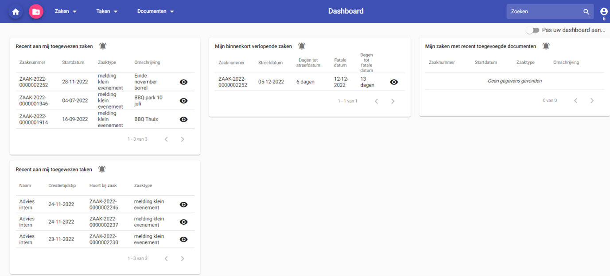

Een andere manier om een zaak, taak of document te openen is vanuit een werklijst. Alle werklijsten zijn vanuit de blauwe werkbalk bovenin te openen.

Het is ook mogelijk om vanuit de zoekfunctie een zaak, taak of document te openen. Deze functie bevindt zich rechts in de werkbalk.
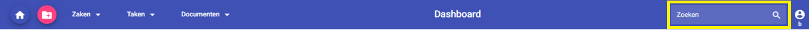

Om naar het dashboard te gaan kan de thuis knop links in de werkbalk gebruikt worden.
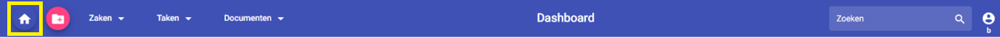

Zodra een werklijst, zaak, taak of document geopend is, dan verschijnt deze in het hoofdscherm. Later in deze handleiding wordt de hoofdindeling van een zaak en de werking van de werklijsten, een zaak, een taak en een document verder beschreven.

## Rollen en rechten

De beschikbaarheid van functionaliteit voor een gebruiker in het ZAC is verbonden aan rechten. Er wordt momenteel gewerkt met drie rollen voor gebruikers, hieronder volgt een korte omschrijving. Deze rollen zijn nog in ontwikkeling. Het komt dus voor dat functionaliteit, zoals beschreven in deze handleiding, niet beschikbaar voor jou is omdat een rol niet aan jou is toegewezen.

Behandelaar: heeft alle rechten om met de werklijsten, zaken, taken en documenten te werken. Er zijn enkele beperkingen op het gebied van werk verdelen, definitieve documenten en beëindigde zaken.

Coördinator: heeft rechten om vanuit werklijsten werk te verdelen en zaken en taken te raadplegen

Record manager: mag zaken en taken raadplegen en heeft aanvullende rechten op het gebied van documenten en beëindigde zaken zoals een zaak heropenen.

## Versie software

De informatie over de software versie van de ZAC is te zien onder het profiel.

# Profiel

## Uitloggen

Een gebruiker kan uit de applicatie loggen via het profiel icoon. Deze bevindt zich recht bovenin de werkbalk en toont de initialen en naam van de ingelogde gebruiker.
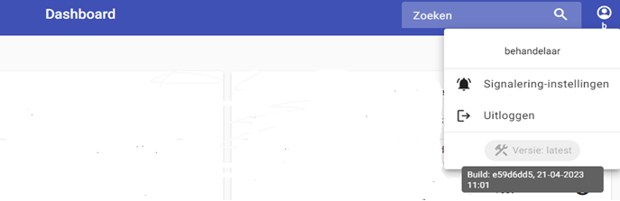
>Zweef met de muisaanwijzer over de versie heen om informatie over de huidige versie te zien!

## Signaleringen

Iedere gebruiker kan ervoor kiezen om gesignaleerd te worden bij gebeurtenissen over zaken en taken die van belang zijn. Signaleringen worden verstuurd naar het dashboard en per e-mail aan het ingestelde e-mailadres van de gebruiker. De werking van het dashboard wordt later in een apart hoofdstuk beschreven.

Voor de signaleringen die per e-mail beschikbaar zijn kan iedere gebruiker zelf aangeven of deze verstuurd moeten worden. Door op Signalering instellingen te klikken opent het overzicht van beschikbare signaleringen en kunnen de gewenste aangevinkt worden.
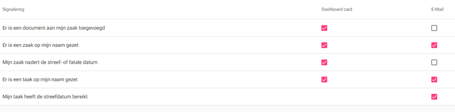

De signaleringen worden in de volgende situaties verstuurd:

Er is een document aan mijn zaak toegevoegd: er is door een andere gebruiker een nieuw document aan een zaak die op jouw naam staat toegevoegd

Er is een zaak op mijn naam gezet: er is een zaak nieuw op jouw naam gezet

Mijn zaak nadert de streef- of fatale datum: een zaak op jouw naam heeft de voor dat zaaktype geldende aantal kalenderdagen tot de streef- of fatale datum bereikt

Er is een taak op mijn naam gezet: er is door een andere gebruiker een taak nieuw op jouw naam gezet

Mijn taak heeft de streefdatum bereikt: een taak op jouw naam heeft de streefdatum bereikt

# Werklijsten

## Werking van de werklijsten

De werklijsten geven inzicht in de zaken, taken en documenten die in de ZAC behandeld worden. In een werklijst kan de gebruiker een overzicht maken dat de gewenste gegevens bevat en vanuit het overzicht een item (zaak, taak of document) openen.

De gegevens die in een overzicht worden weergegeven zijn per gebruiker in te stellen. Zo kan een gebruiker bijvoorbeeld zelf gegevenskolommen toevoegen en verwijderen uit het overzicht. In alle werklijsten zijn er sorteer- en filteropties beschikbaar op de verschillende gegevenskolommen. De sorteer- en filteropties kunnen in combinatie met elkaar gebruikt worden om zo een gewenst overzicht te maken. Een gebruiker heeft ook de mogelijkheid om de toegepaste filters als zoekopdracht te bewaren.

Het aantal items dat per pagina getoond wordt is ook door de gebruiker in te stellen. Dit kan per werklijst gedaan worden en deze instellingen blijven na het sluiten van de browsersessie bewaard.

Alle werklijsten worden gegenereerd op basis van indexering. Het duurt maximaal 15 seconden om een item te indexeren, daarna komt deze beschikbaar in het overzicht.

De werklijsten zijn vanuit de werkbalk te openen.
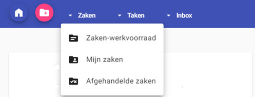

## Gegevenskolommen aanpassen

Een gebruiker kan per werklijst instellen welke kolommen worden weergegeven door in een werklijst rechtsboven op het kolommen icoon te klikken. Om de werklijst weer terug naar de standaardindeling te zetten kan het ronde pijl icoon gebruikt worden. De aangepaste kolommen blijven tijdens de browsersessie onthouden, bij het sluiten van de browser worden ze terug naar de standaardindeling gezet.
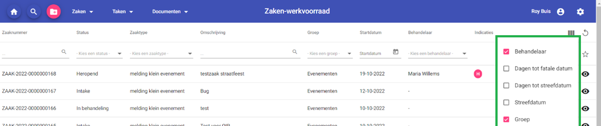

De kolommen kunnen van plek gewisseld worden door de kolomkop te slepen met de muisaanwijzer.

## Filteren en sorteren

In alle werklijsten zijn er sorteer- en filteropties beschikbaar op de verschillende gegevenskolommen. De verschillende opties kunnen in combinatie met elkaar gebruikt worden om zo een gewenst overzicht te maken.

Een gebruiker kan met het pijl icoon in de kolomkop het geopende overzicht sorteren op basis van de gegevens in een kolom. Door nog een keer op de pijl te klikken wordt de andere kant op gesorteerd.
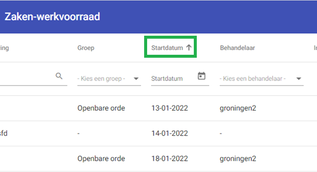

Een gebruiker kan filters op meerdere gegevenskolommen toepassen. Door te klikken op het vergrootglas in de kolomkop kan gefilterd worden op trefwoorden, met de keuzelijst kan gefilterd worden op één keuze en door te klikken op de kalender kan een datumbereik worden ingevuld.

Zodra er een filter is toegepast dan wordt het trechter icoon naast de filters gevuld. Door op dit icoon te klikken kunnen alle toegepaste filters gewist worden.
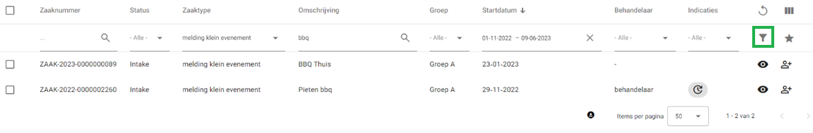

Een gebruiker heeft ook de mogelijkheid om een zoekopdracht te bewaren door met het ster-icoon de toegepaste sortering en filters als zoekopdracht op te slaan. Door in een ongefilterd overzicht op het trechter icoon te klikken kan een bewaarde zoekopdracht worden geopend. Een zoekopdracht kan met een klik op de prullenbak worden gewist.
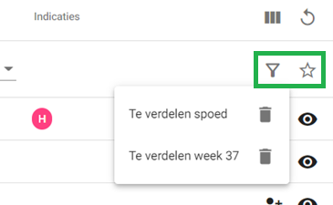

Door te klikken op het oog icoon kan een item geopend worden, Ctrl + oog icoon opent het item in een nieuw tabblad.

## Overzicht werklijsten

**_Zaken-werkvoorraad_**

Met de werklijst 'Werkvoorraad-zaken' zijn alle lopende zaken van de gehele organisatie in een overzicht in te zien.

**_Afgehandelde zaken_**

Deze werklijst geeft inzicht in alle afgehandelde zaken van de organisatie. Een extra gegevenskolom waarin het resultaat wordt weergegeven is beschikbaar bij deze werklijst.

**_Mijn zaken_**

Met de werklijst Mijn zaken' zijn alle lopende zaken die op naam van de ingelogde gebruiker staan in een overzicht in te zien.

Alle door een gebruiker afgehandelde zaken zijn in te zien door de werklijst ‘Afgehandelde zaken’ te gebruiken met daarin een filter op Behandelaar.

**_Taken-werkvoorraad_**

Met de werklijst 'Werkvoorraad-taken' zijn alle lopende taken van de organisatie in een overzicht in te zien. Van iedere taak is het zaaknummer en -informatie te zien van de zaak waar deze bij hoort.

**_Mijn taken_**

Deze werklijst bevat alle lopende taken die op naam van de ingelogde gebruiker staan.

**_Ontkoppelde documenten_**

Alle documenten die in de ZAC bij een zaak zijn ontkoppeld komen in deze werklijst terecht.

Vanuit de werklijst kunnen de documenten met de klembordfunctionaliteit verplaatst worden naar een zaak. Dit kan door vanuit het overzicht op het schaar icoon te klikken.

Het is ook mogelijk om een document te openen en daarna te verwijderen.

**_Inbox documenten_**

Alle documenten die nog niet bij een zaak hebben gehoord, maar wel aan een zaak toegevoegd moeten worden zijn te vinden in de Inbox documenten.

Vanuit de werklijst kunnen de documenten met de klembordfunctionaliteit verplaatst worden naar een zaak. Dit kan door vanuit het overzicht op het schaar icoon te klikken. Met het prullenbak icoon kunnen de documenten verwijderd worden.

Het is ook mogelijk om een document te openen en daarna acties op het document uit te voeren.

**_Inbox productaanvragen_**

Productaanvragen die niet tot een zaak hebben geleid komen in deze Inbox terecht. Vanuit de werklijst kan het bijbehorende aanvraagdocument bekeken worden.

Vanuit de werklijst kan met de productaanvraag via de ‘Zaak aanmaken’ functie alsnog handmatig een zaak worden aangemaakt. Deze functie wordt gestart door in de regel van de productaanvraag op de ‘Zaak aanmaken’ map icoon te klikken. Voor de werking van de ‘Zaak aanmaken’ functie zie het hoofdstuk daarvoor in deze handleiding.

Een productaanvraag verwijderen kan via het prullenbak icoon.

# Werk verdelen

Vanuit de Zaken-werkvoorraad en Taken-werkvoorraad kunnen items verdeeld worden naar een groep en/of naar een behandelaar. Op deze manier kan een Coördinator de werkvoorraad managen en het werk verdelen binnen de organisatie.

## Werking van verdelen

Als de Zaken-werkvoorraad of Taken-werkvoorraad geopend is dan kan de verdeelfunctie geactiveerd worden door een of meerdere van de items te selecteren. Met de Verdeel knop kan aangegeven worden aan welke groep en/of behandelaar de gekozen items toegekend moeten worden.  

**Stappen:**

1 Open de Zaken-werkvoorraad of Taken-werkvoorraad

2 Selecteer minimaal één item om te verdelen door deze links aan te vinken
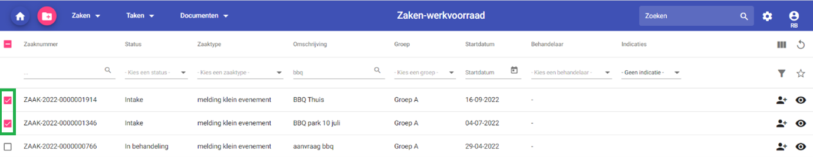

3 Klik op 'Verdelen' onderaan het scherm

4 Kies de groep en/of de behandelaar aan wie de items toegekend moeten worden. Er kan alleen een behandelaar gekozen worden die bij de gekozen groep hoort.
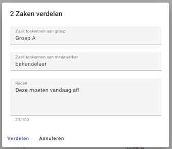

5 Vul eventueel een reden in, deze wordt als toelichting gebruikt in de historie van de zaak

6 Klik op ‘Verdelen’ om de actie uit te voeren
> Let op!  Als eenmaal 'Verdelen' is gestart, is dit niet meer te onderbreken.

## Werk vrijgeven

Met de 'Vrijgeven' knop kan een item van de behandelaar afgehaald worden. Deze functie, die bijvoorbeeld handig is als iemand uit dienst of op vakantie gaat, werkt op een soortgelijke manier als de Verdeel functie en kan ook alleen door de Coördinator gedaan worden.  

**Stappen:**

1 Open de Zaken-werkvoorraad of Taken-werkvoorraad

2 Selecteer minimaal één item om vrij te geven door deze links aan te vinken

3 Vul een reden in, deze wordt als toelichting gebruikt in de historie van de zaak

4 Klik op ‘Vrijgeven’ om de actie uit te voeren
> Let op!  Als eenmaal 'Vrijgeven' is gestart, is dit niet meer te onderbreken.

# Dashboard

## Werking dashboard

Iedere gebruiker van ZAC heeft een persoonlijk dashboard tot beschikking. In dit dashboard kan een gebruiker de gegevens over de zaken in de ZAC naar eigen wens en belang in één overzicht organiseren. Dit gebeurt aan de hand van kaarten. In iedere kaart worden gegevens van een bepaalde soort die voor de gebruiker belangrijk zijn in een compact overzicht getoond.

Het dashboard wordt geopend via de thuis knop in de werkbalk. Het dashboard is ook het standaard beginscherm na het inloggen in de ZAC.
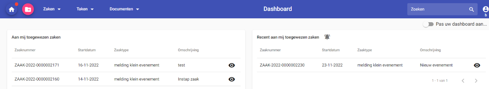

>Een rood bolletje op de thuis knop geeft aan dat er een nieuw item in een van de signaleringskaarten is!

## Overzicht kaarten

Er zijn twee soorten kaarten: compacte weergaven van werklijsten en overzichten van zaken en taken waar een signalering op afgegeven is.

### Werklijstkaarten

Aan mij toegewezen zaken: een compacte weergave van de werklijst ‘Mijn zaken’.
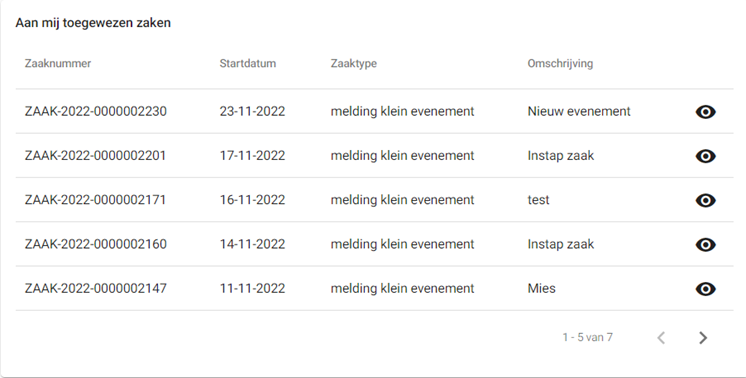

Aan mij toegewezen taken: een compacte weergave van de werklijst ‘Mijn taken’
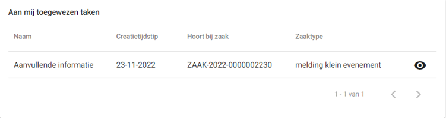

### Signaleringskaarten

**Recent aan mij toegewezen zaken**

Een zaak verschijnt in deze kaart als die nieuw op jouw naam wordt gezet. De zaak blijft in de kaart staan totdat deze geopend is, de zaak verdwijnt dus ook als je deze vanuit een werklijst of de zoekfunctie opent.
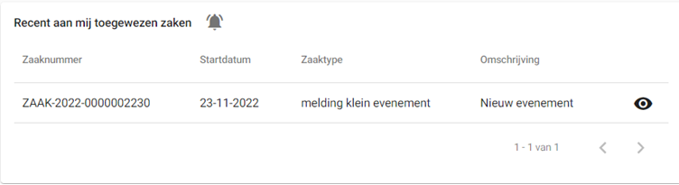

**Mijn zaken met recent toegevoegde documenten**  
Een zaak verschijnt in deze kaart als er door een andere gebruiker een nieuw document aan wordt toegevoegd. De zaak blijft staan totdat de zaak of het document zelf geopend is, de zaak verdwijnt dus ook als je deze vanuit een werklijst of de zoekfunctie opent.
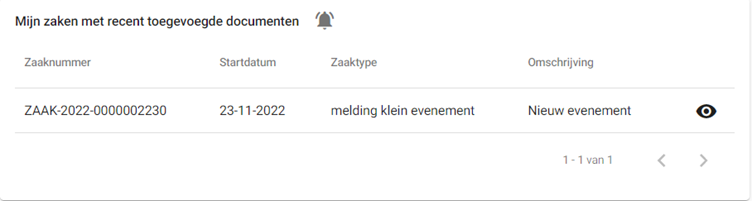

**Mijn binnenkort verlopende zaken**  
Een zaak verschijnt in deze kaart als de streef- of fatale datum binnen het voor dat zaaktype geldende aantal kalenderdagen wordt bereikt.
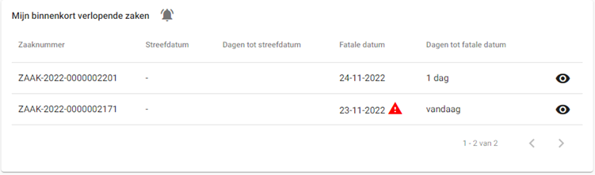

>De gele driehoek geeft aan dat de streefdatum is bereikt!
>De rode driehoek geeft aan dat de fatale datum is bereikt!

**Recent aan mij toegewezen taken**

Een taak verschijnt in deze kaart als deze door een andere gebruiker op jouw naam wordt gezet. De taak blijft in de kaart staan totdat deze geopend is, de taak verdwijnt dus ook als je deze vanuit een werklijst of de zoekfunctie opent.
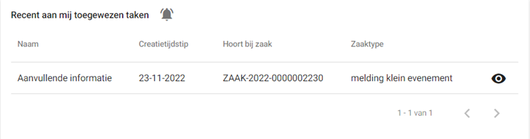

## Dashboard instellen

Om je dashboard in te stellen klik je in het dashboard op het schuifje ‘Pas uw dashboard aan’ om de bewerkingsmodus te activeren. 
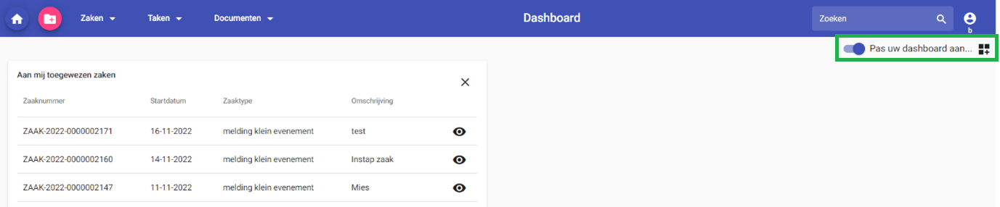

Het is in het dashboard mogelijk om met drie kolommen te werken waarin kaarten geplaatst kunnen worden. In de bewerkingsmodus kunnen de kaarten tussen de kolommen verschoven worden. Waarna bij het terugschakelen naar de gebruiksmodus de kaarten automatisch over de beschikbare ruimte van de gehele pagina verdeeld worden.

Klik op het Dashboardcard toevoegen icoon om de beschikbare kaarten te zien. Door op een kaart te klikken wordt deze aan het dashboard toegevoegd. Kaarten die op het dashboard staan kunnen verwijderd worden door op het kruis in de kaart te klikken.
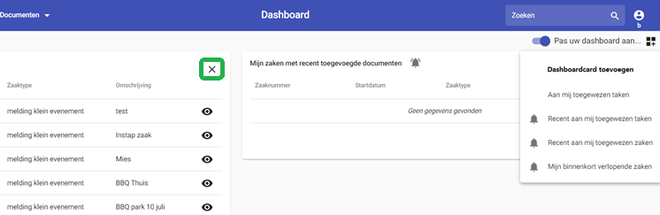

Om een kaart van plek te verwisselen kan je deze verschuiven door deze met het cursor-handje op te pakken en te verplaatsen naar de gewenste plek. De kaart kan op een plek geplaatst worden als het aanwijsvlak verschijnt.
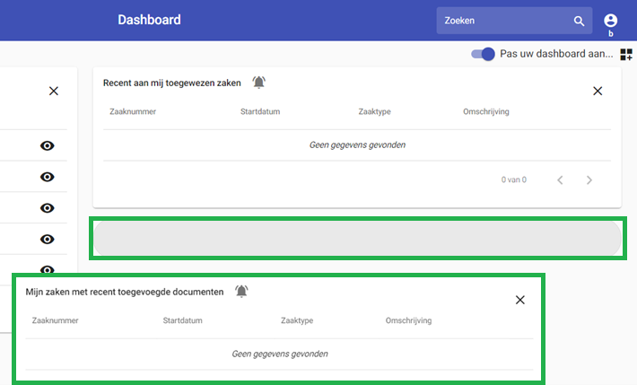

Als je klaar bent met aanpassen dan sluit je het schuifje weer om de aanpassingen vast te zetten

# Zaak aanmaken

ZAC heeft de mogelijkheid om een nieuwe zaak aan te maken. De zaak wordt daarna beschikbaar om te behandelen.

Een nieuwe zaak starten kan door op de ‘Zaak aanmaken’ map icoon boven in de werkbalk te klikken. In het scherm dat opent worden alle verplichte zaakgegevens ingevuld. Bij het aanmaken van een nieuwe zaak kan de persoon of het bedrijf die de initiator van de zaak is direct aan de zaak toegevoegd worden.  

**Stappen**

1 Klik op de ‘Zaak aanmaken’ knop in de werkbalk
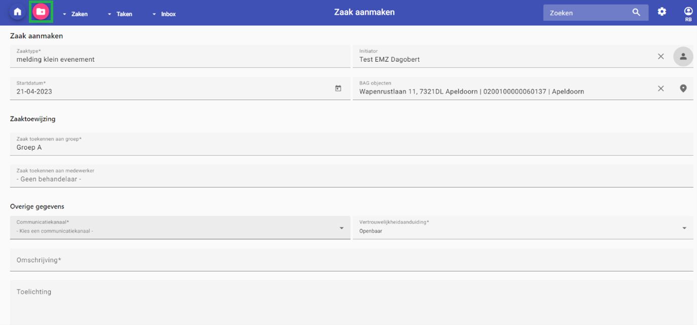

2 Voeg eventueel direct de initiator toe. Een initiator zoeken kan door in het initiatorveld op het poppetje icoon te klikken. Vervolgens kan bovenin gekozen worden voor een persoon of bedrijf.

Een persoon kan gezocht worden op een aantal velden, dit zijn:

- bsn
- geslachtsnaam en geboortedatum
- geslachtsnaam, voornamen en gemeentecode
- postcode en huisnummer
- gemeentecode, huisnummer en straat

Een bedrijf of rechtspersoon kan gezocht worden op de volgende velden:

- KvK-nummer
- vestigingsnummer
- RSIN (rechtspersoon)
- handelsnaam
- postcode en huisnummer

Na het invullen van een zoekveld geeft het zoekscherm aan welke andere velden ingevuld moeten worden. De knop ‘Zoek’ wordt pas actief als een juiste combinatie van velden is ingevuld.

Voeg de initiator toe door in de lijst van zoekresultaten op het poppetje icoon te klikken.

3 Voeg eventueel een BAG-object aan de zaak. Zoek op (een combinatie van) straatnaam, postcode, huisnummer en woonplaats. De lijst van zoekresultaten bevat gevonden adressen. Om de bijbehorende BAG-objecten van een adres te zien klap je het adres uit door op het pijltje te klikken. De typen BAG-objecten die nu getoond worden zijn nummeraanduiding, openbare ruimte, woonplaats en pand. Klik in de lijst van zoekresultaten op het huis icoon om het BAG-object aan de zaak toe te voegen.

4 Kies de groep en eventueel de behandelaar aan wie de zaak initieel toegekend moet worden.

Nadat een zaaktype voor de nieuwe zaak gekozen is wordt de standaard groep die deze zal behandelen ingevuld. Het is mogelijk om deze groep te wijzigen of om zelf een behandelaar te kiezen. Er kan alleen een behandelaar gekozen worden die bij de gekozen groep hoort.

5 Vul de overige gegevens in

6 Klik op ‘Aanmaken’ om de actie af te ronden

# Zaak behandelen

## Overzicht

Een zaak bevat vaak verschillende gegevens zoals documenten, taken, notities en betrokkenen. Als een zaak in de ZAC geopend is dan zijn de diverse gegevens als volgt ingedeeld.
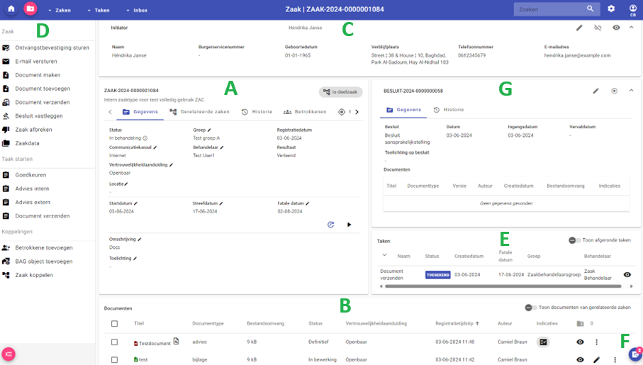

>**A** Zaakgegevens | Dit blok bestaat uit meerdere tabbladen. De tab ‘Gegevens’ bevat de belangrijkste kenmerken van de zaak. In het tabblad ‘Historie’ zijn alle wijzigingen die bij de zaak zijn aangebracht te vinden. De tabbladen ‘Betrokkenen’, ‘Gerelateerde zaken’ en ‘BAG-objecten’ zijn alleen aanwezig als aan een zaak een betrokkene, gerelateerde zaak of een BAG-object is toegevoegd.
>**B** Documenten | Dit overzicht bevat alle documenten die aan de zaak zijn toegevoegd.
>**C** Initiator | Dit blok bevat de gegevens van de initiator van de zaak. De initiator kan een persoon of bedrijf zijn en is de klant voor wie de zaak aangemaakt is en behandeld wordt.
>**D** Acties | In dit menu staan de acties die een behandelaar tot de beschikking heeft bij het behandelen en afhandelen van een zaak. Ook de beschikbare taken zijn via dit menu aan te maken.
>**E** Taken | In dit blok zijn de aangemaakte taken voor de zaak in te zien.
>**F** Notities | Deze knop activeert het notitieblok.
>**G** Besluiten | In dit blok zijn de vastgelegde besluiten te zien.

## Zaakgegevens bewerken

De zaakgegevens hebben in sommige gevallen een aanpassing nodig, bijvoorbeeld als de omschrijving moet worden aangepast.

De zaakgegevens die aangepast mogen worden hebben een potlood icoon waarmee de waarde aangepast kan worden. Het is mogelijk om hierbij een reden op te geven, deze wordt gebruikt bij het vastleggen in de historie.

De datums van een zaak zijn als geheel aan te passen door op het potlood van één van de velden te klikken. Als het streefdatum-veld leeg is, dan betekent dit dat voor een zaak van dit zaaktype niet met een streefdatum wordt gewerkt. Een zaak heeft wel altijd een fatale datum.
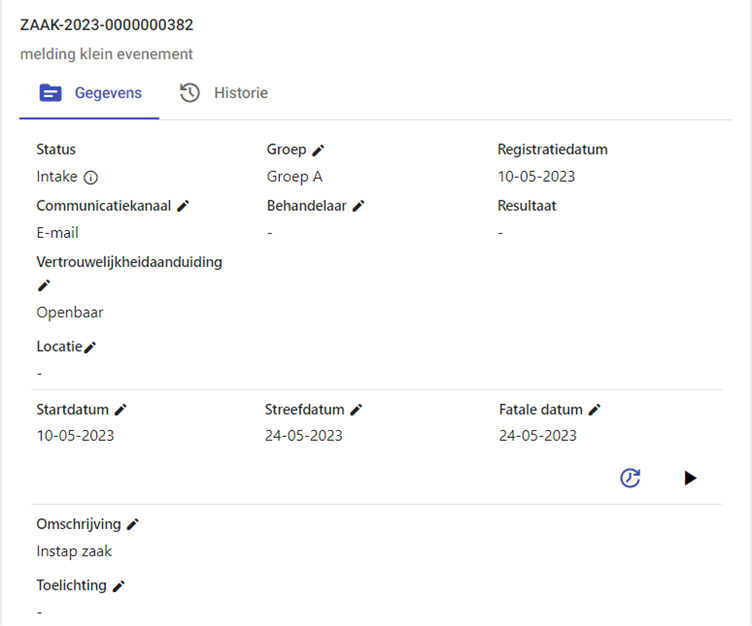

**Stappen**

1 In een zaak in het tabblad ‘Gegevens’ klik je op het potlood van het gegeven dat je wilt aanpassen

2 Het veld is nu geactiveerd. Pas de waarde aan en vul een reden voor het aanpassen in.

3 Klik op het vink icoon om de wijziging op te slaan. As je wilt annuleren dan klik je op het kruis icoon en blijft de huidige waarde staan.

## Locatie vastleggen of wijzigen

Met het potlood icoon op het locatie veld is het mogelijk om een locatie bij een zaak vast te leggen. Van de gekozen locatie worden de coördinaten vastgelegd. Deze locatie kan op de kaart bekeken worden door met de muisaanwijzer op de locatie te klikken. Door de vastgelegde locatie te openen in de kaart kan ook het dichtstbijzijnde adres bij die locatie bekeken worden.
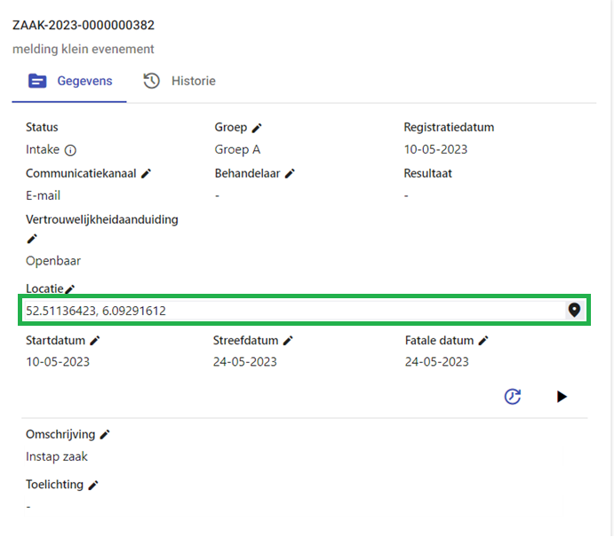

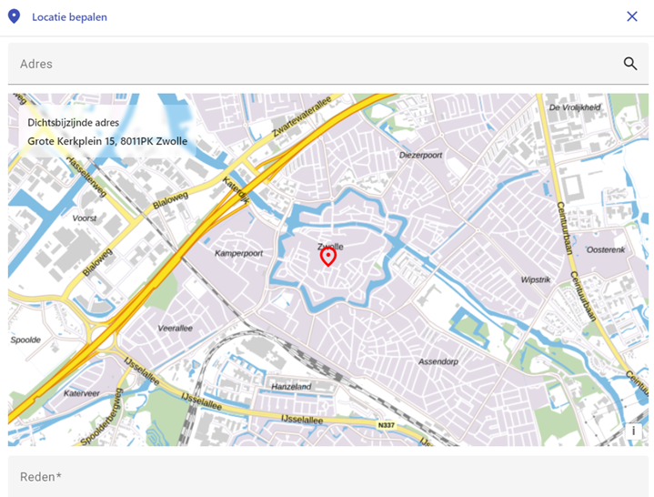

**Stappen:**

1 In een zaak in het tabblad ‘Gegevens’ klik je op locatie

2 Zoek de locatie

Een locatie kan gezocht worden op straatnaam, huisnummer, postcode of plaatsnaam. Het is ook mogelijk om de locatie in de kaart te selecteren.

3 Vul de verplichte reden voor het vastleggen of wijzigen van de locatie in

4 Klik op ‘Opslaan’ om de locatie vast te leggen

## Locatie verwijderen

Het is ook mogelijk een locatie te verwijderen.
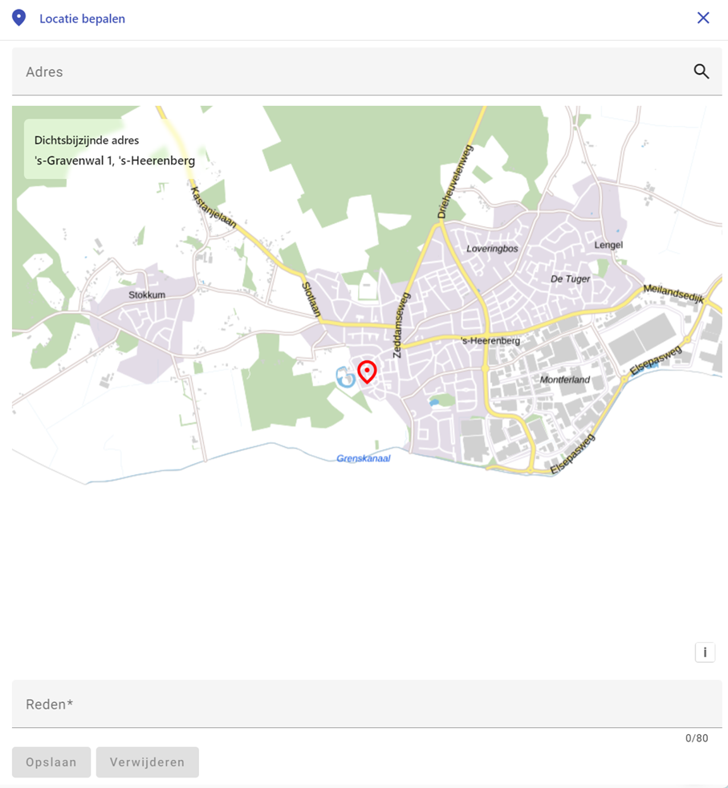

**Stappen:**

1 In een zaak in het tabblad ‘Gegevens’ klik je op locatie

2 Voer niets in het adres veld in

3 Vul de verplichte reden voor het verwijderen van de locatie in

4 Klik op ‘Verwijderen’ om de locatie te verwijderen

## Zaak opschorten

Als de streef- en fatale datum van een zaak aanwezig zijn, kunnen deze eenmalig vanuit de zaakgegevenspagina opgeschort worden. De behandelaar kan zelf de verwachte duur (in kalenderdagen) van de opschorting invullen waarmee het systeem de nieuwe verwachte streef- en fatale datum berekent. De zaak kan daarna door de behandelaar hervat worden waarna het werkelijke aantal dagen dat de opschorting heeft geduurd bij de oorspronkelijke streef- en fatale datum wordt opgeteld.

Merk op: een zaak kan ook opgeschort worden via het starten van de ‘Aanvullende informatie opvragen’ taak.

De opschorten-knop bevindt zich in het datumblok van het tabblad ‘Gegevens’ en is herkenbaar aan het afspelen icoon (de zaakdoorlooptijd loopt en is aan het ‘afspelen’). Zodra met de muisaanwijzer boven de knop gezweefd wordt, verandert het icoon in de pauze en daarmee de opschorten-knop.
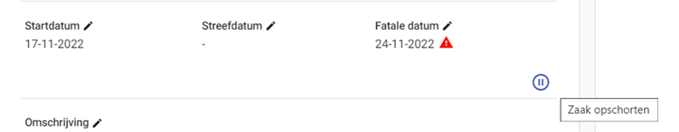

**Stappen:**

1 In een zaak in het tabblad ‘Gegevens’ ga je met je muisaanwijzer naar het afspelen icoon. Deze verandert in het pauze icoon zodra je erop staat, hier klik je op.

2 Vul de opschortduur in kalenderdagen in óf kies de nieuwe streef- en/of fatale datum die de zaak moet krijgen. Als een van de velden wordt ingevuld dan berekent het systeem automatisch de waarde van de andere.
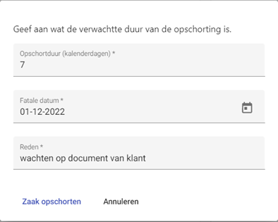

3 Kik op ‘Zaak opschorten’ om de opschorting door te voeren

Een opgeschorte zaak kan door een behandelaar hervat worden vanaf dezelfde plek in het datumblok als opschorten. Een opgeschorte zaak is te herkennen aan een indicatie en aan het pauze icoon dat bij het datumblok zichtbaar is en aangeeft dat de zaak ‘gepauzeerd’ is. De verwachte duur van de opschorting wordt ook aangegeven.

Merk op: een zaak kan ook hervat worden bij het afronden van de ‘Aanvullende informatie opvragen’ taak. Nadat de hervatting is uitgevoerd dan wordt de daadwerkelijke duur van de opschorting berekend en opgeteld bij de oorspronkelijke fatale datum.
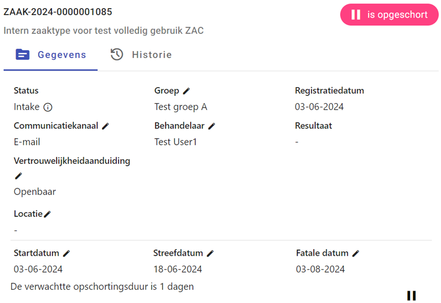

**Stappen:**

1 In een zaak in het tabblad ‘Gegevns’ ga je met je muisaanwijzer naar het pauze icoon. Deze verandert in het afspelen icoon zodra je erop staat, hier klik je op.

2 Vul de reden voor het hervatten in. Standaard wordt hier de reden die bij het opschorten was opgegeven al ingevuld.

3 Klik op ‘Zaak hervatten’ om de opschorting te beëindigen

## Zaak verlengen

Als de streef- en fatale datum van een zaak aanwezig zijn, kunnen deze eenmalig vanuit de zaakgegevenspagina verlengd worden. De behandelaar kan zelf de duur (in kalenderdagen) van de verlenging invullen waarmee het systeem de nieuwe streef- en fatale datum berekent. De maximaal toegestane duur van de verlenging is afhankelijk van het zaaktype.

De verlengen knop bevindt zich in het datumblok van het tabblad ‘Gegevens’ en is herkenbaar aan het klok icoon met de pijl eromheen.
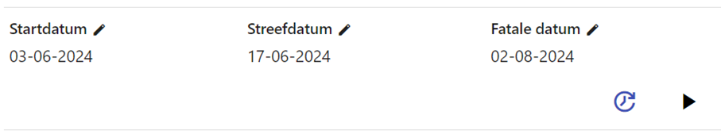

**Stappen:**

1 In een zaak in het tabblad ‘Gegevens’ klik je op het klok icoon

2 Vul de verlengingsduur in kalenderdagen in óf kies de nieuwe streef- en/of fatale datum die de zaak moet krijgen. Als een van de velden wordt ingevuld dan berekent het systeem automatisch de waarde van de andere.

3 Geef aan of de streefdatum van de openstaande taken ook verlengd moeten worden
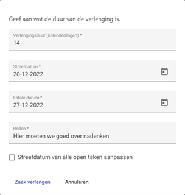

4 Kik op ‘Zaak verlengen’ om de verlenging door te voeren

## Zaak acties

Een zaak is te behandelen met behulp van de acties die in het linker menu beschikbaar zijn. Een groot deel van de acties zijn standaard en altijd beschikbaar. Per fase van het afhandelproces is een aantal extra acties beschikbaar, dit zijn met name de taken.

Het afhandelproces bestaat uit twee fases, in het volgende schema zijn de taken en acties die in de fases te gebruiken zijn te zien. Een actie die niet in een fase zit is altijd beschikbaar.
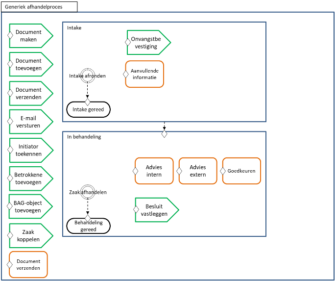

### Ontvangstbevestiging sturen

Met deze actie kan een ontvangstbevestiging per e-mail naar de initiator of een betrokkene gestuurd worden. De mail wordt als document aan de zaak toegevoegd.

**Stappen:**

1 In een zaak kies je actie *Ontvangstbevestiging sturen*

2 Kies eventueel de afzender van de ontvangstbevestiging, dit is het mailadres van waaruit de mail verstuurd wordt.

3 Vul de ontvanger in, dit is het mailadres waar de mail naartoe wordt gestuurd. Hier kan één adres worden ingevuld. Als het mailadres van de initiator bekend is dan kan je deze direct toevoegen door op het poppetje icoon in het veld te klikken.

4 Vul het onderwerp in, deze wordt overgenomen uit het template en kan aangepast worden

5 Maak het bericht op, dit is de body van de e-mail die een standaard vulling heeft vanuit het template en kan aangepast worden.

6 Voeg eventueel een bijlage toe, alle documenten die aan de zaak zijn toegevoegd kunnen als bijlage aan de e-mail worden toegevoegd.

7 Klik op ‘Versturen’ om de actie af te ronden

### E-mail versturen

Met deze actie wordt een e-mail vanuit de zaak verstuurd. De mail wordt als document aan de zaak toegevoegd.

**Stappen:**

1 In een zaak kies je actie *E-mail versturen*

2 Kies eventueel de afzender van de mail, dit is het mailadres van waaruit de mail verstuurd wordt.

3 Vul de ontvanger in, dit is het mailadres waar de mail naartoe wordt gestuurd. Hier kan één adres worden ingevuld. Als het mailadres van de initiator bekend is dan kan je deze direct toevoegen door op het poppetje icoon in het veld te klikken.

4 Vul het onderwerp in, deze wordt overgenomen uit het template en kan aangepast worden

5 Maak het bericht op, dit is de body van de e-mail die een standaard vulling heeft vanuit het template en kan aangepast worden

6 Voeg eventueel een bijlage toe, alle documenten die aan de zaak zijn toegevoegd kunnen als bijlage aan de e-mail worden toegevoegd

7 Klik op ‘Versturen’ om de actie af te ronden

### Document maken

Deze actie maakt het mogelijk om een document met sjablonen in een documentcreatieapplicatie een document te maken en aan de zaak toe te voegen.  

**Stappen**

1 In een zaak kies je actie *Document maken*

2 Kies het documenttype van het te maken document en vul de titel in (deze stap is in ontwikkeling)

3 Klik op de Maken knop om de documentcreatieapplicatie te starten. Deze opent in een nieuw tabblad.

4 Maak het document en klik op Opslaan

5 Het document is aan de zaak toegevoegd en beschikbaar in het documentenoverzicht

### Document toevoegen

Om een bestaand document aan een zaak toe te voegen kan deze actie gebruikt worden. De verplichte metadata moeten worden ingevuld bij het toevoegen.

Als het document de status ‘Definitief’ krijgt dan kan het niet meer aangepast worden. Als een ontvangstdatum wordt ingevuld dan wordt de status automatisch op Definitief gezet. Ook bij het toevoegen van een document aan een beëindigde zaak wordt de status automatisch op Definitief gezet. Met deze actie kunnen meerdere documenten tegelijkertijd worden toegevoegd. Bij een opvolgend toe te voegen document worden de metadata overgenomen van de vorige.

**Stappen**

1 In een zaak kies je actie *Document toevoegen*

2 Upload een document en vul bijbehorende metadata van het document in

3 Klik op Nog een document toevoegen om direct een volgend document toe te voegen. Vul voor dit document ook de metadata.

4 Klik op Opslaan

5 Het document is aan de zaak toegevoegd en beschikbaar in het documentenoverzicht

### Document verzenden

Als een of meerdere documenten door een behandelaar zelf per post verzonden worden dan kan dit met de ‘Document verzenden’ actie vastgelegd worden. Een document wordt dan voorzien van een verzenddatum en een ‘is verzonden’ indicatie zodat het duidelijk is dat dit document is verzonden en wanneer dit is gebeurd. Alleen documenten die aan de voorwaarden voor verzenden voldoen kunnen met deze actie worden verzonden.

**Stappen**

1 In een zaak kies je actie *Document verzenden*

2 Selecteer het document dat verzonden wordt

In de lijst van te verzenden documenten staan alleen documenten die:

- van het bestandstype PDF zijn
- status ‘Definitief’ hebben
- geen ontvangstdatum hebben
- niet de vertrouwelijkheidsaanduiding ‘Geheim, Zeer geheim’ of ‘Confidentieel’ hebben

3 Vul de datum in dat het document verzonden wordt

4 Vul een toelichting in

5 Klik op ‘Verzenden’

Nadat de actie is afgerond is het document voorzien van een ‘is verzonden’ indicatie.
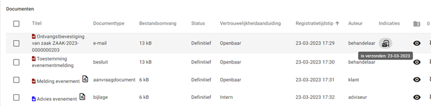

>Zweef met de muis over de indicatie om de verzenddatum te zien!

### Zaak afbreken

In sommige gevallen is het nodig om een zaak vroegtijdig af te breken zonder de fasen van de behandeling te doorlopen. Dit is bijvoorbeeld het geval als een klant het verzoek intrekt. Om een zaak te beëindigen zonder de procesfasen te doorlopen is de Zaak afbreken actie beschikbaar. Hiermee hoeft alleen de reden voor het afbreken ingevuld te worden. De ingevulde reden bepaalt ook het resultaat van de zaak waardoor de zaak op de juiste manier gearchiveerd wordt.

**Stappen**

1 In een zaak kies je actie *Zaak afbreken*

2 Kies de reden dat de zaak wordt afgebroken

3 Klik op ‘Zaak afbreken’

### Intake afronden

Als de intake fase is afgerond dan kan de zaak naar de volgende fase gebracht worden met deze actie. Deze actie is alleen beschikbaar als alle taken zijn afgerond. In het dialoogvenster moet aangegeven worden of de zaak ontvankelijk is of niet. Als ‘Ja’ wordt gekozen dan wordt de intake fase afgerond en wordt de in behandeling fase gestart. Als ‘Nee’ wordt gekozen dan wordt de zaak beëindigd. Er kan in beide gevallen gekozen worden om een e-mail te versturen.

**Stappen**

1 In een zaak kies je actie *Intake afronden*

2 Maak een keuze of de zaak ontvankelijk is

Als ‘Ja’ wordt gekozen ga dan verder met stap 3 en 4. Bij ‘Nee’ ga je naar stap 5 en verder.

3 Geef aan of je een bericht over het in behandeling nemen per mail wilt versturen. Als je hiervoor kiest controleer dan eerst of de afzender van de mail, dit is het mailadres van waaruit de mail verstuurd wordt, juist is. Daarna vul je het e-mailadres van de ontvanger in. Als het e-mailadres van de initiator bekend is dan kan je deze direct toevoegen door op het poppetje icoon in het veld te klikken. Om de inhoud van het bericht te bekijken klik je op het pijltje in het ‘Bericht’ veld.

4 Klik of ‘Intake afronden’. De actie is nu afgerond.

5 Vul de reden in dat de zaak niet ontvankelijk is. Deze reden wordt vastgelegd in de zaakhistorie.

6 Geef aan of je een bericht over het niet in behandeling nemen per mail wilt versturen. Als je hiervoor kiest dan vul je het e-mailadres van de ontvanger in.

7 Klik of ‘Intake afronden’. De actie is nu afgerond.

### Initiator toekennen

De initiator van een zaak is de persoon of het bedrijf die het verzoek heeft geïnitieerd. Een zaak kan bij het aanmaken deze initiator al toegekend hebben. Als dit niet het geval is dan kan handmatig een initiator worden toegevoegd.

De initiator bij een zaak is bovenaan het zaakgegevensscherm te vinden. Als er geen initiator is toegekend dan staat in dit blok ‘geen initiator’ vermeld. Met het ‘Initiator toevoegen’ icoon kan een persoon of bedrijf worden gezocht en worden toegekend.
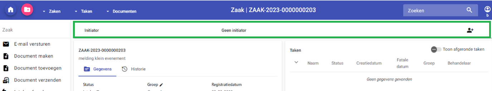

Als een zaak wel een initiator heeft toegekend dan kan deze gewijzigd worden met het ‘Initiator wijzigen’ icoon, deze is dan beschikbaar in plaats van het ‘initiator toekennen’ icoon.
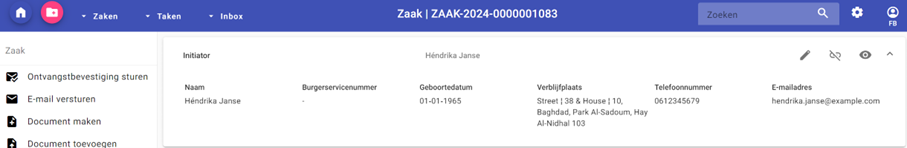

>Het telefoonnummer en e-mailadres van de initiator komen uit een andere bron dan de persoonsgegevens en zijn niet altijd aanwezig!

**Stappen**

1 In een zaak klik je op de ‘Initiator toevoegen’ icoon (poppetje +) of op de ‘Initiator wijzigen’ icoon (potlood)

2 In het scherm dat opent kies je bovenin voor een persoon of bedrijf

3 Zoek de persoon of het bedrijf
Een persoon kan gezocht worden op een aantal velden, dit zijn:
- bsn
- geslachtsnaam en geboortedatum
- geslachtsnaam, voornamen en gemeentecode
- postcode en huisnummer
- gemeentecode, huisnummer en straat

Een bedrijf of rechtspersoon kan gezocht worden op de volgende velden:
- KvK-nummer
- vestigingsnummer
- RSIN (rechtspersoon)
- handelsnaam
- postcode en huisnummer

Na het invullen van een zoekveld geeft het zoekscherm aan welke andere velden ingevuld moeten worden. De knop ‘Zoek’ wordt pas actief als een juiste combinatie van velden is ingevuld.

4 Klik in de lijst van zoekresultaten op het poppetje icoon om een persoon of bedrijf aan de zaak toe te kennen.
De initiator verschijnt nadat deze is toegevoegd boven in het zaakgegevensscherm. Via het oog icoon is het mogelijk om naar de persoons- of bedrijfsgegevenspagina te gaan. Het is mogelijk om de initiator te verwijderen door op het prullenbak icoon te klikken.

Als de initiator een bedrijf is dan kunnen extra gegevens over het bedrijf worden opgehaald via het ‘Volledig profiel ophalen’ icoon.
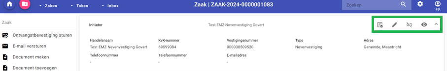

>Klik op het pijltje rechtsboven om de gegevens in- en uit te klappen!
>Klik op het oog icoon om naar de persoons- of bedrijfsgegevenspagina te gaan!
>Klik op het pagina icoon om meer bedrijfsgegevens op te halen. Deze functie is alleen voor een bedrijf beschikbaar!

### Betrokkene toevoegen

Een betrokkene is een persoon of bedrijf die een rol speelt bij een zaak. Deze kunnen handmatig aan een zaak worden toegevoegd op een vergelijkbare wijze als het toekennen van een initiator. Een zaak kan meerdere betrokkenen hebben.

**Stappen**

1 In een zaak kies je de actie *Betrokkene toevoegen*

2 In het scherm dat opent kies je bovenin voor een persoon of bedrijf

3 Kies de soort betrokkenheid van de betrokkene

4 Vul een toelichting in, deze wordt vastgelegd in de zaakhistorie

5 Zoek de persoon of het bedrijf

Een persoon kan gezocht worden op een aantal velden, dit zijn:

- bsn
- geslachtsnaam en geboortedatum
- geslachtsnaam, voornamen en gemeentecode
- postcode en huisnummer
- gemeentecode, huisnummer en straat

Een bedrijf of rechtspersoon kan gezocht worden op de volgende velden:

- KvK-nummer
- vestigingsnummer
- RSIN (rechtspersoon)
- handelsnaam
- postcode en huisnummer

Na het invullen van een zoekveld geeft het zoekscherm aan welke andere velden ingevuld moeten worden. De knop ‘Zoek’ wordt pas actief als een juiste combinatie van velden is ingevuld.

6 Klik in de lijst van zoekresultaten op het poppetje icoon om een persoon of bedrijf aan de zaak toe te voegen

Betrokkenen zijn nadat ze zijn toegevoegd te vinden onder de tab ‘Betrokkenen’ in het zaakgegevensscherm. Deze tab is niet bij de zaak aanwezig als er geen betrokkene is toegevoegd.

Vanuit het overzicht is het via het oog icoon mogelijk om naar de persoons- of bedrijfsgegevenspagina te gaan. Daarnaast kan een betrokkene ontkoppeld worden door op het ontkoppel icoon te klikken (een reden is verplicht).
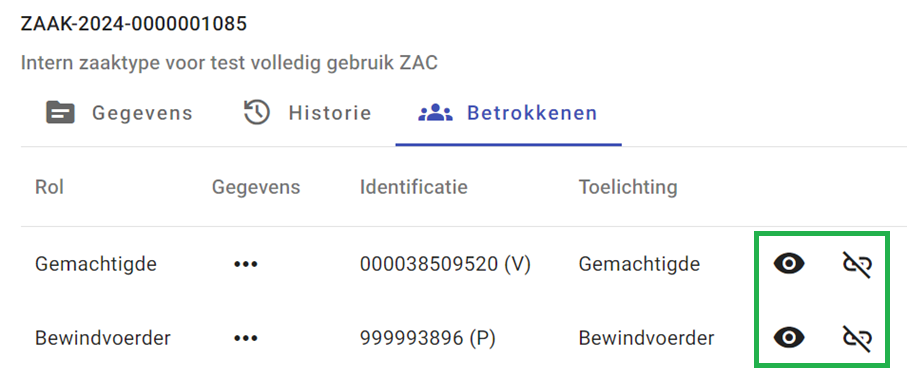

>De letter achter de identificatie geeft aan of het een persoon, vestiging of rechtspersoon betreft!
>Klik op de drie puntjes om de naam van de betrokkene op te halen en te tonen!

### BAG-object toevoegen

Met deze actie kan een adres en andere typen BAG-objecten uit de Basisregistratie adressen en gebouwen (BAG) aan een zaak worden toegevoegd.

**Stappen:**

1 In een zaak kies je de actie *BAG object toevoegen*

2 In het scherm dat opent zoek je of postcode, of straatnaam (met of zonder nummer), of plaats. Of een combinatie of deze 3 opties.

De lijst van zoekresultaten bevat gevonden adressen. Om de bijbehorende BAG-objecten van een adres te zien klap je het adres uit door op het pijltje te klikken. De typen BAG-objecten die nu getoond worden zijn nummeraanduiding, openbare ruimte, woonplaats en pand.

3 Klik in de lijst van zoekresultaten op het huis icoon om het BAG-object aan de zaak toe te voegen. Het BAG-object wordt direct aan de zaak toegevoegd terwijl het ‘BAG-object toevoegen’ scherm nog open is. Als je de gewenste objecten gekoppeld hebt sluit je het scherm door op het kruisje te klikken.

BAG-objecten zijn nadat ze zijn toegevoegd te vinden onder de tab ‘BAG objecten’ in het zaakgegevensscherm. Deze tab is niet bij de zaak aanwezig als er geen BAG-object is toegevoegd.

Vanuit het overzicht is het via het oog icoon mogelijk om naar de BAG-objecten gegevenspagina te gaan. Daarnaast kan een BAG-object ontkoppeld worden door op het ontkoppel icoon te klikken (een reden is verplicht).
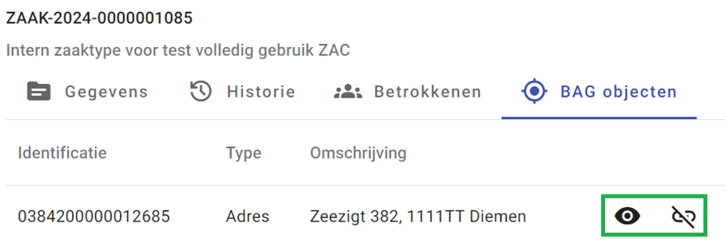

## Taken

### Werking van taken

Tijdens het behandelen van een zaak zijn er taken beschikbaar. Een taak is een activiteit die nodig is voor de behandeling van de zaak die door een collega binnen de organisatie moet worden uitgevoerd, bijvoorbeeld de uitkomst van aanvullend gevraagde informatie vastleggen of een goedkeuring geven. De medewerker die de taak uitvoert werkt ook in de ZAC en krijgt de taak toegekend.

Een taak is beschikbaar in het actiemenu en wordt aangemaakt door de behandelaar van een zaak. Iedere fase van het afhandelproces heeft een of meerdere taken die in die fase gebruikt kunnen worden. Taken kunnen herhaaldelijk worden uitgevoerd. Alle taken moeten afgehandeld zijn om de zaak naar de volgende fase door te zetten.

Een taak bestaat uit twee delen: het taakstartscherm en het taakbehandelscherm.

### Starten van taken

In het taakstartscherm kan de zaakbehandelaar de gegevens die voor de taak gelden invullen. In sommige taken is het ook mogelijk om een document aan te vinken dat van belang voor de taak is. Als een taak per e-mail wordt uitgezet dan kan in dit scherm ook het e-mailadres worden ingevuld. Tot slot kan de zaakbehandelaar in dit scherm kiezen aan welke groep en eventueel aan welke behandelaar de taak wordt toegekend. Het taakbehandelscherm bevat de gegevens en velden die de taakbehandelaar nodig heeft om de uitkomst van de taak vast te leggen.

***Beschikbare taken in de ‘Intake’ fase***

Taak: Aanvullende informatie

Deze taak is bedoeld om ontbrekende informatie op te vragen bij de klant of een belanghebbende. De taak ondersteunt deze activiteit door een mail te versturen, de zaak eventueel op te schorten, de uiterlijke afhandeldatum vast te leggen en een taak aan te maken om deze datum te kunnen bewaken.

***Beschikbare taken in de ‘In behandeling’ fase***

Taak: Advies intern

Deze taak is bedoeld om aan een adviseur een advies over de zaak te vragen. De adviseur is een groep of een medewerker die ook in de ZAC werkt. Het gevraagde advies kan betrekking hebben op een document, maar dat is niet verplicht. De taak ondersteunt de adviseur bij het vastleggen van het advies en kan door de behandelaar van de zaak gebruikt worden om de voortgang van de activiteit te bewaken.

Taak: Advies extern

Deze taak is bedoeld om aan een adviseur die niet in de ZAC werkt een advies over de zaak te vragen. Het gevraagde advies kan betrekking hebben op een document, maar dat is niet verplicht. De taak ondersteunt deze activiteit door een mail naar de adviseur te sturen, de vraag vast te leggen en kan door de behandelaar van de zaak gebruikt worden om de voortgang van de activiteit te bewaken.

Taak: Goedkeuren

Deze taak is bedoeld om aan een goedkeuring van iets over de zaak te vragen, bijvoorbeeld een voorgenomen oplossingsrichting of besluit. De goedkeurder is een groep of een medewerker die ook in de ZAC werkt. De goedkeuring kan betrekking hebben op een document, maar dat is niet verplicht.

### Inzien en behandelen van taken

Nadat een taak is aangemaakt verschijnt deze in het overzicht van taken. Vanuit het overzicht kan een taak geopend worden om deze te bekijken of te behandelen.
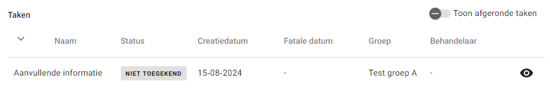

>Klik op het schuifje om ook de eerder afgeronde taken in het overzicht te zien!
>Klik op het uitklappijltje in de kolomkop om meer gegevens over de taken te zien!

### Werking van de Taak: Aanvullende informatie

Deze taak is bedoeld om ontbrekende informatie op te vragen bij de klant of een belanghebbende. Om de taak aan te maken volg je de volgende stappen:

**Stappen:**

1 In een zaak kies je de taak *Aanvullende informatie*

2 In het taakstartscherm dat opent, controleer je eerst of de afzender van de mail, dit is het mailadres van waaruit de mail verstuurd wordt, juist is. Daarna vul je het e-mailadres van de ontvanger in. Als het e-mailadres van de initiator bekend is dan kan je deze direct toevoegen door op het poppetje icoon in het veld te klikken.

3 Maak het bericht van de e-mail op. Deze is op basis van een mailtemplate voorgevuld.

Het is bij het opmaken van het bericht mogelijk om gebruik te maken van variabelen. Deze zijn in het menu bij het bericht beschikbaar en kunnen vanuit de lijst in het bericht geplaatst worden. Na het verzenden van de mail worden deze gevuld met de waarde die ze representeren.

4 Voeg eventueel een bijlage aan de mail toe door deze te selecteren

5 De fatale datum is de datum dat de taak uiterlijk moet zijn afgehandeld, deze is bepaald op basis van een instelling in de zaps en kan eventueel worden aangepast.

6 Als je de zaak wilt opschorten dan vink je deze optie aan. De streef- en fatale datum van de zaak worden dan opgeschort tot de datum die als fatale datum bij de taak is aangegeven (zie de vorige stap). Een zaak kan maar eenmaal opgeschort worden dus als dit al een keer gebeurd is dan is deze optie niet beschikbaar

7 Kies de groep en/of de behandelaar aan wie de taak toegekend moet worden

De groep is voor ingevuld op basis van een instelling in de zaps. Het is mogelijk om deze groep te wijzigen of om zelf een behandelaar te kiezen. Er kan alleen een behandelaar gekozen worden die bij de gekozen groep hoort.

8 Klik op ‘Starten’ om de taak aan te maken

De taak verschijnt nu bij de zaak in het overzicht van taken. Om de taak te behandelen kan deze via het oog icoon geopend worden vanuit dit overzicht. Daarnaast is de taak beschikbaar via de werklijsten. Volg de volgende stappen om de taak te behandelen.

**Stappen:**

1 Open de taak door op het oog icoon te klikken

Bovenaan de taak is de verzonden mail te zien. Deze mail is ook als document bij de zaak beschikbaar.

2 Vul de gevraagde gegevens van de taak in.

3 Als de zaak is opgeschort is het mogelijk om bij het afronden van deze taak de zaak automatisch te laten hervatten. Geef bij ‘Zaak hervatten’ aan of dit gewenst is. Deze optie is alleen beschikbaar als de zaak is opgeschort.

4 Als het nodig is om een document aan de zaak toe te voegen of een nieuw document te maken dan zijn deze acties beschikbaar in het linker menu

5 Klik op ‘Opslaan en afronden’ om de taak af te ronden. Met de knop ‘Tussentijds opslaan’ worden de vastgelegde gegevens opgeslagen maar, wordt de taak niet afgerond.

### Werking van de Taak: Advies intern

Deze taak is bedoeld om een advies over de zaak te vragen bij een interne adviseur. Om de taak aan te maken volg je de volgende stappen:

**Stappen:**

1 In een zaak kies je de taak *Advies intern*

2 In het taakstartscherm dat opent, vul je vraag voor de adviseur in. Als er relevante documenten zijn waar de adviseur naar moet kijken dan vink je deze in.

3 Kies de groep en/of de behandelaar aan wie de taak toegekend moet worden

De groep is voor ingevuld op basis van een instelling in de zaps. Het is mogelijk om deze groep te wijzigen of om zelf een behandelaar te kiezen. Er kan alleen een behandelaar gekozen worden die bij de gekozen groep hoort.

4 Klik op ‘Starten’ om de taak aan te maken

De taak verschijnt nu bij de zaak in het overzicht van taken. Om de taak te behandelen kan deze via het oog icoon geopend worden vanuit dit overzicht. Daarnaast is de taak beschikbaar via de werklijsten. Volg de volgende stappen om de taak te behandelen:

**Stappen:**

1 Open de taak door op het oog icoon te klikken

Bovenaan de taak is de vraag en eventuele door de behandelaar geselecteerde relevante documenten te zien. De documenten kunnen bekeken of gedownload worden door op de knoppen in de regel te klikken. Ctrl + oog icoon opent het document in een nieuw tabblad.

2 Vul de gevraagde gegevens van de taak in.

3 Als het nodig is om een document aan de zaak toe te voegen of een nieuw document te maken dan zijn deze acties beschikbaar in het linker menu

4 Klik op ‘Opslaan en afronden’ om de taak af te ronden. Met de knop ‘Tussentijds opslaan’ worden de vastgelegde gegevens opgeslagen maar, wordt de taak niet afgerond.

### Werking van de Taak: Goedkeuren

Deze taak is bedoeld om een goedkeuring over de zaak te vragen bij een interne groep of medewerker. Om de taak aan te maken volg je de volgende stappen:

**Stappen:**

1 In een zaak kies je de taak *Goedkeuren*

2 In het taakstartscherm dat opent, vul je vraag voor de goedkeurder in. Als er relevante documenten zijn waar de goedkeurder naar moet kijken dan vink je deze in.

3 Kies de groep en/of de behandelaar aan wie de taak toegekend moet worden

De groep is voor ingevuld op basis van een instelling in de zaps. Het is mogelijk om deze groep te wijzigen of om zelf een behandelaar te kiezen. Er kan alleen een behandelaar gekozen worden die bij de gekozen groep hoort.

4 Klik op ‘Starten’ om de taak aan te maken

De taak verschijnt nu bij de zaak in het overzicht van taken. Om de taak te behandelen kan deze via het oog icoon geopend worden vanuit dit overzicht. Daarnaast is de taak beschikbaar via de werklijsten. Volg de volgende stappen om de taak te behandelen:

**Stappen:**

1 Open de taak door op het oog icoon te klikken

Bovenaan de taak is de vraag en eventuele door de behandelaar geselecteerde relevante documenten te zien. De documenten kunnen bekeken of gedownload worden door op de knoppen in de regel te klikken. Ctrl + oog icoon opent het document in een nieuw tabblad.

2 Vul de gevraagde gegevens van de taak in.

3 Plaats als dit nodig is een digitale ondertekening op het document door de checkbox in de regel van het document aan te vinken

4 Als het nodig is om een document aan de zaak toe te voegen of een nieuw document te maken dan zijn deze acties beschikbaar in het linker menu

5 Klik op ‘Opslaan en afronden’ om de taak af te ronden. Met de knop ‘Tussentijds opslaan’ worden de vastgelegde gegevens opgeslagen, maar wordt de taak niet afgerond.

### Werking van de Taak: Advies extern

Deze taak is bedoeld om een advies dat bij een externe adviseur is gevraagd vast te leggen bij de zaak. Een externe adviseur is iemand die niet in de ZAC werkt en dus ook iet de taak kan afhandelen. Deze taak is dan ook bedoeld om het gevraagde advies vast te leggen en zo inzichtelijk te maken dat dit gedaan is. Verder kan de aangemaakte taak gebruikt worden om de voortgang te bewaken en het gegeven advies in vast te leggen. Om de taak aan te maken volg je de volgende stappen:

**Stappen:**

1 In een zaak kies je de taak *Advies extern*

2 In het taakstartscherm dat opent, vul je vraag die je aan de adviseur hebt gesteld in. Vul ook in wie de adviseur is aan wie je de vraag gesteld hebt en via welke bron je dat gedaan hebt. Zo is het voor de betrokken groep inzichtelijk op welk moment welke vraag aan wie gesteld is.

3 Kies de groep en/of de behandelaar aan wie de taak toegekend moet worden.

De groep is voor ingevuld op basis van een instelling in de zaps. Het is mogelijk om deze groep te wijzigen of om zelf een behandelaar te kiezen. Er kan alleen een behandelaar gekozen worden die bij de gekozen groep hoort.

4 Klik op ‘Starten’ om de taak aan te maken

De taak verschijnt nu bij de zaak in het overzicht van taken. Om de taak te behandelen kan deze via het oog icoon geopend worden vanuit dit overzicht. Daarnaast is de taak beschikbaar via de werklijsten. Volg de volgende stappen om de taak te behandelen:

**Stappen:**

1 Open de taak door op het oog icoon te klikken

Bovenaan de taak zijn de gegevens van het gevraagde advies te zien.

2 Vul de gevraagde gegevens van de taak in.

3 Als het nodig is om een document aan de zaak toe te voegen of een nieuw document te maken dan zijn deze acties beschikbaar in het linker menu

4 Klik op ‘Opslaan en afronden’ om de taak af te ronden. Met de knop ‘Tussentijds opslaan’ worden de vastgelegde gegevens opgeslagen, maar wordt de taak niet afgerond.

### Werking van de Taak: Document verzenden

Deze taak is bedoeld om een document door een interne groep of medewerker te laten verzenden. Het is een alternatief van de _actie_ Document verzenden waarbij je als behandelaar zelf het document verzendt. Nadat de taak is afgerond wordt ook hier het document dan voorzien van een verzenddatum en een ‘is verzonden’ indicatie zodat het duidelijk is dat dit document is verzonden en wanneer dit is gebeurd. Alleen documenten die aan de voorwaarden voor verzenden voldoen kunnen met deze taak worden verzonden.

Om de taak aan te maken volg je de volgende stappen:

**Stappen:**

1 In een zaak kies je de taak *Document verzenden*

2 In het taakstartscherm dat opent, selecteer je het document dat verzonden moet worden.

In de lijst van te verzenden documenten staan alleen documenten die:

- van het bestandstype PDF zijn
- status ‘Definitief’ hebben
- geen ontvangstdatum hebben
- niet de vertrouwelijkheidsaanduiding ‘Geheim, Zeer geheim’ of ‘Confidentieel’ hebben

3 Vul een toelichting op de taak in, deze is door de behandelaar van de taak te zien

4 Kies de groep en/of de behandelaar aan wie de taak toegekend moet worden

De groep is vooringevuld op basis van een instelling in de zaps. Het is mogelijk om deze groep te wijzigen of om zelf een behandelaar te kiezen. Er kan alleen een behandelaar gekozen worden die bij de gekozen groep hoort.

5 Klik op ‘Starten’ om de taak aan te maken

De taak verschijnt nu bij de zaak in het overzicht van taken. Om de taak te behandelen kan deze via het oog icoon geopend worden vanuit dit overzicht. Daarnaast is de taak beschikbaar via de werklijsten. Volg de volgende stappen om de taak te behandelen:

**Stappen:**

1 Open de taak door op het oog icoon te klikken

Bovenaan de taak is het document dat verzonden moet worden te zien, dit kunnen er meerdere zijn. De documenten kunnen bekeken of gedownload worden door op de knoppen in de regel te klikken. Ctrl + oog icoon opent het document in een nieuw tabblad.

2 Vul de verzenddatum van het document in.

3 Vul indien nodig de toelichting die door de aanmaker van de taak is gegeven aan, deze wordt vastgelegd als toelichting in de taakhistorie

4 Klik op ‘Opslaan en afronden’ om de taak af te ronden. Met de knop ‘Tussentijds opslaan’ worden de vastgelegde gegevens opgeslagen, maar wordt de taak niet afgerond.

Nadat de actie is afgerond is het document voorzien van een ‘is verzonden’ indicatie.

## Zaak koppelen

### Werking van zaakrelaties

In sommige werkprocessen of -situaties komt het voor dat zaken een relatie met elkaar hebben. Het is in de ZAC mogelijk om twee zaken aan elkaar te koppelen. Hiervoor zijn meerdere soorten relaties tussen zaken mogelijk. Of een bepaalde relatie gelegd mag worden is afhankelijk van of dit in de zaaktypen is ingesteld. Als dit niet is ingesteld dan biedt de ZAC ook niet de mogelijkheid om deze koppeling te maken.

De ZAC kent de volgende soorten relaties tussen twee zaken:

- Hoofd- en deelzaak
- Relevante andere zaak

Toelichting op de afhankelijkheid van zaaktype inrichting:

- Om een hoofd-deelzaakrelatie te leggen moet in het zaaktype van de hoofdzaak zijn ingesteld dat deze relatie gelegd mag worden.
- Om een relevante andere zaak relatie te leggen moet in het zaaktype van de zaak die je wilt koppelen een zaaktyperelatie gelegd zijn met het zaaktype van de zaak waaraan je deze wilt koppelen.

Een deelzaak wordt gebruikt om een deel van het proces dat tot de uitkomst van de hoofdzaak leidt tot stand te laten komen. Hierbij geldt dat de hoofdzaak pas mag worden afgehandeld als de deelzaak is afgehandeld. Deze relatie mag dan ook alleen tussen openstaande zaken gelegd worden. Verder heeft een deelzaak in de ZAC dezelfde functionaliteit als een reguliere zaak beschikbaar.

Een relevante andere zaak wordt gebruikt om een relatie tussen twee zaken duidelijk te maken. Er zijn 3 soorten relevante andere zaken mogelijk:

- Onderwerp: De andere zaak is relevant voor c.q. is onderwerp van de onderhanden zaak
- Vervolg: De andere zaak gaf aanleiding tot het starten van de onderhanden zaak
- Bijdrage: Aan het bereiken van de uitkomst van de andere zaak levert de onderhanden zaak een bijdrage

Een andere relevante zaak relatie tussen zaken kan één- of tweezijdig gelegd worden waarbij, afhankelijk van de zaaktype inrichting, in de ZAC de volgende relaties mogelijk zijn om te leggen:

- Onderwerp-onderwerp
- Bijdrage-vervolg
- Vervolg-bijdrage

### Zaak koppelen om een zaakrelatie te leggen

Voor het koppelen van zaken wordt de klembord functionaliteit gebruikt.

**Stappen:**

1 In een zaak kies je actie *Zaak koppelen*

2 De geopende zaak is nu op het klembord gezet. Het klembord vind je onderaan het scherm.

3 Zoek de zaak waaraan je de zaak wilt koppelen en open deze

4 In de geopende zaak klik je in het klembord op het koppelen icoon
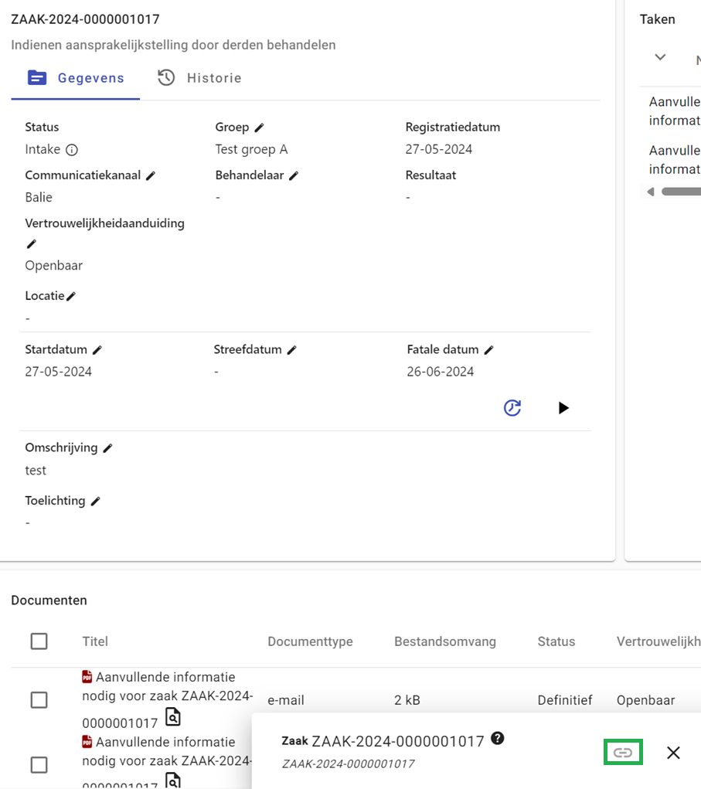

5 Kies de relatie die de zaak op het klembord moet krijgen ten opzichte van de geopende zaak. Merk op, hier worden alleen de mogelijke opties getoond.
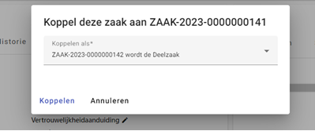

6 Klik op ‘Koppelen’ om de koppeling te leggen

### Inzien gekoppelde zaken

Als een zaak een gekoppelde zaak heeft, is deze bij een geopende zaak te benaderen via het tabblad ‘Gerelateerde zaken’. Deze tab is alleen aanwezig als er een gekoppelde zaak is. Daarnaast heeft bij en hoofd-deelzaak relatie een gekoppelde zaak de indicatie ‘Is hoofdzaak’ of ‘Is deelzaak’ op de zaakgegevenspagina. Relevante andere zaken hebben dit niet. Om naar de gekoppelde zaak te gaan kan op het oog icoon geklikt worden.

Het is ook mogelijk om vanuit een zaak de documenten van de gekoppelde zaak te bekijken. Deze kunnen in het zaakdocumentenoverzichten worden weergegeven door het ‘Toon documenten van gerelateerde zaken’ schuifje aan te zetten.
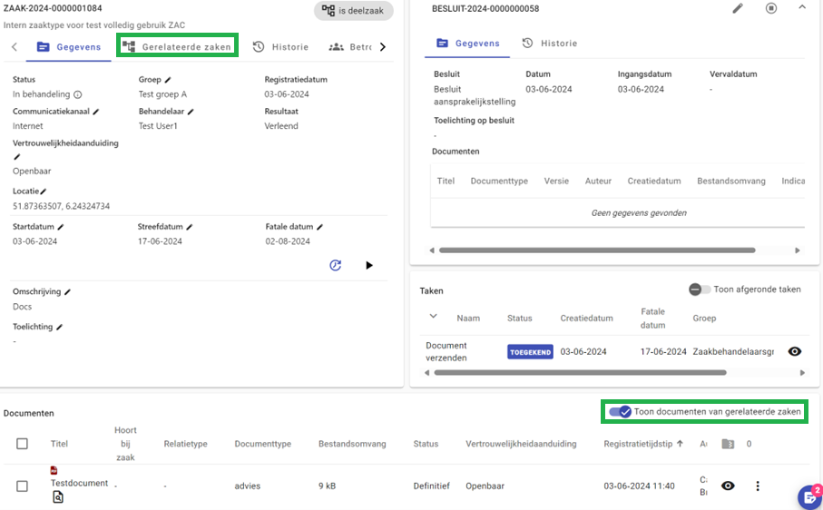

### Ontkoppelen zaken

Gekoppelde zaken kunnen weer los van elkaar gemaakt worden door ze te ontkoppelen.

**Stappen:**

1 In een zaak open je het tabblad ‘Gerelateerde zaken’

2 Klik in de regel van de zaak die je wilt ontkoppelen op het Zaak ontkoppelen icoon

3 Vul de reden waarom je zaak gaat ontkoppelen in

4 Klik op ‘Ontkoppelen’ om de koppeling te verwijderen

## Zaak afhandelen

### Besluit vastleggen

De uitkomst van de behandeling van een zaak kan als zaakbesluit worden vastgelegd. Bij dit besluit kan ook het document waarin dit besluit is vastgelegd worden toegevoegd. Het is mogelijk om meerdere besluiten bij een zaak vast te leggen.

Of een besluit kan worden vastgelegd is afhankelijk van of dit is ingesteld bij het zaaktype. In het zaaktype kan ook zijn ingesteld dat een besluit verplicht moet worden vastgelegd als bij die zaak een bepaald resultaattype wordt vastgelegd. In dat resultaat kan namelijk vastliggen dat de bewaartermijn pas in mag gaan zodra de ingangs- of vervaldatum van dat besluit is bereikt.

**Stappen:**

1 In een zaak kies je de actie *Besluit vastleggen*

2 In het scherm dat opent kies je het resultaat dat de zaak gaat krijgen

3 Kies het besluit uit de lijst van beschikbare besluittypen

4 Op basis van het gekozen resultaat bepaalt het systeem of de vervaldatum van het besluit verplicht moet worden ingevuld. Vul de ingangsdatum en, indien bekend, de vervaldatum van het besluit in.

5 Op basis van het geselecteerde beslissingstype bepaalt het systeem of publicatie- en uiterlijke reactiedatum kunnen worden gebruikt en vult deze vooraf in. Vul de effectieve publicatie- en uiterlijke reactiedatum in, indien deze afwijken van de standaard. 
>De uiterlijke reactiedatum van het besluit kan niet eerder worden ingesteld dan de gedefinieerde reactietermijn 

6 Selecteer het document waarin het besluit is opgenomen. Alleen documenttypen waarvan bij het besluittype is ingesteld dat deze gekozen mogen worden verschijnen in het overzicht.
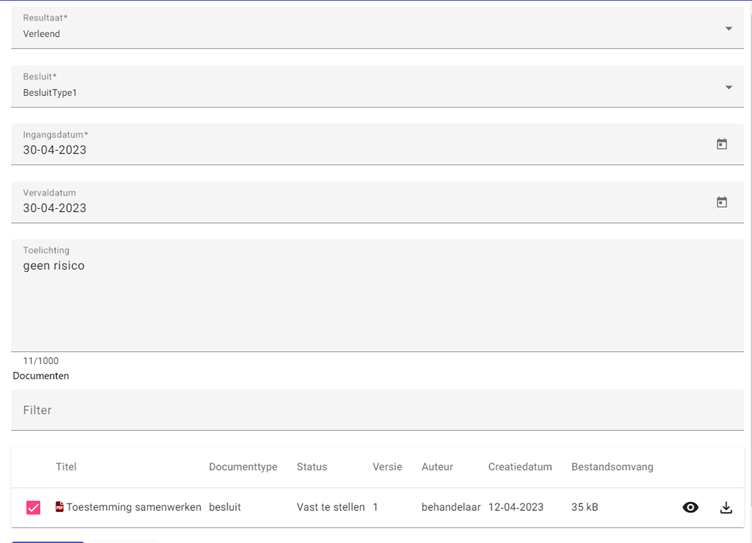

>Dit document is te koppelen omdat het documenttype ‘Besluit’ aan het besluittype ‘BesluitType1’ is gekoppeld!

7 Klik op ‘Aanmaken’ om het besluit vast te leggen

8 Om eventueel een volgend besluit vast te leggen herhaal je de voorgaande stappen. Bij een volgend besluit is het eerder vastgelegde resultaat al voor ingevuld.

Nadat het besluit is aangemaakt wordt deze naast het blok met zaakgegevens weergegeven. Als er meerdere besluiten zijn toegevoegd dan is de meest recent toegevoegde opengeklapt en staan de oudere besluiten eronder. Deze kunnen opengeklapt worden door er op te klikken.

### Besluit wijzigen

De gegevens van een vastgelegd besluit kunnen gewijzigd worden. Door op het potlood icoon te klikken kan het besluitscherm weer geopend worden en zijn gegevens aan te passen. Het besluittype is niet aan te passen. Het is verplicht om hierbij een reden op te geven, deze wordt gebruikt bij het vastleggen in de historie.

**Stappen:**

1 In een zaak klik je bij het besluit dat je wilt wijzigen op het potlood icoon *Besluit wijzigen*

2 In het scherm dat opent, wijzig je de gegevens

3 Vul de reden voor het wijzigen in, deze wordt vastgelegd in de besluithistorie

4 Klik op ‘Wijzigen’ om het besluit weer op te slaan

### Besluit intrekken

Een besluit kan ingetrokken worden door deze een vervaldatum en -reden te geven. Om dit uit te voeren is het stop icoon beschikbaar bij een besluit. Als een besluit een verzonden document heeft dan wordt de behandelaar daarop geattendeerd.

**Stappen:**

1 In een zaak klik je bij het besluit dat je wilt intrekken op het stop icoon *Besluit intrekken*

2 In het scherm dat opent, vul je in per wanneer het besluit vervalt en kies je een vervalreden

3 Vul de toelichting voor het intrekken in

4 Klik op ‘Wijzigen’ om het besluit weer op te slaan

### Zaak afhandelen

Met deze actie kan een zaak die helemaal gereed is worden afgehandeld. Deze actie is dan ook alleen beschikbaar als alle taken zijn afgerond.

Bij het afhandelen van de zaak wordt het resultaat vastgelegd. Dit resultaat bepaalt vervolgens op welke wijze de zaak gearchiveerd wordt. Het kan voorkomen dat bij een bepaald resultaat een besluit is vastgelegd, dit wordt in die situatie door de ZAC afgedwongen.

**Stappen:**

1 In een zaak kies je de actie *Zaak afhandelen*

2 In het scherm dat opent kies je het resultaat dat de zaak krijgt. Als je voor de zaak al een besluit hebt vastgelegd dan is dit resultaat al vastgelegd via die actie. Als je dit resultaat nog wilt wijzigen dan ga je naar stap 7.

3 Vul eventueel een toelichting in, deze wordt vastgelegd in de zaakhistorie

4 Geef aan of je een e-mail over het afhandelen van de zaak wilt versturen. Als je deze aanvinkt, ga je naar stap 5, anders ga je verder met stap 6

5 Controleer eerst of de afzender van de mail, dit is het mailadres van waaruit de mail verstuurd wordt, juist is. Daarna vul je het e-mailadres van de ontvanger in. Als het e-mailadres van de initiator bekend is dan kan je deze direct toevoegen door op het poppetje icoon in het veld te klikken. Om de inhoud van het bericht te bekijken klik je op het pijltje in het ‘Bericht’ veld.

6 Klik op ‘Zaak afhandelen’ om de actie uit te voeren

7 Sluit de actie *Zaak afhandelen* door te klikken op ‘Annuleren’

8 Klik op het potlood icoon van het vastgelegde besluit

9 In het scherm dat opent pas je het resultaat aan en vul je de reden voor het wijzigen in

10 Klik op ‘Wijzigen’ om de aanpassingen in het besluit vast te leggen

11 Om de zaak af te handelen ga je weer terug naar stap 1

## Zaak heropenen

Een beëindigde zaak heeft een beperkt aantal mogelijkheden om gegevens te wijzigen. Door een zaak te heropenen worden de einddatum en de eindstatus van de zaak verwijderd. Er kan daarna een aantal van de gegevens, waaronder het resultaat en het besluit, alsnog gewijzigd worden. Daarnaast kunnen bijvoorbeeld documenten worden toegevoegd of ontkoppeld. Een heropende zaak kan net als een openstaande zaak worden afgehandeld met de *zaak afhandelen* actie.

Het afhandelproces is niet beschikbaar bij een heropende zaak wat betekent dat er geen nieuwe taken gestart kunnen worden. Ook is andere proces gerelateerde functionaliteit zoals opschorten en verlengen niet beschikbaar

De heropenen optie is alleen mogelijk als een gebruiker een bepaalde rol heeft, dat is nu de 'Recordmanager' rol.

**Stappen:**

1 In een zaak kies je de actie *Zaak heropenen*

2 Vul de reden dat de zaak wordt heropend in. Deze reden wordt vastgelegd in de zaakhistorie.

3 Klik op ‘Zaak heropenen’ om de actie uit te voeren

# Persoons-/bedrijfspagina

De gegevens van een persoon of bedrijf kunnen bekeken worden vanuit de persoons- of bedrijfsgegevenspagina. De pagina bevat de gegevens van de persoon of bedrijf zoals bij de bron opgehaald plus de contactgegevens zoals deze in Open Klant geregistreerd zijn.

Daarnaast bevat de pagina een overzicht van alle zaken waar de persoon of bedrijf bij betrokken is die in de ZAC worden behandeld. Het overzicht bevat, net als de werklijsten, sorteer- en filtermogelijkheden en toont standaard de openstaande zaken. Het is ook mogelijk om afgeronde zaken aan het overzicht toe te voegen.

Deze pagina is te benaderen door vanuit een zaak op het oog icoon van een initiator of betrokkene te klikken of door een persoon of bedrijf via de zoekfunctie te openen.
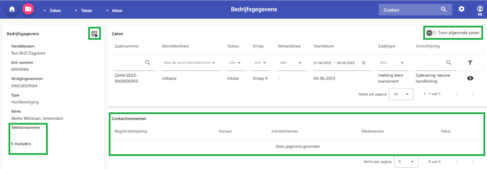

>Klik op het schuifje om ook afgehandelde zaken in het overzicht te zien!
>Als er in Open Klant contactgegevens aanwezig zijn dan worden deze getoond, zo niet, dan staat er een streepje!
>Als er contactmomenten aanwezig zijn dan worden deze getoond, zo niet, dan is het overzicht leeg!
>Klik op het pagina icoon om meer bedrijfsgegevens op te halen. Deze functie is alleen voor een bedrijf beschikbaar!

# BAG-object pagina

De gegevens van een BAG-object kunnen bekeken worden vanuit de BAG-objectgegevenspagina. De pagina bevat de gegevens van het BAG-object zoals bij de bron opgehaald. Afhankelijk van het type BAG-object dat geopend is worden ook de gegevens van de bijbehorende BAG-objecten getoond. Bijvoorbeeld: als de BAG-object pagina van een nummeraanduiding is geopend dan kunnen ook de gegevens van de openbare ruimte en de woonplaats bekeken worden.

Daarnaast bevat de pagina een overzicht van alle zaken waar het BAG-object aan toegevoegd is en die in de ZAC worden behandeld. Het overzicht bevat, net als de werklijsten, sorteer- en filtermogelijkheden en toont standaard de openstaande zaken. Het is ook mogelijk om afgeronde zaken aan het overzicht toe te voegen.

Deze pagina is te benaderen door vanuit een zaak op het oog icoon van een BAG-object te klikken of door een BAG-object via de zoekfunctie te openen.
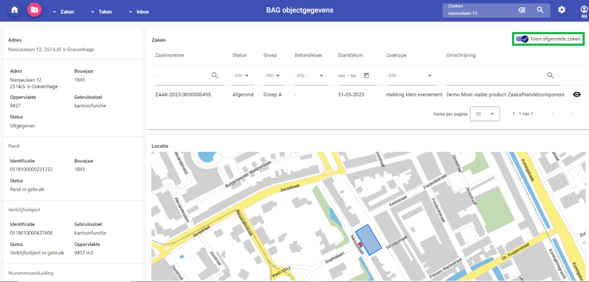

>Klik op het schuifje om ook afgehandelde zaken in het overzicht te zien!

# Documenten

## Overzicht

Een zaak kan één of meerdere documenten toegevoegd hebben. Toegevoegde documenten zijn in een overzicht onder de zaakgegevens te zien. Het overzicht kan gesorteerd worden door in de kolomkop op het pijl icoon te klikken. Bij een geopende taak is het overzicht eveneens beschikbaar.

Bij ieder document kan het oog icoon gebuikt worden om de documentgegevenspagina te openen. Als een document bewerkt mag worden dan is hiervoor het potlood icoon direct beschikbaar. Door op het kebabmenu te klikken kunnen andere functies voor documenten benaderd worden zonder de documentgegevenspagina te hoeven openen.
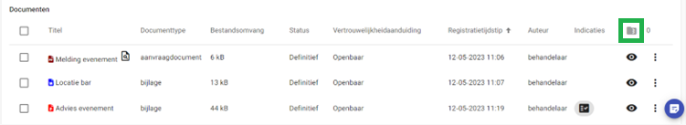

>Klik op het icoon naast de titel om een documentvoorbeeld te zien!
>Zweef met de muis over een indicatie om meer erover te weten te komen!
>Klik op het kebab menu om meerdere functies te kunnen gebruiken!
>Klik op het schuifje om ook documenten uit gekoppelde zaken in het overzicht te zien!
>Selecteer documenten en klik daarna op het zip icoon om een zip bestand van de documenten te maken!

## Document verplaatsen

Het kan gebeuren dat een document bij een verkeerde zaak wordt toegevoegd. Een document naar een andere zaak verplaatsen kan met het schaar icoon. Hiermee wordt het document op een klembord gezet en kan in een andere zaak het document vanaf het klembord aan een andere zaak worden toegevoegd.

**Stappen**

1 In het documentenoverzicht klik je bij het document dat je wilt verplaatsen op de drie puntjes en vervolgens op het schaar icoon. Het klembord verschijnt nu onder in beeld met het document erop geplaatst. Om het plaatsen of het klembord te annuleren klik je op het kruis.
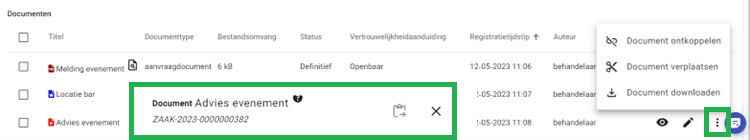

2 Open de zaak waar je het document aan wilt toevoegen. Het verplaatsen icoon bij het document is nu actief.

3 Klik op het document verplaatsen icoon om de actie uit te voeren

## Document ontkoppelen

Als een document bij een zaak is toegevoegd waar deze niet thuishoort dan kan deze ontkoppeld worden. Het document wordt dan bij de zaak weggehaald en komt in de werklijst Ontkoppelde documenten terecht. Vanuit deze werklijst kan het document naar een andere zaak verplaatst of verwijderd worden.

**Stappen**

1 In het documentenoverzicht klik je bij het document dat je wilt ontkoppelen op het kebab menu en vervolgens op het ontkoppelen icoon.
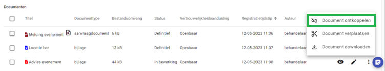

2 Vul de reden voor het ontkoppelen in en klik op ‘Ja’

3 De actie is uitgevoerd en het document is toegevoegd aan de werklijst Ontkoppelde documenten

## Documenten raadplegen

Vanuit het overzicht kan een document geopend worden door op het oog icoon te klikken. Ctrl + oog icoon opent het item in een nieuw tabblad. Van documenten die het van het bestandsformaat PDF of een afbeelding zijn kan een documentvoorbeeld worden bekeken door op het icoon naast de titel te klikken.

Als het document geopend is wordt het documentgegevensscherm met daarin alle metadata getoond. Van documenten van het bestandsformaat PDF of een afbeelding wordt een documentvoorbeeld getoond. Het bestand kan vanuit hier met de *Downloaden* actie worden geopend.

Als er meerdere versies van een document zijn dan kan de gebruiker met de &lt; en &gt; pijltjes naar een andere versie gaan.

## Document bewerken

Een bestand van het MS Word, Excel of PowerPoint formaat kan inhoudelijk bewerkt worden. Hierdoor ontstaat een nieuwe versie van het document. Dit is alleen mogelijk als de status van het document niet ‘Definitief’ is.

Een bestand bewerken kan vanuit de documentgegevenspagina met de *Bewerken actie*. Het is ook mogelijk om dit direct vanuit het documentenoverzicht te doen, als een document bewerkt kan worden dan is hierbij het potlood icoon beschikbaar waarmee direct bewerkt kan worden.

Hieronder staan de stappen om te bewerken vanuit de documentgegevenspagina.

**Stappen**

1 Op de documentgegevenspagina kies je de actie *Bewerken*

2 Bewerk het bestand in vanuit de applicatie waarin het geopend is

3 Sla het bestand op

4 Een nieuwe versie van het document is toegevoegd

## Metadata bewerken

De metadata van een document kunnen aangepast worden. Hierdoor ontstaat een nieuwe versie van het document. Dit is alleen mogelijk als de status van het document niet ‘Definitief’ is.

**Stappen**

1 Op de documentgegevenspagina kies je de actie *Nieuwe versie*

2 In het scherm dat opent, bewerk je de metadata

3 Klik op ‘Toevoegen’

## Document ondertekenen

Documenten kunnen digitaal ondertekend worden door een gebruiker van de ZAC. Dit kan zowel vanuit het document zelf als vanuit de Goedkeuren taak. Bij een ondertekening wordt gebruiker die heeft ondertekend en de datum en tijdstip van ondertekening vastgelegd. Een ondertekening leidt altijd tot een nieuwe versie van het document en een aanpassing van de status naar ‘Definitief’. Een versie van een document kan eenmaal ondertekend worden.

**Stappen:**

1 Op de documentgegevenspagina kies je de actie *Ondertekenen*

2 In het dialoogvenster dat opent, geef je aan of je wilt ondertekenen door op ‘Ja’ te klikken

Een document vanuit een ‘Goedkeuren’ taak ondertekenen werkt zoals hierna omschreven.

**Stappen:**

1 Open de 'Goedkeuren taak'

2 Het document (of meerdere) dat de zaakbehandelaar heeft gemarkeerd voor ondertekening staat in het overzicht bij Ondertekenen.

3 Vink het document aan in de check box om de ondertekening te zetten

4 Klik op ‘Opslaan’ of ‘Opslaan en afronden’
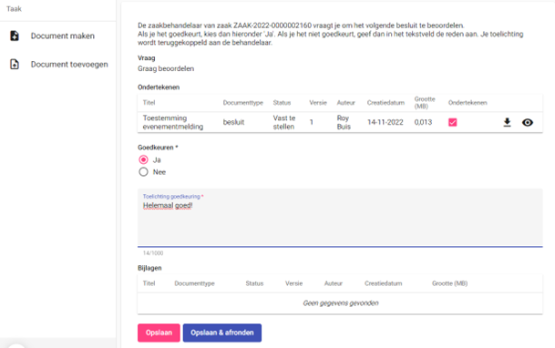

## Document converteren naar PDF

Van een document kan een PDF-versie gemaakt worden via de ‘Converteren’ actie. Dit is alleen mogelijk met MS Office documenten die de status ‘Definitief’ hebben.

**Stappen**

1 Op de documentgegevenspagina kies je de actie *Converteren*. De conversie wordt hierna direct gestart.

2 De PDF wordt als nieuwe versie van het document toegevoegd

## Document verwijderen

Een document kan verwijderd worden door het document vanuit een zaak of de werklijst ‘Ontkoppelde documenten’ te openen en gebruik te maken van de ‘Verwijderen’ actie. Deze actie is alleen mogelijk als een gebruiker een bepaalde rol heeft, dat is nu de 'Recordmanager' rol.

**Stappen:**

1 Op de documentgegevenspagina kies je de actie *Verwijderen*

2 Vul de reden voor het verwijderen in

3 Klik op ‘Document verwijderen’ om de actie uit te voeren
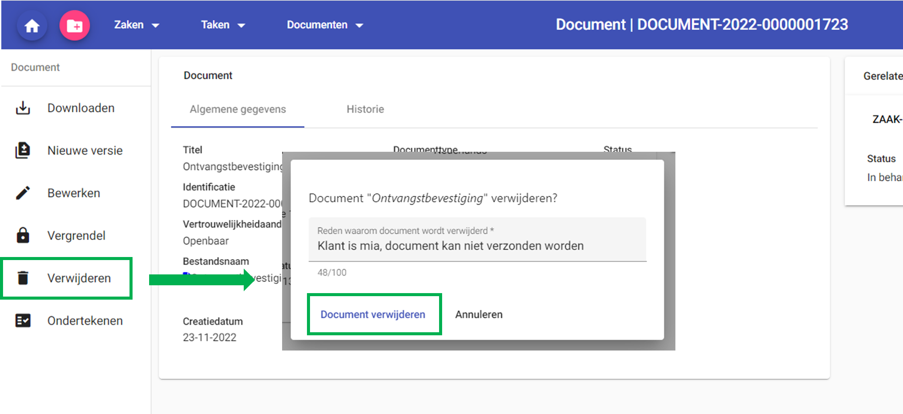

# Notities

Er kan op ieder moment bij een zaak een notitie worden vastgelegd. Een notitie kan handig zijn om bijvoorbeeld een aantekening vast te leggen die tijdens de behandeling kan helpen maar geen informatie bevat over de uiteindelijke uitkomst van de zaak.

De notities functie wordt geactiveerd met het Notities icoon rechtsonder in het zaakscherm. Als er notities bij een zaak aanwezig zijn dan geeft het icoon aan hoeveel er zijn.

## Notitie aanmaken

Een nieuwe notitie kan vanuit de Notities functie gestart worden.

**Stappen:**

1 In een zaak klik je op de Notities icoon

2 Voeg de tekst in de tekst box in
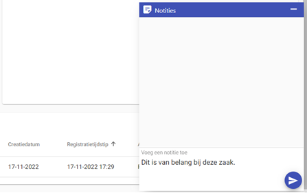

3 Klik op Opslaan om de notitie toe te voegen

4 De notitie is toegevoegd aan het notitieblok

## Notitie bewerken

Een bestaande notitie kan aangepast worden.

**Stappen:**

1 In een zaak klik je op de Notities icoon

2 Klik op het potlood icoon om de tekst box te activeren
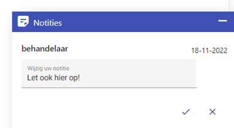

3 Pas de notitie aan

4 Klik op het vinkje om de notitie weer op te slaan. Met het kruis kan de aanpassing geannuleerd worden

## Notitie verwijderen

Een notitie kan verwijderd worden via de Notities functie. Let op de notitie is daarmee direct verwijderd en niet meer terug te halen.

**Stappen:**

1 In een zaak klik je op de Notities icoon

2 Klik op het prullenbak icoon om de notitie te verwijderen.

# Zoeken

Met de zoekfunctie kan gezocht worden naar gegevens over zaken die in de ZAC behandeld worden en de bijbehorende documenten en taken.

De zoekfunctie is vanuit de werkbalk te openen en kan direct gebruikt worden door het invoeren van zoektermen. Het zoekpaneel kan ook geopend worden door op het vergrootglas icoon te klikken en daarna in het scherm de zoektermen in te geven.

In het zoekpaneel kan gekozen worden voor vier categorieën: zaken, personen, bedrijven en BAG-objecten. Iedere categorie heeft haar eigen zoekscherm dat benaderd kan worden door op respectievelijk het dossier, poppetje, gebouw of kompas icoon te klikken.

## Werking van zoeken op zaken

Een zoekopdracht begint met het invullen van één of meer zoektermen in het ‘Zoeken’ veld. Hierbij kunnen onder andere de volgende hulpmiddelen gebruikt worden:

- Zoeken met booleaanse operatoren AND (&& of +), OR en NOT (!) Voorbeeld: bbq + park geeft alleen resultaten waarin beide woorden voorkomen
- Zoeken met \* wildcard in een zoekterm. Voorbeeld: fees\* vindt feest en feessie

Na het uitvoeren van de zoekopdracht kunnen de resultaten gefilterd worden op de zaak-, taak- of documentkenmerken die aan de linkerkant van het panel met checkboxen beschikbaar zijn. Het aanvinken van een optie filtert direct de zoekresultaten.

Het is tevens mogelijk om deze kenmerken juist uit te sluiten van de zoekresultaten. Om dit te activeren kan het schuifje boven de kenmerken verplaatst worden waardoor deze rood wordt en kunnen opties aangevinkt worden om uit te sluiten.

Door bij de zoekopdracht een keuze te maken bij ‘Zoeken in’ wordt alleen binnen dat specifieke kenmerk gezocht en worden andere zoekresultaten ook uitgesloten. Het ‘Zoeken in’ keuzeveld bevindt zich voor het ‘Zoeken’ veld

Bij de filteropties zit ook de mogelijkheid om te filteren op zaakinitiator. Dit kan door een bsn, vestigingsnummer of RSIN in te vullen of door een persoon of bedrijf te zoeken op een ander kenmerk door op het poppetje icoon te klikken.

Tot slot kan er gefilterd worden op datumkenmerken door een bereik in te vullen.

Een zoekresultaat kan geopend worden door op het oog icoon te klikken. Ctrl + oog icoon opent het item in een nieuw tabblad. Om een zoekopdracht te wissen kan op het X icoon in het ‘Zoeken’ veld geklikt worden. De zoekterm en de gekozen filters worden dan gewist en er kan aan een nieuwe zoekopdracht begonnen worden.

## Werking zoeken van personen

Een persoon zoeken werkt op een vergelijkbare manier als het toekennen van een initiator. De zoekfunctie voor personen is echter bedoeld om de persoonsgegevens en de zaken waarvan deze persoon initiator of betrokkene is te bekijken. Bij het openen van een zoekresultaat wordt de persoonspagina met deze gegevens getoond.

Een persoon kan gezocht worden op een aantal velden, dit zijn:

- bsn
- geslachtsnaam en geboortedatum
- geslachtsnaam, voornamen en gemeentecode
- postcode en huisnummer
- gemeentecode, huisnummer en straat

Na het invullen van een zoekveld geeft het zoekscherm aan welke andere velden ingevuld moeten worden. De knop ‘Zoek’ wordt pas actief als een juiste combinatie van velden is ingevuld.

Door in de lijst van zoekresultaten op het poppetje icoon te klikken opent de persoonspagina. In het overzicht van zaken kan, net als in de werklijsten, gefilterd en gesorteerd worden. Door te klikken op het oog icoon kan een item geopend worden, Ctrl + oog icoon opent het item in een nieuw tabblad.

## Werking zoeken van bedrijven

Een bedrijf zoeken werkt op dezelfde manier als een persoon zoeken en lijkt dus sterk op het toekennen van een initiator.

Een zoekopdracht begint met het invullen van de zoektermen. Een vestiging van een bedrijf kan gezocht worden op kvk-nummer, vestigingsnummer of handelsnaam. Een rechtspersoon kan alleen gezocht worden op RSIN.

Door in de lijst van zoekresultaten op het gebouw icoon te klikken opent de bedrijfspagina. In het overzicht van zaken kan, net als in de werklijsten, gefilterd en gesorteerd worden. Door te klikken op het oog icoon kan een item geopend worden, Ctrl + oog icoon opent het item in een nieuw tabblad.

## Werking zoeken van BAG-objecten

Een BAG-object zoeken werkt op dezelfde wijze als bij het toevoegen van een BAG-object.

Een BAG-object zoek je door (een combinatie van) straatnaam, postcode, huisnummer en woonplaats in te vullen. De lijst van zoekresultaten bevat gevonden adressen. Om de bijbehorende BAG-objecten van een adres te zien klap je het adres uit door op het pijltje te klikken. De typen BAG-objecten die nu getoond worden zijn nummeraanduiding, openbare ruimte, woonplaats en pand.

Door in de lijst van zoekresultaten op het oog icoon te klikken opent de BAG-objectpagina. De pagina bevat de gegevens van het BAG-object zoals bij de bron opgehaald. Afhankelijk van het type BAG-object dat geopend is worden ook de gegevens van de bijbehorende BAG-objecten getoond. Bijvoorbeeld: als de BAG-object pagina van een nummeraanduiding is geopend dan kunnen ook de gegevens van de openbare ruimte en de woonplaats bekeken worden.

Daarnaast bevat de pagina een overzicht van alle zaken waar het BAG-object aan toegevoegd is en die in de ZAC worden behandeld. Het overzicht bevat, net als de werklijsten, sorteer- en filtermogelijkheden en toont standaard de openstaande zaken. Het is ook mogelijk om afgeronde zaken aan het overzicht toe te voegen.

# Goed om te weten

## Begrippenlijst

**Zaak** een samenhangend geheel van werk dat in een Zaakregistratiecomponent wordt opgeslagen en in de ZAC wordt behandeld

**Taak** een stap in een proces of model dat in de ZAC wordt opgeslagen en bedoeld is om de behandeling van een zaak uit te voeren

**Document** een informatieobject dat in een Documentregistratiecomponent is opgeslagen en bedoeld is om de behandeling van een zaak uit te voeren

**Zaakafhandel-parameters** beheeronderdeel in de ZAC, afgekort als ‘zaps’, waarin per zaaktype aspecten van de zaakbehandeling ingesteld kunnen worden.

## Indicaties

De volgende indicaties worden gebruikt in de ZAC

| Indicatie      | Waar     | Icoon                    |
|----------------|----------|--------------------------|
| Is opgeschort  | Zaak     | Pauze                    |
| Is heropend    | Zaak     | Herstart ronde pijl      |
| Is hoofdzaak   | Zaak     | Boomdiagram gevuld       |
| Is deelzaak    | Zaak     | Boomdiagram open         |
| Is verlengd    | Zaak     | Klok met pijl voorwaarts |
| Is vergrendeld | Document | Slot                     |
| Is ondertekend | Document | Document met vink        |
| Heeft besluit  | Document | Hamer                    |
| Gebruiksrecht  | Document | Privacy                  |
| Is verzonden   | Document | Brievenbus met envelop   |
