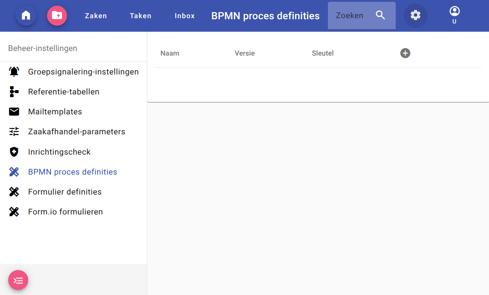

# BPMN guide (BETA)

:fire: The functionality described below is still "Beta". Beta software may contain errors or inaccuracies and may not function as well as regular releases. :fire:

## ZAC and BPMN
ZAC uses [Flowable](https://www.flowable.com/) to support BPMN processes. Forms that provide input for the BPMN processes are implemented using the [Forms.io](https://forms.io/) framework.

### Feature flag
By default, BPMN support in ZAC is disabled in K8s and enabled in local Docker Compose environment. This is controlled by the `FEATURE_FLAG_BPMN_SUPPORT` environment variable, that accepts `true` or `false` values.

## BPMN process definition
To create a BPMN process definition, you can:
* use Flowable [web editor](https://trial.flowable.com/design)
* start with our integration tests [process](../../../src/itest/resources/bpmn/itProcessDefinition.bpmn)

### Requirements

#### Candidate group/user
The "User tasks" should have the candidate group or user set. For example, the XML attribute in the `.bpmn` file might look like this: `flowable:candidateGroups="group"`

For example:
```xml
    <userTask id="userTask" name="User details" flowable:candidateGroups="group" flowable:formKey="testForm" flowable:formFieldValidation="false">
      ... the rest of userTask tags ...
    </userTask>
```

### Upload
1. Open ZAC
2. Go to the "Beheer-instellingen"
3. Open "BPMN Process definities"
4. Click on the plus sign to open a file selection dialog
5. Select the BPM process file



## Form.io form
To create a Form.io form:
* use the Form.io [Builder](https://formio.github.io/formio.js/app/builder)
* upload our integration tests [form](../../../src/itest/resources/bpmn/testForm.json)

### Upload
1. Open ZAC
2. Go to the "Beheer-instellingen"
3. Open "Form.io formulieren"
4. Click on the plus sign to open a file selection dialog
5. Select the Form.io form

### Validation
Form.io offers validation of the data entered in the form. 

For example, the emails can be validated by specifying `validate` and `type` keys:
```json
{
  "label": "E-mail sender",
  "type": "email",
  "key": "email",
  "input": true,
  "applyMaskOn": "change",
  "validate": {
    "required": true
  }
}
```

### ZAC extensions

#### Zaak status
To change zaak status you have to:
* create a service task
* set class `net.atos.zac.flowable.delegate.UpdateZaakJavaDelegate`
* add fields
   * `statustypeOmschrijving` to `stringvalue` equal to your desired zaak statustype omschrijving
   * `resultaattypeOmschrijving` to a valid `stringvalue`, required by your zaak statustype

For example:
```xml
    <serviceTask id="ServiceTask_357" name="Status to &quot;Verleend&quot;" flowable:class="net.atos.zac.flowable.delegate.UpdateZaakJavaDelegate">
      <extensionElements>
        <flowable:field name="statustypeOmschrijving">
          <flowable:string><![CDATA[Afgerond]]></flowable:string>
        </flowable:field>
        <flowable:field name="resultaattypeOmschrijving">
          <flowable:string><![CDATA[Verleend]]></flowable:string>
        </flowable:field>
        <design:stencilid><![CDATA[ServiceTask]]></design:stencilid>
        <design:stencilsuperid><![CDATA[Task]]></design:stencilsuperid>
      </extensionElements>
    </serviceTask>
```

#### Send email
To send email:
* create a service task
* set class `net.atos.zac.flowable.delegate.SendEmailDelegate`
* add fields:
  * `to` as `stringvalue` equal to the receiver's email address
  * `from` as `stringvalue` - the sender's email address
  * `replyTo` as `stringvalue` - the replyTo's email address
  * `template` as `stringvalue` - the name of the email template you want to use

For example:
```xml
    <serviceTask id="ServiceTask_358" name="Send email" flowable:class="net.atos.zac.flowable.delegate.SendEmailDelegate">
      <extensionElements>
        <flowable:field name="from">
          <flowable:string><![CDATA[team-dimpact@info.nl]]></flowable:string>
        </flowable:field>
        <flowable:field name="to">
          <flowable:string><![CDATA[shared-team-dimpact@info.nl]]></flowable:string>
        </flowable:field>
        <flowable:field name="replyTo">
          <flowable:string><![CDATA[shared-team-dimpact@info.nl]]></flowable:string>
        </flowable:field>
        <flowable:field name="template">
          <flowable:string><![CDATA[Algemene e-mail]]></flowable:string>
        </flowable:field>
        <design:stencilid><![CDATA[ServiceTask]]></design:stencilid>
        <design:stencilsuperid><![CDATA[Task]]></design:stencilsuperid>
      </extensionElements>
    </serviceTask>
```

#### User/group
To list the ZAC groups and users (groep / medewerker) you should use a `fieldset` layout component with:
* `"type": "groepMedewerkerFieldset"`
* two `select` components with:
   * custom data source: `"dataSrc": "custom"`
   * `"clearOnRefresh": true`, so that changes in the group can clear the users

The first select component will be used for groups, while the second select component will be populated with users.

For example:
```json
    {
      "legend": "Approval by:",
      "type": "groepMedewerkerFieldset",
      "key": "AM_TeamBehandelaar",
      "input": false,
      "components": [
        {
          "label": "Group",
          "type": "select",
          "key": "AM_TeamBehandelaar_Groep",
          "input": true,
          "widget": "html5",
          "validate": {
            "required": true
          },
          "dataSrc": "custom",
          "clearOnRefresh": true
        },
        {
          "label": "User",
          "type": "select",
          "key": "AM_TeamBehandelaar_Medewerker",
          "widget": "html5",
          "input": true,
          "validate": {
            "required": true
          },
          "dataSrc": "custom",
          "refreshOn": "AM_TeamBehandelaar_Groep",
          "clearOnRefresh": true
        }
      ]
    }
```

### SmartDocuments
To create and attach a file generated by SmartDocuments to the current task, you should use a `fieldset` layout component with:
* `"type": "smartDocumentsFieldset"`
* a `select` component with:
   * the same key as the `fieldset` and suffix `_Template`
   * custom data source: `"dataSrc": "custom"`
* a `button` with:
   * SmartDocument properties
   * custom event: `"event": "createDocument"`

#### Properties
The following properties can be used to configure the integration: 
* `SmartDocuments_Group` - path to the SmartDocuments group
* `SmartDocuments_InformatieobjecttypeUuid` - default informatieobjecttype UUID
* `SmartDocuments_<template name>_InformatieobjecttypeUuid` - UUID of the Informatieobjecttype for a specific template

The path to the SmartDocuments group specifies which group of templates to list. For example: `root/nested group/group with more nesting`.  

First, a lookup for the template-specific information object type (informatieobjecttype) UUID is attempted. If a template-specific UUID is not found, the default is used.
The template name should be snake-case (`Data Test` becomes `Data_Test`).

Example:
```json
    {
      "legend": "SmartDocuments",
      "type": "smartDocumentsFieldset",
      "key": "SD_SmartDocuments",
      "input": false,
      "components": [
        {
          "label": "Template",
          "type": "select",
          "key": "SD_SmartDocuments_Template",
          "input": true,
          "widget": "html5",
          "validate": {
            "required": true
          },
          "dataSrc": "custom",
          "clearOnRefresh": true
        },
        {
          "label": "Create",
          "action": "event",
          "showValidations": false,
          "block": true,
          "tableView": false,
          "key": "SD_SmartDocuments_Create",
          "type": "button",
          "event": "createDocument",
          "input": true,
          "properties": {
            "SmartDocuments_Group": "Dimpact/OpenZaak",
            "SmartDocuments_Data_Test_InformatieobjecttypeUuid": "efc332f2-be3b-4bad-9e3c-49a6219c92ad",
            "SmartDocuments_OpenZaakTest_InformatieobjecttypeUuid": "efc332f2-be3b-4bad-9e3c-49a6219c92ad"
          }
        }
      ]
    }
```

### Reference Table values
To display and use values from a reference table you can use:
* a fieldset with type `referenceTableFieldset`
* `select` type component with:
   * custom data source
   * properties containing `ReferenceTable_Code`

Example:
```json
    {
      "legend": "Reference table",
      "type": "referenceTableFieldset",
      "key": "RT_ReferenceTable",
      "input": false,
      "components": [
        {
          "label": "Communication channel",
          "type": "select",
          "key": "RT_ReferenceTable_Values",
          "input": true,
          "widget": "html5",
          "validate": {
            "required": true
          },
          "dataSrc": "custom",
          "properties": {
            "ReferenceTable_Code": "COMMUNICATIEKANAAL"
          }
        }
      ]
    }


```
### Available documents section
To display linked documents of a zaak you can use:
* a fieldset with type `documentsFieldset`
* `select` type component with:
  * custom data source
  * multi select attribute (`type=select` with `multiple=true`) 

Example:
```json
    {
      "legend": "Available Documents",
      "type": "documentsFieldset",
      "key": "ZAAK_Documents",
      "input": false,
      "components": [
        {
          "label": "Documents",
          "type": "select",
          "key": "ZAAK_Documents_Select",
          "input": true,
          "widget": "choicesjs",
          "multiple": true,
          "defaultValue": [],
          "clearOnRefresh": true,
          "dataSrc": "custom",
          "placeholder": "Select one or more documents",
          "customOptions": {
            "choicesOptions": {
              "removeItemButton": true,
              "placeholder": false,
              "searchEnabled": true,
              "shouldSort": false
            }
          },
          "validate": {
            "required": true
          }
        }
      ]
    }
```
