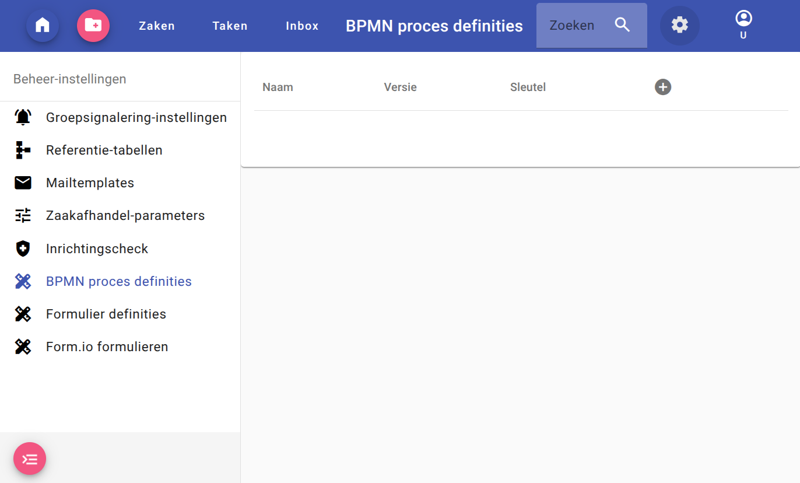

# BPMN guide

## ZAC and BPMN

ZAC uses [Flowable](https://www.flowable.com/) as embedded process automation engine to support BPMN processes.
Forms that provide input for user tasks in BPMN processes are implemented using the open source [Form.io](https://form.io/) web form library.

## BPMN process definition

To create a BPMN process definition, you can:

- use Flowable [web editor](https://trial.flowable.com/design)
- start with our integration tests [process](../../../src/itest/resources/bpmn/itProcessDefinition.bpmn)

## Use of quotes

Please make sure that you use straight quotes (') in expressions. Sometimes your system will use
[smart (curly) quotes](https://practicaltypography.com/straight-and-curly-quotes.html) which will
not parse correctly.

### Requirements

#### Candidate group/user

The "User tasks" should have a candidate group or user set.

### Upload

1. Open ZAC
2. Go to the "Beheer-instellingen"
3. Open "BPMN Process definities"
4. Click on the plus sign to open a file selection dialog
5. Select the BPM process file



## Form.io form

To create a Form.io form:

- use the Form.io [Builder](https://formio.github.io/formio.js/app/builder)
- upload our integration tests [form](../../../src/itest/resources/bpmn/testForm.json)

### Upload

1. Open ZAC
2. Go to the "Beheer-instellingen"
3. Open "Form.io formulieren"
4. Click on the plus sign to open a file selection dialogue
5. Select the Form.io form

### Validation

Form.io offers validation of the data entered in the form.

For example, the emails can be validated by specifying `validate` and `type` keys:

```json
{
  "label": "E-mail sender",
  "type": "email",
  "key": "email",
  "input": true,
  "applyMaskOn": "change",
  "validate": {
    "required": true
  }
}
```

### ZAC extensions

ZAC extension fields are added to the Form.io form as an `ZAC_TYPE` `attribute` to the field component.

Available ZAC types are:

- `ZAC_groep`
- `ZAC_medewerker`
- `ZAC_smart_documents_template_groups`
- `ZAC_smart_documents_template_group_templates`
- `ZAC_referentie_tabel`
- `ZAC_documenten`
- `ZAC_documenten_niet_ondertekend`
- `ZAC_gekozen_documenten_niet_ondertekend`
- `ZAC_regel_link_tekstueel`
- `ZAC_regel_link_oog_icoon`
- `ZAC_resultaat`
- `ZAC_status`
- `ZAC_process_data`

#### Undefined ZAC_TYPE

A `ZAC_TYPE` that is not in the list above (for example a typo such as `ZAC_documentn`) cannot be
recognised by ZAC. Form.io itself does not flag this, so instead of a silently empty field ZAC
replaces the component with a red-bordered message in the rendered task form:

> <span style="color: red; border: 1px solid red; padding: 0.25rem;">Undefined ZAC_TYPE: 'ZAC_documentn'</span>

Seeing this message means the form needs to be corrected: check the spelling of the `ZAC_TYPE`
attribute on the affected component and upload the form again.

## JavaScript in Form.io forms

Form.io forms support several places where script-like logic can be configured: conditional display, custom validation, calculated values, and `custom` component logic (e.g. a button's custom action). Before adding any JavaScript to a form, beheerders should understand what it can do and prefer a safer alternative where one exists.

### JavaScript executes as trusted code, not data

Any JavaScript added to a Form.io component runs unrestricted in the browser of every user who opens that task — it can read and change the entire submission, manipulate the page, and make network calls. Adding JavaScript to a form is effectively adding code to the application itself.

:warning: Only add JavaScript to a Form.io form if you understand exactly what the code does. If you are unsure, have a developer review it before uploading the form.

:warning: ZAC may in the future prevent uploading Form.io forms that contain JavaScript logic. Forms using JSON Logic will always remain allowed. New forms should therefore prefer JSON Logic over JavaScript wherever possible, to avoid needing rework later.

### Prefer JSON Logic over JavaScript where available

Form.io offers [JSON Logic](https://jsonlogic.com/) as a safer, declarative alternative to JavaScript for:

- conditional (advanced) logic — showing/hiding a component based on other field values
- custom validation — rejecting a submission unless a rule holds

A JSON Logic rule can only compute a value from the submitted form data. Unlike JavaScript, it cannot access the page (DOM), make network calls, or have other side effects. See:

- https://jsonlogic.com/ — the JSON Logic specification, with an interactive playground to try out rules
- https://jsonlogic.com/operations.html — a reference of all supported JSON Logic operators
- https://help.form.io/form-building/logic-and-conditions — Form.io's documentation on Advanced Conditions, Logic and Custom Validation, including where JSON Logic can be used instead of JavaScript

For simple show/hide behavior, also consider Form.io's "Simple Conditions", which need no code at all.

#### Example: conditional display

Not recommended (JavaScript, in "Advanced Conditions"):

```js
show = data.aanvraagType === "spoed";
```

Recommended (JSON Logic, in "Advanced Conditions"):

```json
{
  "==": [{ "var": "aanvraagType" }, "spoed"]
}
```

#### Example: custom validation

Not recommended (JavaScript):

```js
valid =
  data.eindDatum > data.startDatum
    ? true
    : "Einddatum moet na startdatum liggen";
```

Recommended (JSON Logic):

```json
{
  ">": [{ "var": "eindDatum" }, { "var": "startDatum" }]
}
```

### Calculated values: no JSON Logic alternative

Form.io does not offer a JSON Logic option for calculated values — only JavaScript is supported there. If you need a calculated value, keep it a pure expression: only read `data`/`row` and return a value. Do not use a calculated value to manipulate the DOM, call `submit()`, or perform network calls.

### `custom` component logic: highest risk, last resort

Some behavior cannot be expressed with JSON Logic or a calculated value, for example manipulating the page or submitting the form programmatically. As an illustration, imagine a `custom` component that looks up an address for a postcode via an external API directly from the browser, then auto-submits the form once the result comes back:

```json
{
  "custom": "instance.loading = true; var root = instance.root; root.shouldValidate = function(){return false;}; fetch('https://example-postcode-api.nl/lookup?postcode=' + data.postcode + '&apiKey=hardcoded-secret-key').then(function(response){ return response.json(); }).then(function(result){ root.getComponent('adres').setValue(result.adres); root.submission.state = 'draft'; return root.submit(); }).then(function(){ instance.loading = false; });"
}
```

This is a **not recommended** pattern:

- it reaches into `instance.root` and mutates the renderer's internal state (`root.shouldValidate`)
- it disables form validation for the entire form (`root.shouldValidate = function(){return false;}`)
- it calls an external API directly from the browser with an API key embedded in the form definition, which every user who opens the task can read
- it force-submits the form once the lookup completes, without the user confirming the result

If similar behavior is genuinely needed, and JSON Logic or a calculated value cannot express it:

- reach out to the ZAC development team to discuss the use case; possibly the behavior can be implemented differently, or possibly it warrants a feature request
- keep the JavaScript as small and narrowly scoped as possible
- avoid disabling validation, embedding credentials, or calling external APIs directly from the browser unless there is no other way to achieve the required behavior
- have the code reviewed by someone who understands JavaScript before uploading the form

## Supported functionality

The following functionality is supported by the BPMN process definition:

- Zaak
  - listing status and result types
  - changing status and result
  - suspending
  - resuming
  - extending
- Send email
- Send automatische ontvangstbevestiging
- User/group
  - listing groups/users
  - assigning a group/user to a zaak
  - assigning zaak's default group/user to a task
  - assigning the group/user of another task
- Documents
  - listing attached documents
  - listing available SmartDocuments templates
  - creating documents
  - signing documents
- Listing reference table data
- Process data

### Zaak

#### Listing statustypes

The available status types for a zaak can be displayed with:

- A `select` component, with the attribute `ZAC_TYPE` of `ZAC_status`

Example:

```json
{
  "label": "Select status",
  "optionsLabelPosition": "right",
  "key": "ZK_Status",
  "widget": "html5",
  "validate": {
    "required": true,
    "onlyAvailableItems": true
  },
  "attributes": {
    "ZAC_TYPE": "ZAC_status"
  },
  "type": "select",
  "input": true,
  "dataSrc": "custom"
}
```

#### Listing resultaattypes

The available result types for a zaak can be displayed with:

- A `select` component, with the attribute `ZAC_TYPE` of `ZAC_resultaat`

Example:

```json
{
  "label": "Select result",
  "optionsLabelPosition": "right",
  "key": "ZK_Result",
  "widget": "html5",
  "validate": {
    "required": true,
    "onlyAvailableItems": true
  },
  "attributes": {
    "ZAC_TYPE": "ZAC_resultaat"
  },
  "type": "select",
  "input": true,
  "dataSrc": "custom"
}
```

#### Changing status and result

To change zaak status, you have to:

- create a service task
- set class `net.atos.zac.flowable.delegate.UpdateZaakJavaDelegate`
- add fields
  - `statustypeOmschrijving` to `stringvalue` or `expression` representing your desired zaak statustype omschrijving
  - `resultaattypeOmschrijving` to a valid `stringvalue` or `expression`, required by your zaak statustype

For example:

```xml
    <serviceTask id="ServiceTask_357" name="Status to &quot;Verleend&quot;" flowable:class="net.atos.zac.flowable.delegate.UpdateZaakJavaDelegate">
      <extensionElements>
        <flowable:field name="statustypeOmschrijving">
          <flowable:string><![CDATA[Afgerond]]></flowable:string>
        </flowable:field>
        <flowable:field name="resultaattypeOmschrijving">
          <flowable:string><![CDATA[Verleend]]></flowable:string>
        </flowable:field>
        <design:stencilid><![CDATA[ServiceTask]]></design:stencilid>
        <design:stencilsuperid><![CDATA[Task]]></design:stencilsuperid>
      </extensionElements>
    </serviceTask>
```

#### Suspending

To suspend a zaak:

- create a service task
- set class `net.atos.zac.flowable.delegate.SuspendZaakDelegate`
- add fields:
  - `aantalDagen` - number of days to suspend the zaak for. Added to the current date.
  - `opschortingReden` - reason for suspension

For example:

```xml
    <serviceTask id="ServiceTask_360" name="Suspend" flowable:class="net.atos.zac.flowable.delegate.SuspendZaakDelegate">
      <extensionElements>
        <flowable:field name="aantalDagen">
          <flowable:expression><![CDATA[10]]></flowable:expression>
        </flowable:field>
        <flowable:field name="opschortingReden">
          <flowable:expression><![CDATA[suspend test]]></flowable:expression>
        </flowable:field>
        <design:stencilid><![CDATA[ServiceTask]]></design:stencilid>
        <design:stencilsuperid><![CDATA[Task]]></design:stencilsuperid>
      </extensionElements>
    </serviceTask>
```

#### Resuming

To resume a zaak:

- create a service task
- set class `net.atos.zac.flowable.delegate.ResumeZaakDelegate`
- add fields:
  - `hervattenReden` - reason for resuming
  - `hervattenDatum` - resume date (optional). If not set, the current date is used.

For example:

```xml
    <serviceTask id="ServiceTask_361" name="Resume" flowable:class="net.atos.zac.flowable.delegate.ResumeZaakDelegate">
      <extensionElements>
        <flowable:field name="hervattenReden">
          <flowable:expression><![CDATA[resume test]]></flowable:expression>
        </flowable:field>
        <flowable:field name="hervattenDatum">
          <flowable:expression><![CDATA[${ZK_Resume_Date}]]></flowable:expression>
        </flowable:field>
        <design:stencilid><![CDATA[ServiceTask]]></design:stencilid>
        <design:stencilsuperid><![CDATA[Task]]></design:stencilsuperid>
      </extensionElements>
    </serviceTask>
```

The `hervattenDatum` is a date-time string with a time-zone in the ISO-8601 calendar system: `2025-11-14T17:38:21.929149+01:00[Europe/Amsterdam]`.

#### Extending

To extend a zaak:

- create a service task
- set class `net.atos.zac.flowable.delegate.ExtendZaakDelegate`
- add fields:
  - `aantalDagen` - number of days to extend the zaak for
  - `verlengingReden` - reason for extending
  - `takenVerlengen` - whether to extend all tasks in the zaak (optional, default `false`)

For example:

```xml
    <serviceTask id="ServiceTask_378" name="Extend" flowable:class="net.atos.zac.flowable.delegate.ExtendZaakDelegate">
      <extensionElements>
        <flowable:field name="aantalDagen">
          <flowable:expression><![CDATA[${extendDays}]]></flowable:expression>
        </flowable:field>
        <flowable:field name="verlengingReden">
          <flowable:string><![CDATA[Extend test]]></flowable:string>
        </flowable:field>
        <flowable:field name="takenVerlengen">
          <flowable:expression><![CDATA[${extendTasks}]]></flowable:expression>
        </flowable:field>
        <design:stencilid><![CDATA[ServiceTask]]></design:stencilid>
        <design:stencilsuperid><![CDATA[Task]]></design:stencilsuperid>
      </extensionElements>
    </serviceTask>
```

### Send email

To send email:

- create a service task
- set class `net.atos.zac.flowable.delegate.SendEmailDelegate`
- add fields:
  - `to` - equal to the receiver's email address
  - `from` - the sender's email address
  - `replyTo` - the replyTo's email address
  - `template` - the name of the email template you want to use

For example:

```xml
    <serviceTask id="ServiceTask_358" name="Send email" flowable:class="net.atos.zac.flowable.delegate.SendEmailDelegate">
      <extensionElements>
        <flowable:field name="from">
          <flowable:string><![CDATA[team-dimpact@info.nl]]></flowable:string>
        </flowable:field>
        <flowable:field name="to">
          <flowable:string><![CDATA[shared-team-dimpact@info.nl]]></flowable:string>
        </flowable:field>
        <flowable:field name="replyTo">
          <flowable:string><![CDATA[shared-team-dimpact@info.nl]]></flowable:string>
        </flowable:field>
        <flowable:field name="template">
          <flowable:string><![CDATA[Algemene e-mail]]></flowable:string>
        </flowable:field>
        <design:stencilid><![CDATA[ServiceTask]]></design:stencilid>
        <design:stencilsuperid><![CDATA[Task]]></design:stencilsuperid>
      </extensionElements>
    </serviceTask>
```

#### Using zaakdata in email templates

Email templates support dynamic substitution of zaakdata values. This allows you to include
data that was collected during the BPMN process (e.g. from Form.io form fields) directly in the email subject and body.

Use the following syntax in the email template subject or body:

```
{ZAAKDATA:<key>}
```

Where `<key>` is the name of the zaakdata variable — this corresponds to the `key` of the Form.io form field
or any other variable stored in the zaakdata during the process.

:warning: If the key does not exist or has no value, it will be replaced with `Onbekend`.

Example: if your Form.io form has a field with key `customerPhone`, add the following to your email template subject or body:

```
Het telefoonnummer van de klant is: {ZAAKDATA:customerPhone}
```

To store a Form.io field value as zaakdata, use the `ZAC_process_data` type (see [Process data](#process-data)):

```json
{
  "label": "Telefoonnummer",
  "type": "input",
  "key": "customerPhone",
  "input": true,
  "attributes": {
    "ZAC_TYPE": "ZAC_process_data"
  }
}
```

### Send confirmation email (automatische ontvangstbevestiging)

To send a confirmation email to the zaak initiator or zaak-specific contact email address from a BPMN process:

- create a service task
- set class `nl.info.zac.flowable.bpmn.delegate.SendConfirmationEmailDelegate`
- add fields:
  - `from` - the sender's email address
  - `replyTo` - the reply-to email address (optional)
  - `template` - the name of the email template to use

Unlike `SendEmailDelegate`, the recipient address is resolved automatically from the zaak:

1. The email address from the zaak-specific contact details is used if available.
2. Otherwise, the default email address of the initiator of zaak is used. Or if the initiator does not have a default email address, the first email address of the initiator is used3. If no address can be found, no email is sent and the process continues.
3. If no email address could be found, no email is sent and the process continues.

The email is stored as a document attached to the zaak.

For example:

```xml
    <serviceTask id="ServiceTask_359" name="Send confirmation email" flowable:class="nl.info.zac.flowable.bpmn.delegate.SendConfirmationEmailDelegate">
      <extensionElements>
        <flowable:field name="from">
          <flowable:string><![CDATA[noreply@example.nl]]></flowable:string>
        </flowable:field>
        <flowable:field name="replyTo">
          <flowable:string><![CDATA[contact@example.nl]]></flowable:string>
        </flowable:field>
        <flowable:field name="template">
          <flowable:string><![CDATA[Ontvangstbevestiging]]></flowable:string>
        </flowable:field>
        <design:stencilid><![CDATA[ServiceTask]]></design:stencilid>
        <design:stencilsuperid><![CDATA[Task]]></design:stencilsuperid>
      </extensionElements>
    </serviceTask>
```

### User/group

#### Listing groups

- A `select` component, with the attribute `ZAC_TYPE` of `ZAC_groep`

```json
{
  "label": "Group",
  "type": "select",
  "key": "AM_TeamBehandelaar_Groep",
  "input": true,
  "dataSrc": "custom",
  "clearOnRefresh": true,
  "attributes": {
    "ZAC_TYPE": "ZAC_groep"
  }
}
```

#### Listing users in a group

- A `select` component, with the attribute `ZAC_TYPE` of `ZAC_medewerker`
- An optional attribute `refreshOn` to refresh the user list when the group changes. The value of this attribute should be the key of the group component.

```json
{
  "label": "User",
  "type": "select",
  "key": "AM_TeamBehandelaar_Groep",
  "dataSrc": "custom",
  "clearOnRefresh": true,
  "input": true,
  "refreshOn": "AM_TeamBehandelaar_Groep",
  "attributes": {
    "ZAC_TYPE": "ZAC_medewerker"
  }
}
```

#### Assigning a group/user to a zaak

To assign a group or user to a zaak:

- create a service task
- set class `net.atos.zac.flowable.delegate.UpdateZaakAssignmentDelegate`
- add fields:
  - `groepId` - group to use for the assignment
  - `behandelaarGebruikersnaam` - user to use for the assignment (optional)
  - `reden` - the reason for the assignment

For example:

```xml
    <serviceTask id="ServiceTask_362" name="Assign for approval" flowable:class="net.atos.zac.flowable.delegate.UpdateZaakAssignmentDelegate">
      <extensionElements>
        <flowable:field name="groepId">
          <flowable:expression><![CDATA[${AM_TeamBehandelaar_Groep}]]></flowable:expression>
        </flowable:field>
        <flowable:field name="behandelaarGebruikersnaam">
          <flowable:expression><![CDATA[${AM_TeamBehandelaar_Medewerker}]]></flowable:expression>
        </flowable:field>
        <flowable:field name="reden">
          <flowable:expression><![CDATA[Please check case ${zaakIdentificatie}]]></flowable:expression>
        </flowable:field>
        <design:stencilid><![CDATA[ServiceTask]]></design:stencilid>
        <design:stencilsuperid><![CDATA[Task]]></design:stencilsuperid>
      </extensionElements>
    </serviceTask>
```

#### Assigning zaak's default group/user to a task

The following BPMN-specific variables can be used in expressions in the BPMN process:

- `zaakGroep` - group assigned to the zaak
- `zaakBehandelaar` (optional) - user assigned to the zaak

The above variables can be used in `assignee` and `candidateGroups` attributes for example:
For example:

```xml
<userTask id="userTask"
          name="User details"
          flowable:assignee="${var:get(zaakBehandelaar)}"
          flowable:candidateGroups="${zaakGroep}"
          flowable:formKey="testForm"
          flowable:formFieldValidation="false">
  ... the rest of userTask tags ...
</userTask>
```

We are using `var:get` [function](https://documentation.flowable.com/latest/develop/be/be-expressions#variable-functions) here which tries to get a `zaakBehandelaar` variable value, so that it will not throw an exception when the variable does not exist.
As the group should always be provided when creating a zaak we set the candidate group directly to the value of `zaakGroep` variable.

#### Assigning the group/user of another task

To set the assignee and candidate group to the user/group used in another user task, you can use the `taken:behandelaar` and `taken:groep` functions:

```xml
<userTask id="userTask"
          name="User details"
          flowable:assignee="${taken:behandelaar('userTaskId')}"
          flowable:candidateGroups="${taken:groep('userTaskId')}"
          flowable:formKey="testForm"
          flowable:formFieldValidation="false">
  ... the rest of userTask tags ...
</userTask>
```

Note: the `userTaskId` should be replaced with the actual id of the user task in the BPMN process.

### Documents

#### Listing available documents

To display linked documents of a zaak you can use:

- `select` type component with:
  - custom data source
  - attributes containing `ZAC_TYPE` of `ZAC_documenten`
  - multi select attribute (`type=select` with `multiple=true`)

Example:

```json
{
  "label": "Documents",
  "type": "select",
  "key": "ZAAK_Documents_Select",
  "input": true,
  "widget": "choicesjs",
  "multiple": true,
  "defaultValue": [],
  "clearOnRefresh": true,
  "dataSrc": "custom",
  "placeholder": "Select one or more documents",
  "customOptions": {
    "choicesOptions": {
      "removeItemButton": true,
      "placeholder": false,
      "searchEnabled": true,
      "shouldSort": false
    }
  },
  "validate": {
    "required": true
  },
  "attributes": {
    "ZAC_TYPE": "ZAC_documenten"
  }
}
```

#### Creating documents

This requires these three components:

##### Listing SmartDocuments template groups linked to the current zaaktype

- A `select` component, with the attribute `ZAC_TYPE` of `ZAC_smart_documents_template_groups`

```json
{
  "label": "Template Group",
  "type": "select",
  "key": "SmartDocuments_Group",
  "input": true,
  "dataSrc": "custom",
  "clearOnRefresh": true,
  "attributes": {
    "ZAC_TYPE": "ZAC_smart_documents_template_groups"
  }
}
```

##### Listing SmartDocuments templates linked to a template group and the current zaaktype

- A `select` component, with the attribute `ZAC_TYPE` of `ZAC_smart_documents_template_group_templates`
- An optional attribute `refreshOn` to refresh the template list when the template group changes. The value of this attribute should be the key of the template group component.

```json
{
  "label": "Template",
  "type": "select",
  "key": "SD_SmartDocuments_Template",
  "dataSrc": "custom",
  "clearOnRefresh": true,
  "input": true,
  "refreshOn": "SmartDocuments_Group",
  "attributes": {
    "ZAC_TYPE": "ZAC_smart_documents_template_group_templates"
  }
}
```

##### Create document button

- A `button` with:
- custom event: `"event": "createDocument"`

Example:

```json
{
  "label": "Create",
  "action": "event",
  "showValidations": false,
  "block": true,
  "tableView": false,
  "key": "SD_SmartDocuments_Create",
  "type": "button",
  "event": "createDocument",
  "input": true
}
```

#### Listing attached documents

- A `choicesjs` widget `select` component, with the attribute `ZAC_TYPE` of `ZAC_documenten`

```json
{
  "label": "Documents",
  "type": "select",
  "key": "ZAAK_Documents_Select",
  "input": true,
  "widget": "choicesjs",
  "multiple": true,
  "defaultValue": [],
  "clearOnRefresh": true,
  "dataSrc": "custom",
  "placeholder": "Select one or more documents",
  "customOptions": {
    "choicesOptions": {
      "removeItemButton": true,
      "placeholder": true,
      "searchEnabled": true,
      "shouldSort": false
    }
  },
  "validate": {
    "required": true
  },
  "attributes": {
    "ZAC_TYPE": "ZAC_documenten"
  }
}
```

#### Signing documents

To automatically sign one or more documents as part of a process:

- create a user task with a form that lets the user select documents to sign (see form field below)
- create a service task after the user task
- set class `net.atos.zac.flowable.delegate.SignDocumentDelegate`
- optionally add a field:
  - `documentenKey` - the key of the form field that contains the selected documents (defaults to `ZAAK_Documenten_Te_Ondertekenen` if not set)

The delegate signs every row of that field whose `selected` checkbox is ticked. Documents that are already signed will be skipped automatically.

The form field for selecting documents to sign is a `datagrid` with the attribute `ZAC_TYPE` of
`ZAC_documenten_niet_ondertekend`. It is filled with all documents of the zaak that are not yet
signed, each with a `selected` checkbox:

```json
{
  "label": "Documenten",
  "type": "datagrid",
  "key": "ZAAK_Documenten_Ondertekenen_Selectie",
  "input": true,
  "disableAddingRemovingRows": true,
  "validate": { "required": true },
  "attributes": { "ZAC_TYPE": "ZAC_documenten_niet_ondertekend" },
  "components": [
    { "label": "", "key": "selected", "type": "checkbox", "input": true },
    {
      "label": "Titel",
      "key": "titel",
      "type": "textfield",
      "input": true,
      "disabled": true
    },
    {
      "key": "openen",
      "type": "htmlelement",
      "input": false,
      "attributes": { "ZAC_TYPE": "ZAC_regel_link_oog_icoon" }
    }
  ]
}
```

The optional `ZAC_regel_link_oog_icoon` column renders an icon linking to the document of that row in
a new tab; `ZAC_regel_link_tekstueel` renders the same link as text. Both take their route from the datagrid
they sit in, so no URL has to be configured in the form.

To confirm that selection in a following user task, use a `datagrid` with the attribute `ZAC_TYPE` of
`ZAC_gekozen_documenten_niet_ondertekend` and a `refreshOn` pointing at the key of the selection field
above. Only the documents selected there are shown. Because a task can stay open for days, their
titles and signing state are re-read when the task is opened, and any document that has been signed
in the meantime is left out:

```json
{
  "label": "Documenten",
  "type": "datagrid",
  "key": "ZAAK_Documenten_Te_Ondertekenen",
  "input": true,
  "disableAddingRemovingRows": true,
  "refreshOn": "ZAAK_Documenten_Ondertekenen_Selectie",
  "attributes": { "ZAC_TYPE": "ZAC_gekozen_documenten_niet_ondertekend" },
  "components": [
    { "label": "", "key": "selected", "type": "checkbox", "input": true },
    {
      "label": "Titel",
      "key": "titel",
      "type": "textfield",
      "input": true,
      "disabled": true
    },
    {
      "key": "openen",
      "type": "htmlelement",
      "input": false,
      "attributes": { "ZAC_TYPE": "ZAC_regel_link_oog_icoon" }
    }
  ]
}
```

Leave the `selected` checkbox of that confirmation grid editable: unticking a row there is how a user
drops a document again, and the delegate will then not sign it. Disabling the checkbox makes the grid
view-only and every listed document will be signed.

### Reference Table values

To display and use values from a reference table you can use:

- a fieldset with type `referenceTableFieldset`
- `select` type component with:
  - custom data source
  - attribute `ZAC_TYPE` of `ZAC_referentie_tabel`
  - properties containing `ReferenceTable_Code`

Example:

```json
{
  "label": "Communication channel",
  "type": "select",
  "key": "RT_ReferenceTable_Values",
  "input": true,
  "widget": "html5",
  "validate": {
    "required": true
  },
  "dataSrc": "custom",
  "attributes": {
    "ZAC_TYPE": "ZAC_referentie_tabel"
  },
  "properties": {
    "ReferenceTable_Code": "COMMUNICATIEKANAAL"
  }
}
```

:warning: prefixing the reference table code with 'BPMN\_' is recommended to avoid conflicts with other ZAAK types and reference tables.

### Process data

- A `input` component, with the attribute `ZAC_TYPE` of `ZAC_process_data`, where the `key` is the name of the process data variable

```json
{
  "label": "Process data",
  "type": "input",
  "key": "<PROCESS_DATA_VARIABLE_NAME>",
  "input": true,
  "dataSrc": "custom",
  "attributes": {
    "ZAC_TYPE": "ZAC_process_data"
  }
}
```

### Reading zaak and taak data

ZAC puts the whole zaak and the whole taak into the form's template context, so reading a value
needs no `ZAC_TYPE` and no ZAC property at all — it is Form.io's own `{{ }}` interpolation:

```json
{
  "label": "",
  "type": "content",
  "key": "ZO_zaaknummer",
  "input": false,
  "html": "<strong>Zaaknummer:</strong> {{ zaak.identificatie }}"
}
```

Two objects are available, `zaak` and `taak`, and any property of either is reachable by its path:

```
{{ zaak.identificatie }}                  {{ taak.naam }}
{{ zaak.zaaktype.omschrijving }}          {{ taak.groep.naam }}
{{ zaak.resultaat.resultaattype.naam }}   {{ taak.fataledatum }}
```

Because it is a template and not a field, several values can go in one sentence — which is the main
thing this can do that a dedicated field type could not:

```html
Zaak {{ zaak.identificatie }} ({{ zaak.zaaktype.omschrijving }}) is behandeld
door {{ zaak.behandelaar.naam }}.
```

`zaak` is the zaak as read from Open Zaak, with its group and behandelaar resolved from the zaak
rollen via user identity management, and it is re-read every time the task is opened. `taak` is the
task in the process engine, with its candidate group and assignee resolved the same way.

ZAC removes HTML tags (`<...>`) from every string value of both objects before the form sees them, so
a `<script>` a user typed into the zaak cannot end up in the page. Quotes and ampersands are
deliberately left as typed, because the same values are seeded into input fields where `&amp;` would
show — so this is not a general escape. Interpolate these values as **text**, never into an HTML
attribute: `<div title="{{ zaak.omschrijving }}">` can still be broken out of.

A property neither object carries — a zaak without a behandelaar, a taak without a groep — renders as
nothing rather than throwing, and reading on through it (`taak.groep.naam`) is safe. There is no
field-level error message either way, so an empty result means either "no value" or "wrong path".

#### Where a value is stored

Two stores hold the values a form works with. They differ in scope, not in order — both exist for the
whole life of the zaak.

| Store                                         | Scope                                | Written when                                                                              | Read in a form by                                            |
| --------------------------------------------- | ------------------------------------ | ----------------------------------------------------------------------------------------- | ------------------------------------------------------------ |
| **this task's answers** (`taakdata`)          | one task                             | every save of that task, partial or final; it stays as the task's record after completion | the field key, bare: `{{ NF_Uren }}`                         |
| **the zaak's process variables** (`zaakdata`) | the whole zaak, shared by every task | at process start, and again when a task completes                                         | `{{ zaak.zaakdata.NF_Uren }}`, or a `ZAC_process_data` field |

Completing a task copies **all** of its answers into the process variables, which is why a field key
needs a prefix of its own — see [Filling an editable field](#filling-an-editable-field).

Neither store holds the zaak itself. `startdatum`, `status`, `resultaat` and the rest are read from
`zaak` directly, which is what the previous section describes.

#### Filling an editable field

Interpolation only renders text. To put a value **into** an input, use Form.io's own
`customDefaultValue`, which is JavaScript with the same context available:

```json
{
  "label": "Toelichting",
  "type": "textarea",
  "key": "IN_toelichting",
  "input": true,
  "customDefaultValue": "value = zaak.toelichting"
}
```

Anything else JavaScript can express works here as well.

Three rules for filled fields:

1. **A saved answer is never overwritten.** Form.io skips a default value once the submission
   already carries the key, so what the user typed survives a reopen. This is Form.io's own
   behaviour, not something ZAC adds.
2. **Do not format the value of a field that parses its own.** A date picker reads the raw value and
   formats it for display itself, so give it `value = zaak.startdatum` and leave it to render
   `24-08-2026` on its own.
3. **Do not use a process variable name as the `key`.** Completing a task writes every submitted key
   back as a process variable, so a field keyed `zaakGroep` overwrites that variable. Prefix the keys
   of your own fields.

That third rule is the difference that matters between the two mechanisms: an interpolated value is
only rendered and can never be written back, while a filled field becomes part of the submission.

### Custom functions

ZAC supports custom functions in Form.io `content` components via the `{{ }}` template syntax.
These functions are evaluated client-side and can be used to display dynamic data in read-only content blocks.

#### Formatting a value for display

Interpolation renders a value exactly as it is stored, which is rarely what a form should show:
`2026-08-24` instead of `24‑08‑2026`, `true` instead of `Ja`, `[object Object]` for anything
composite. Four functions format a value on its way to the page.

They differ from `ZAC_getDocumentTitles` in what you hand them: a **value**, not a field key. So they
work on anything reachable in the template — a zaak property, a taak property, a process variable or a
field of the form itself.

| Function                         | Argument(s)                         | Renders                                  | When the value is empty or absent |
| -------------------------------- | ----------------------------------- | ---------------------------------------- | --------------------------------- |
| `ZAC_opmaakDatum(value)`         | a date                              | the date in Dutch notation: `24‑08‑2026` | nothing                           |
| `ZAC_opmaakBoolean(value, …)`    | a boolean, optionally two labels    | the labels you give, else `true`/`false` | nothing                           |
| `ZAC_opmaakLijst(value, …)`      | a list, optionally a property name  | the entries joined with commas           | nothing                           |
| `ZAC_opmaakLegeWaarde(value, …)` | any value, optionally a placeholder | the value itself                         | `-`, or a placeholder of your own |

```
Zaak {{ zaak.identificatie }} is gestart op {{ ZAC_opmaakDatum(zaak.startdatum) }}
en {{ ZAC_opmaakBoolean(zaak.isOpen, "loopt nog", "is afgerond") }}.
```

These four functions are **display-only**. Put them in a `content` component, a label or a description
— never in the value of an input field. Form.io interpolates the value properties of a component too
(`defaultValue`, `customDefaultValue`, `calculateValue`), so a formatted value will silently be written
into the field and end up in the submission, where it is no longer the value the rest of ZAC expects.
Interpolate the property itself there: `{{ zaak.startdatum }}`, not `{{ ZAC_opmaakDatum(zaak.startdatum) }}`.

##### ZAC_opmaakDatum

Renders a date the same way the rest of ZAC does, including the non-breaking hyphens that keep a date
on one line. It reads the stored ISO value, so it does not matter how the value was written.

```
{{ ZAC_opmaakDatum(zaak.startdatum) }}     →  24‑08‑2026
{{ ZAC_opmaakDatum(taak.fataledatum) }}    →  31‑12‑2026
{{ ZAC_opmaakDatum(zaak.omschrijving) }}   →  the text itself, unchanged
```

A value that is not a date is passed through untouched rather than replaced by something wrong.

Do **not** use this function to fill a date field. Its output is Dutch notation with non-breaking
hyphens (`24‑08‑2026`), which no date picker can read back: the field stays empty and the browser
console fills with `Invalid date provided` from the picker and a deprecation warning from moment.
A date field wants the stored ISO value, so write `{{ zaak.startdatum }}` there and keep
`ZAC_opmaakDatum` for the text the behandelaar reads.

##### ZAC_opmaakBoolean

Puts a word of your own in place of a boolean. Give it two labels — the first for `true`, the second
for `false` — because a form rarely wants to say "true", it wants to say what the answer means.

```
{{ ZAC_opmaakBoolean(zaak.isOpen, "Open", "Gesloten") }}                →  Open
{{ ZAC_opmaakBoolean(zaak.isProcesGestuurd, "Procesgestuurd", "Zaakgestuurd") }}
                                                                        →  Procesgestuurd
{{ ZAC_opmaakBoolean(zaak.isHeropend, "Heropend") }}                    →  Nee
{{ ZAC_opmaakBoolean(zaak.isOpen, "actie.ja", "actie.nee") }}           →  Ja
{{ ZAC_opmaakBoolean(zaak.isOpen) }}                                    →  true
```

Give only the first label and `false` still renders `Nee`. A label may also be a translation key, as
the fourth line shows, so `actie.ja` and `actie.nee` give you Ja and Nee.

Called **without labels** the function hands the boolean back as it is, so Form.io renders it the way
it renders any other value: `true` or `false`. Use that where the raw value is what you want to show —
for anything a behandelaar reads, give it labels.

A value that is neither `true` nor `false` is passed through as it is. That matters: pointed at a text
field, the function shows that text instead of confidently answering "Nee" about something that was
never a yes-or-no question.

##### ZAC_opmaakLijst

Joins the entries of a list with commas. A second argument names the property to read from each entry,
for a list of objects.

```
{{ ZAC_opmaakLijst(zaak.indicaties) }}                    →  OPSCHORTING, VERLENGD
{{ ZAC_opmaakLijst(zaak.kenmerken, "kenmerk") }}          →  kenmerk-1, kenmerk-2
{{ ZAC_opmaakLijst(zaak.besluiten, "identificatie") }}    →  BESLUIT-01, BESLUIT-02
```

Entries that are empty are left out, so a partly filled list does not render stray commas. An empty
list, or a property the zaak does not have, renders nothing. Without this function a list renders as
`[object Object],[object Object]`.

##### ZAC_opmaakLegeWaarde

Renders the value, or `-` when there is nothing to show — the same dash the zaak screens use, so it
means the same thing to the reader. An optional second argument replaces the dash.

```
{{ ZAC_opmaakLegeWaarde(zaak.omschrijving) }}                        →  the omschrijving
{{ ZAC_opmaakLegeWaarde(zaak.toelichting) }}                         →  -
{{ ZAC_opmaakLegeWaarde(zaak.einddatum, "Nog niet bekend") }}        →  Nog niet bekend
{{ ZAC_opmaakLegeWaarde(zaak.besluiten, "actie.nee") }}              →  Nee
```

Empty means an empty string, an empty list, a property that holds nothing, and a property the zaak
does not have at all. Like the labels above, the placeholder may be a translation key.

#### ZAC_getDocumentTitles

Resolves a list of document UUIDs stored in a taakdata field to their human-readable document titles.
The titles are formatted as a Dutch conjunction list (e.g. `Document A, Document B en Document C`).

- Use a `content` component with an `html` property containing `{{ ZAC_getDocumentTitles(<fieldKey>) }}`
- `<fieldKey>` must match the name of a taakdata field containing documents, in any of the shapes below (it does not need to be a component in the form)

The argument is the bare field name, without quotes. Taakdata is available as variables in the template, so
what the function receives is the value of that field. Several `content` components may call it with different
fields; the titles of all of them are fetched when the form is opened.

Any field holding documents works, whichever shape it stores them in:

- a single UUID
- a list of UUIDs, the way a `ZAC_documenten` select stores them: `["06a47923-…", "44e891f7-…"]`
- a list of datagrid rows, the way the signing grids store them: `[{ "selected": true, "titel": "…", "uuid": "…" }]`

Rows whose `selected` checkbox was unticked are left out, so the list matches what a signing task will
actually sign. Entries without a UUID are ignored. Titles are always read from the document itself, so a
`titel` stored in a row earlier can never show up out of date.

```json
{
  "label": "Selected documents",
  "type": "content",
  "key": "selectedDocuments",
  "html": "<p>Gekozen documenten:</p><p>{{ ZAC_getDocumentTitles(ZAAK_Documents_Select) }}</p>",
  "input": false
}
```

If a document cannot be fetched or has no title, the UUID is used as a fallback.

#### Supported process data variables

- `zaakIdentificatie` - zaak id
- `zaakCommunicatiekanaal` - zaak communication channel
- `zaakGroep` - zaak group
- `zaakBehandelaar` - zaak assigned user, once the zaak has one
- `zaaktypeOmschrijving` - zaaktype description

`zaakUUID` and `zaaktypeUUID` exist as process variables and a process definition can use them, but
ZAC deliberately keeps them out of the task data, so a `ZAC_process_data` field with either key stays
empty. Read `{{ zaak.uuid }}` and `{{ zaak.zaaktype.uuid }}` instead — see
[Reading zaak and taak data](#reading-zaak-and-taak-data), which also covers every zaak field that is
not a process variable at all.
