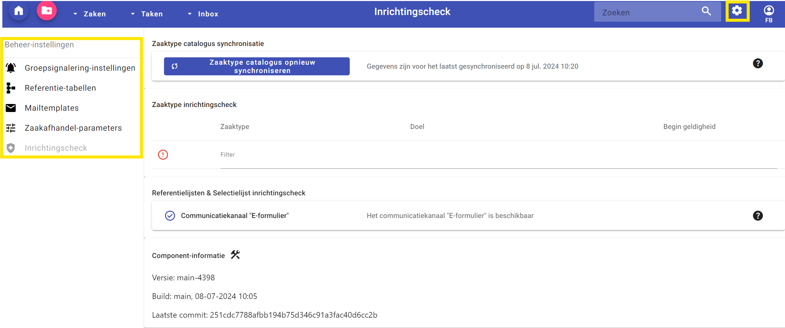
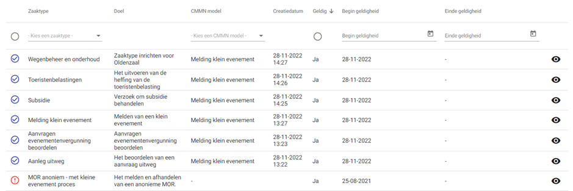
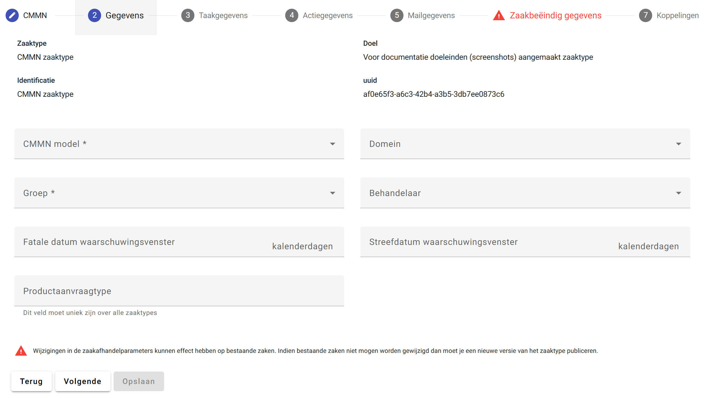
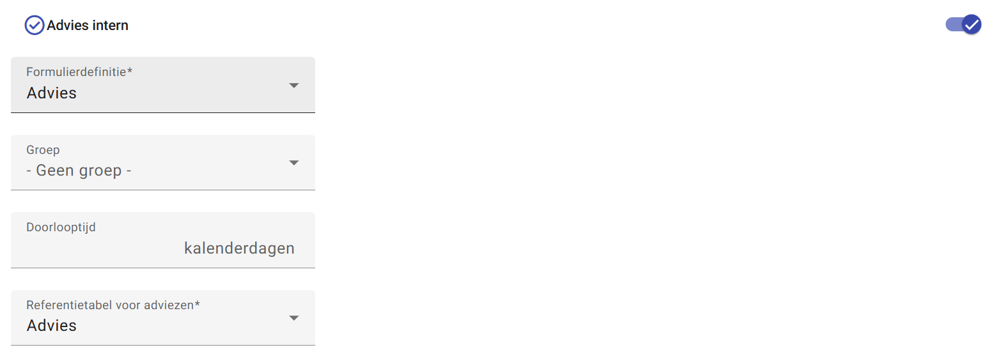
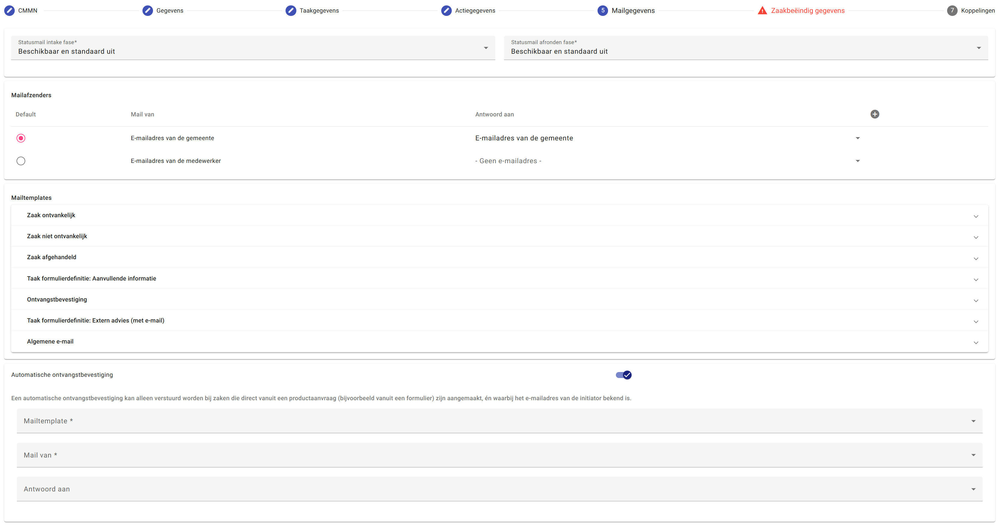
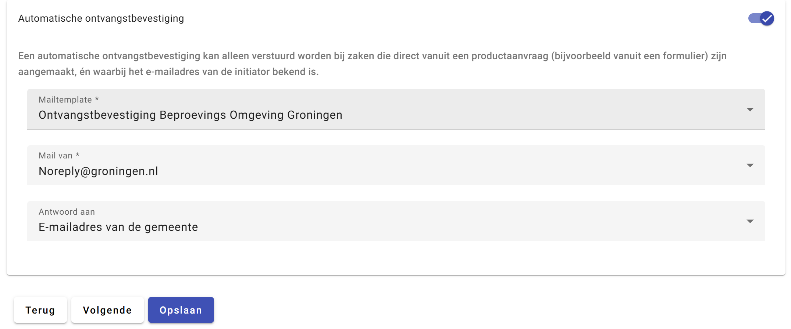
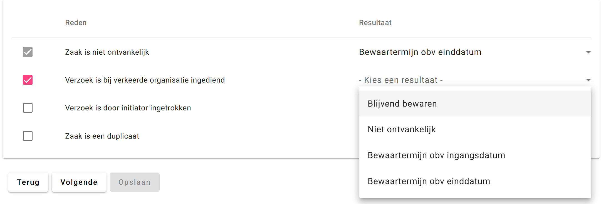
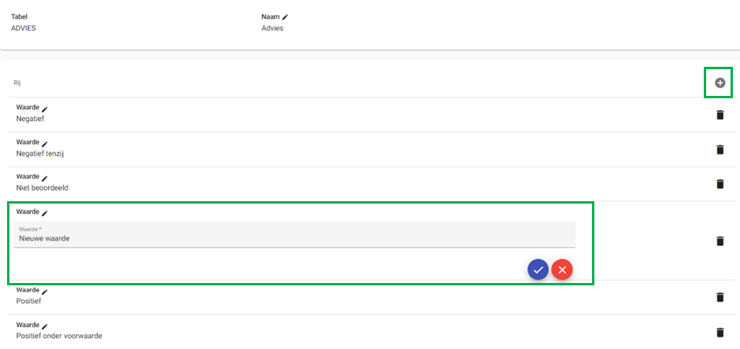
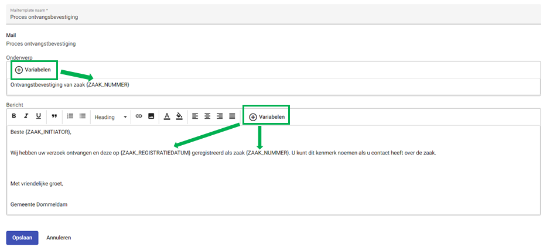
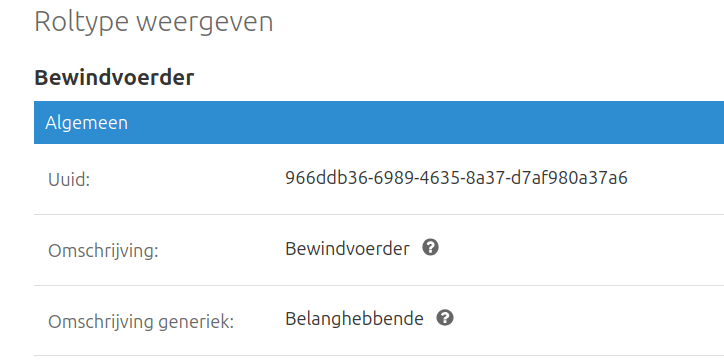

# Inrichting Zaakafhandelcomponent

> **Colofon**  
> Datum : 12-08-2025  
> Versie :   1.4  
> Verandering : ZAC v3.12 Inrichting Zaakafhandelcomponent  
> Project referentie : ZAC  
> Toegangsrechten : Alleen lezen  
> Status : Definitief  
> Redacteur : Karin Masselink  
> Auteur(s) : Roy Buis, Edgar Vonk, John Bol, Hristo Iliev, Sander Boer, Camiel Braun  

Versiegeschiedenis:

| 1.0   | Initiële versie     |
|-------|--------------------------------------------------------------------------------------------------------------------------------------------|
| 1.1 | ZAC versie 3.7 |
| 1.2 | ZAC versie 3.9 |
| 1.3 | ZAC versie 3.11 |
| 1.4 | ZAC versie 3.12 |

# Inhoud

[*Inrichting Zaakafhandelcomponent*](#inrichting-zaakafhandelcomponent)
- [Zaakafhandelcomponent](#zaakafhandelcomponent)
- [Beheerinstellingen](#beheerinstellingen)

[*Zaakafhandel-parameters*](#zaakafhandel-parameters)
- [Werking van de zaakafhandel-parameters](#werking-van-de-zaakafhandel-parameters)
- [Inrichten van een zaaktype](#inrichten-van-een-zaaktype)
 [*Gegevens*](#gegevens)
 [*Taakgegevens*](#taakgegevens)
 [*Actiegegevens*](#actiegegevens)
 [*Mailgegevens*](#mailgegevens)
 [*Zaakbeëindig gegevens*](#zaakbeëindig-gegevens)
 [*Koppelingen*](#koppelingen)

[*Referentietabellen*](#referentietabellen)
- [Referentietabel bewerken](#referentietabel-bewerken)

[*Mailafzenders*](#mailafzenders)
- [Werking van de mailafzenders](#werking-van-de-mailafzenders)
- [Mailafzender bewerken](#mailafzender-bewerken)
- [Mailafzender aan de referentietabel toevoegen](#mailafzender-aan-de-referentietabel-toevoegen)

[*Mailtemplates*](#mailtemplates)
- [Werking van de mailtemplates](#werking-van-de-mailtemplates)
- [Mailtemplate bewerken](#mailtemplate-bewerken)
- [Mailtemplate aanmaken](#mailtemplate-aanmaken)

[*Inrichtingscheck*](#inrichtingscheck)
- [Zaaktypecatalogus synchronisatie](#zaaktypecatalogus-synchronisatie)
- [Zaaktype inrichtingscheck](#zaaktype-inrichtingscheck)
- [Roltypen](#roltypen)

[*Signaleringen*](#signaleringen)
- [Werking van de signaleringen](#werking-van-de-signaleringen)
- [Groepsignalering inschakelen](#groepsignalering-inschakelen)

[*Domeinen*](#domeinen)
- [De functie van Domeinen](#de-functie-van-domeinen)
- [Domeinen inrichten en zaaktype / behandelaars toewijzen](#domeinen-inrichten-en-zaaktype--behandelaars-toewijzen)

## Inrichting Zaakafhandelcomponent 

### Zaakafhandelcomponent
De Zaakafhandelcomponent (ZAC) is een applicatie bedoeld voor het behandelen van zaken en managen van de werkvoorraad van zaken. De applicatie is daarmee ook gepositioneerd in de interactielaag van het 5 lagen model van Common Ground. 
Om zaken te registeren en behandelen maakt de applicatie gebruik van registratiecomponenten die zicht in de datalaag bevinden. Een groot deel van de inrichting zal dan ook in deze componenten gebeuren, een belangrijke daarvan is de zaaktypecatalogus. Om de ZAC in gebruik te nemen en te werken met de ingerichte zaaktypecatalogus is configuratie in de ZAC noodzakelijk. Daarnaast is er een aantal instellingen in de ZAC beschikbaar om het werken met het component naar eigen wens in te richten. Alle benodigde inrichting is in deze handleiding beschreven.

### Beheerinstellingen
Het inrichten van de ZAC gaat via de beheermenu dat rechts in de werkbalk te openen is via het radar icoon. Het beheermenu bestaat 5 onderdelen, bij het openen van de beheerinstellingen is standaard ‘Inrichtingscheck’ geopend.

In deze handleiding wordt de werking van de beheer-instellingen per onderdeel beschreven.

## Zaakafhandel-parameters  
De zaakafhandel-parameters (hierna ‘zaps’) zijn bedoeld om een zaaktype dat in de ZAC gebruikt wordt in te richten.

### Werking van de zaakafhandel-parameters
Bij het openen van de zaps worden alle zaaktypen uit de zaaktypecatalogus getoond. Ook de oudere versies met een eindde geldigheid worden opgehaald. Vanuit het overzicht kan een zaaktype geopend worden om deze in te richten. Wijzigingen in een actief zaaktype zijn na het opslaan direct zichtbaar in de ZAC.

### Inrichten van een zaaktype
Om de zaps te benaderen ga je door op het radar icoon te klikken naar de Beheer-instellingen. Open in het menu de ‘Zaakafhandel-parameters’. Alle zaaktypen worden opgehaald en het overzicht wordt geopend. Het is mogelijk om in dit overzicht te filteren en sorteren.

!Klik op het bolletje links van het zaaktype kolom om snel te filteren op geldig en niet geldig!

Stappen:
Klik in het overzicht op het oog icoon van het zaaktype dat je wilt inrichten
#### Gegevens

- CMMN model (v)| het zaakafhandelmodel waarmee de zaak wordt afgehandeld
- Domein | om een zaaktype aan een specifiek domein toe te wijzen moet hier een domein gekozen worden. Als hier geen keuze wordt gemaakt, dan valt dit zaaktype onder alle domeinen en zal door alle behandelaars die niet aan een specifiek domein zijn toegewezen worden gezien.
- Groep (v)|  de groep die standaard bij zaaktoewijzing wordt ingevuld als een gebruiker de zaak aanmaakt. Als de zaak op een andere wijze wordt aangemaakt, bijvoorbeeld via een productaanvraag, dan is dit de groep waar een nieuwe zaak initieel op gezet wordt
- Behandelaar |  de behandelaar waar een nieuwe zaak na het aanmaken initieel op gezet wordt
- Streefdatum waarschuwingsvenster | het aantal kalenderdagen voordat de streefdatum van de zaak wordt bereikt dat bepaalt:
  - wanneer zaken een waarschuwingsindicatie (rode driehoek) krijgen
  - wanneer de signalering ‘Mijn zaak nadert de streefdatum’ wordt verstuurd
  - wanneer een zaak in de dashboardkaart ‘Mijn binnenkort verlopende zaken’ verschijnt
- Fatale datum waarschuwingsvenster | het aantal kalenderdagen voordat de fatale datum van de zaak wordt bereikt dat bepaalt:
  - wanneer zaken een waarschuwingsindicatie (rode driehoek) krijgen
  - wanneer de signalering ‘Mijn zaak nadert de fatale datum’ wordt verstuurd
  - wanneer een zaak in de dashboardkaart ‘Mijn binnenkort verlopende zaken’ verschijnt
- Productaanvraagtype | het id van de productaanvraag zoals deze in Overige Registraties is ingericht. Deze instelling bepaalt dus voor een in Open Formulieren ingevuld formulier dat in Overige Registraties is geregistreerd van welk zaaktype door de ZAC een zaak aangemaakt moet worden.
#### Taakgegevens
1. Klik op de knop Volgende om naar het volgende tabblad ‘Taakgegevens’ te gaan. Hier worden alle beschikbare taken van het CMMN-model getoond. Standaard staan alle taken aan maar het is mogelijk om een taak via het schuifje uit te zetten waardoor deze tijdens de zaakbehandeling niet beschikbaar is.

 
2. Klik op een taak om de instellingen te openen. Iedere taak heeft standaard 3 instellingen:
- Formulierdefinitie (v) | welk formulier voor het taakbehandelformulier wordt gebruikt
- Groep | de groep die standaard bij taaktoewijzing wordt ingevuld als een gebruiker de taak start
- Doorlooptijd | bepaalt de fatale datum van de taak
In sommige taakbehandelformulieren komen keuzelijsten voor waarvan de opties via een referentietabel aangepast kunnen worden. Welke referentietabel in dat taakbehandelformulier gebruikt wordt is dan te zien bij de instelling ‘Referentietabel voor ...’. Om de opties aan te passen kun je later naar de menukeuze ‘Referentietabellen’ gaan en daar de juiste tabel te kiezen, dit wordt elders in deze handleiding omschreven. Het is ook mogelijk om zelf een referentietabel aan te maken en deze in het taakbehandelformulier te gebruiken. Na het aanmaken van de tabel kan deze in de lijst bij de instelling ‘Referentietabel voor ...’ gekozen worden.

#### Actiegegevens
Ga verder naar het tabblad ‘Actiegegevens’. Bij de acties waarmee een gebruiker een fase afrondt is het mogelijk om een toelichting te tonen, denk aan een herinnering aan een belangrijke handeling die in die fase moete zijn uitgevoerd. Klik op een fase om de toelichting in het veld in te vullen.

#### Mailgegevens
1. Ga verder naar ‘Mailgegevens’. Tijdens de zaakbehandeling gebruikt de ZAC een aantal e-mails dat verstuurd wordt, voornamelijk aan de klant. Sommige van deze mails worden verplicht verstuurd en anderen zijn optioneel. De beschikbare opties bij alle mails kunnen in 'Mailgegevens' ingesteld worden. 
- Voor de statusmails kan bepaald worden of deze beschikbaar zijn en wat de standaard geselecteerde keuze is:
  - Statusmail intake fase (v) | bepaalt of bij het afronden van de fase ‘Intake’ de optie voor het versturen van een e-mail beschikbaar is en of deze standaard aangevinkt is
  - Statusmail afronden fase (v) | bepaalt of bij het afronden van de fase ‘In behandeling’ de optie voor het versturen van een e-mail beschikbaar is en of deze standaard aangevinkt is
  
  

2. **Mailafzenders** Bij het verzenden van een mail kan de behandelaar kiezen wat de afzender van de e-mail wordt. De keuzes die de behandelaar te zien krijgt zijn, is in dit tabblad in te stellen en gelden voor alle mails. Een mail heeft altijd de opties e-mailadres van de gemeente en het e-mailadres van de medewerker (de ingelogde gebruiker). Deze opties kunnen worden aangevuld met meer mailafzenders. Daarnaast kan een van deze opties als standaard ingevulde mailafzender worden ingesteld. Verder kan bij iedere mailafzender een eigen 'Antwoord aan' e-mailadres worden ingesteld, als dit niet wordt ingesteld dan is deze gelijk aan de afzender. Een uitgebreide beschrijving van de mailafzenders is in het hoofdstuk Mailafzenders te vinden.
-  Stel de lijst van mogelijke mailafzenders op en kies de 'Antwoord aan' bij iedere mailafzender. Selecteer daarna welke mailafzender als default wordt getoond aan de behandelaar.
3. **Mailtemplates** Iedere e-mail heeft een eigen template dat de standaard inhoud van het bericht en het onderwerp bepaalt. In dit overzicht stel je in welke e-mail welke mailtemplate gebruikt. Iedere e-mail heeft een standaard mailtemplate. Om deze te bekijken of te bewerken kun je later naar naar de menukeuze ‘Mailtemplates’ gaan. Het is ook mogelijk om zelf een mailtemplate aan te maken en deze in een van de e-mails te gebruiken. Na het aanmaken van de template kan deze in de lijst bij de instelling ‘mailtemplate’ gekozen worden. Open een e-mail door er op te klikken en stel bij iedere e-mail het gewenste template in.

4. **Automatische ontvangsbevestiging** Als een zaak wordt aangemaakt via SmartDocuments waar een mailadres van de aanvrager bij is ingevuld kan hiervoor een automatische ontvangstbevestiging worden verstuurd vanuit ZAC. Op deze plek kan dit aan of uit worden gezet en gekozen worden voor:
- De mailtemplate
- Het verzendadres
- Het retouradres
#### Zaakbeëindig gegevens
Ga verder naar ‘Zaakbeëindig gegevens’.  In dit tabblad kan voor een aantal situaties waarin de zaak wordt beëindigd het resultaat dat de zaak krijgt bepaald worden. De mogelijke resultaten zijn ingesteld bij het zaaktype. Stel voor de volgende situaties het resultaat in:
- Zaak is niet ontvankelijk (v) | bepaalt het resultaat wanneer een gebruiker bij de actie ‘Intake afronden’ deze optie kiest.
- Verzoek is bij verkeerde organisatie ingediend | dit is een van de opties wanneer een gebruiker de [Zaak afbreken] actie gebruikt. Om de optie te activeren vink je deze aan en stel je het resultaat in dat de zaak krijgt wanneer deze optie gekozen wordt. 
- Verzoek is door initiator ingetrokken | dit is een van de opties wanneer een gebruiker de [Zaak afbreken] actie gebruikt. Om de optie te activeren vink je deze aan en stel je het resultaat in dat de zaak krijgt wanneer deze optie gekozen wordt.
- Zaak is een duplicaat | dit is een van de opties wanneer een gebruiker de [Zaak afbreken] actie gebruikt. Om de optie te activeren vink je deze aan en stel je het resultaat in dat de zaak krijgt wanneer deze optie gekozen wordt.
    

#### Koppelingen

1. Ga verder naar 'Koppelingen'. Hier kunt u Landelijke registratie koppelingen aan of uit zetten en het documenttype selecteren dat door elk Smartocuments  sjabloon moet worden verwerkt.

##### Landelijke registratie koppelingen

- Hiermee kan voor een zaaktype de BRP en of KvK koppelingen worden uitgezet, met de knoppen:
  -- Basisregistratie personen (persoonsgegevens) koppelen
  -- KvK (bedrijfsgegevens) koppelen

Met de dropdown keuzes Zoekwaarde, Raapleegwaarde en Verwerkingregisterwaarde is de configuratie van de basisregistratie personen (persoonsgegevens) doelbinding voor dit zaaktype in te stellen. De waarden die hier te kiezen zijn, zijn in te richten bij de Referentie-tabellen:

- BRP_DOELBINDING_RAADPLEEG_WAARDE
- BRP_DOELBINDING_ZOEK_WAARDE
- BRP_VERWERKINGSREGISTER_WAARDE

De dropdowns zijn niet beschikbaar voor 2Secure BRP Protocollering aanbieder.

##### SmartDocuments

- SmartDocuments wordt gebruikt om Word-documenten te maken van sjablonen
- Elk SmartDocuments-sjabloon moet de plug-in "RedirectURL" ingeschakeld hebben.
- SmartDocuments inschakelen voor het huidige zaaktype (stap 1)
- De sjabloongroep uitvouwen (stap 2)
- Documenttype selecteren (stap 3)
- De configuratie opslaan (stap 4) 
  

- Het documenttype deselecteren kan door het vinkje te verwijderen of in de dropdown "Geen documenttype" te selecteren.

2. Klik op ‘Opslaan’ om de zaps voor het zaaktype te bewaren. Het zaaktype is hierna actief te gebruiken in de ZAC.

## Referentietabellen

Referentietabellen worden in de ZAC ondermeer gebruikt om de keuzes in keuzelijsten te beheren. Een keuzelijst heeft een standaard referentietabel gekoppeld waarin de waarden bewerkt kunnen worden. Er kan een referentietabel toegevoegd worden om deze vervolgens via de zaakafhandelparameters te koppelen aan een zaaktype en zo te gebruiken. Hiermee is het mogelijk om voor een zaaktype een van de standaard afwijkende referentietabel te gebruiken.
ZAC maakt onderscheid tussen systeemreferentietabellen en zelf toegevoegde referentietabellen. De systeemreferentietabellen zijn standaard beschikbaar en kunnen niet verwijderd worden. De zelf toegevoegde referentietabellen kunnen wel verwijderd worden.
ZAC kent de volgende systeemreferentietabellen:

- ADVIES | bevat de mogelijk waarde voor de keuzelijst ‘Advies’ die gebruikt wordt bij het afronden van de taak ‘Intern advies’
- AFZENDER | bevat de mogelijke afzenders van een e-mail; zie sectie 'Mailafzenders' voor meer details
- BRP_DOELBINDING_RAADPLEEG_WAARDE | bevat de 1ste waarde die gebruikt wordt bij het configureren de BRP doelbinding voor dit zaaktype
- BRP_DOELBINDING_ZOEK_WAARDE | bevat de 2de waarde die gebruikt worden bij het configureren de BRP doelbinding voor dit zaaktype
- COMMUNICATIEKANAAL | bevat de mogelijke waarden voor de keuzelijst ‘Communicatiekanaal’ die gebruikt wordt bij het aanmaken of aanpassen van een zaak
- DOMEIN | bevat de mogelijke domeinen die gebruikt kunnen worden in de zaakafhandelparameters
- SERVER_ERROR_ERROR_PAGINA_TEKST | bevat (optionele) tekstparagrafen die getoond worden bij foutmeldingen voor 'server errors' (technische fouten afkomstig van de server of onderliggende systemen). Door een volgende waarde toe te voegen, zal deze onder de al bestaande waarde(s) worden getoond bij de foutmelding. 
Dit kunnen bijvoorbeeld doorverwijzingen zijn naar een functioneelbeheerafdeling van de gemeente. Bijvoorbeeld: "Neem s.v.p. contact op met ...".  

### Referentietabel bewerken

Een systeem- of zelf toegevoegde referentietabel kan als volgt bewerkt worden.
Stappen:
1. In het Beheer-instellingen menu kies je ‘Referentietabellen’
2. Open de tabel door op het oog icoon te klikken
3. Om een waarde te bewerken klik je op het potlood naast de waarde waardoor het veld geactiveerd wordt. Pas de waarde in het veld aan en klik op het vink icoon om deze op te slaan. Als je wilt annuleren klik je op het kruis en blijft de oude waarde bewaard.

4. Om een waarde aan de tabel toe te voegen klik je op het + icoon. De nieuwe waarde verschijnt in de lijst met standaard de tekst ‘Nieuwe waarde’. Pas deze waarde aan zoals in de vorige stap omschreven.

5. Om een waarde uit een tabel te verwijderen klik je in de regel van de waarde op het prullenbak icoon. De waarde wordt direct verwijderd.

## Mailafzenders

### Werking van de mailafzenders
Bij het verzenden van een mail kan de behandelaar kiezen wat de afzender van de e-mail wordt. De keuzes die de behandelaar te zien krijgt zijn is in dit tabblad in te stellen en gelden voor alle mails. Een mail heeft altijd de opties e-mailadres van de gemeente en het e-mailadres van de medewerker (de ingelogde gebruiker). Deze opties kunnen worden aangevuld met meer mailafzenders. Daarnaast kan een van deze opties kan als standaard ingevulde mailafzender worden ingesteld. Verder kan bij iedere mailafzender een eigen 'Antwoord aan' e-mailadres worden ingesteld, als dit niet wordt ingesteld dan is deze gelijk aan de afzender.
Let op, de 'Van' afzender mailadressen kunnen in veel gevallen niet vrij gekozen worden. Steeds vaker is namelijk in het DNS bij een domeinnaam vastgelegd welke mailservers exclusief mail mogen versturen met een Van-adres wat op de bewuste domeinnaam eindigt. Als dergelijke mail dan door een andere mailserver wordt verstuurd dan wordt dat in de meeste gevallen geweigerd, het hangt af van de ontvangende mailserver of daar naar gekeken wordt maar meestal wel. Het gevolg daarvan is dat het 'Van' e-mailadres een domein moet hebben (bijv @example.com) wat toegestaan wordt door de betreffende mailserver.

### Mailafzender bewerken
De mailafzenders kunnen in de zaps bij menukeuze 'Mailgegevens' ingesteld worden. Het e-mailadres van de gemeente, inclusief de daarbij weergegeven naam van de gemeente, is in een omgevingsvariabele ingesteld. Het e-mailadres van de medewerker wordt uit de gebruikersbeheer component opgehaald. Deze twee opties zijn altijd beschikbaar en hierbij kan voor beide een 'Antwoord aan' e-mailadres worden ingesteld. Aan deze opties kunnen mailafzenders worden toegevoegd, deze extra mailafzenders worden opgehaald uit een referentietabel.

Stappen:
1. In het Beheer-instellingen menu kies je ‘Zaakafhandel-parameters’
2. Ga naar menukeuze 'Mailgegevens'
3. Kies een 'Antwoord aan' e-mailadres voor de opties e-mailadres van de gemeente en e-mailadres van de medewerker
4. Voeg optioneel een extra mailafzender toe door op het plus icoon te klikken en op de keuze te klikken. De hier beschikbare keuzes komen uit de referentietabel 'AFZENDER' en kunnen aan deze tabel worden toegevoegd, zie de beschrijving onder het volgende kopje.
5. Selecteer een van de mailafzenders als default door de radiobutton aan te vinken
6. Klik op ‘Opslaan’ om de wijziging door te voeren

### Mailafzender aan de referentietabel toevoegen
Extra mailafzenders kunnen aan de referentietabel worden toegevoegd om ze daarna te gebruiken bij het instellen van de mailgegevens. Ook 'Antwoord aan' e-mailadressen kunnen aan deze tabel worden toegevoegd.

Stappen:
1. In het Beheer-instellingen menu kies je ‘Referentie-tabellen’
2. Open de tabel 'AFZENDER' door op het oog icoon te klikken
3. Maak een nieuwe waarde aan door op het plus icoon (Toevoegen) te klikken
4. Vul de nieuwe waarde van in
5. Klik op ‘Opslaan’ om de waarde toe te voegen, deze is daarna beschikbaar bij het instellen van de mailafzenders
 
## Mailtemplates

Tijdens de zaakbehandeling gebruikt de ZAC een aantal e-mails dat verstuurd wordt, voornamelijk aan de klant. Sommige van deze mails worden verplicht verstuurd en anderen zijn optioneel. Iedere e-mail heeft een eigen template dat de standaard inhoud van het bericht en het onderwerp bepaalt.

Er zijn drie categoriën mails die verstuurd kunnen worden tijdens de zaakbehandeling. Hieronder volgt een overzicht van de mails per categorie:

**Taak**
- Ontvangstbevestiging | deze mail wordt aan de klant verstuurd nadat de actie ‘Ontvangstbevestiging’ is uitgevoerd
- Taak formulierdefinitie: Aanvullende informatie | deze mail wordt aan de klant verstuurd nadat de taak is gestart
- Taak formulierdefinitie: Extern advies (met e-mail) | deze mail wordt aan de adviseur verstuurd nadat de taak is gestart
 
**Statusmail**
- Zaak ontvankelijk | deze mail wordt aan de klant verstuurd nadat de actie ‘Intake afronden’ is uitgevoerd en de gebruiker voor ontvankelijk = ‘Ja’ heeft gekozen en ‘Verzend mail’ heeft aangevinkt
- Zaak niet ontvankelijk | deze mail wordt aan de klant verstuurd nadat de actie ‘Intake afronden’ is uitgevoerd en de gebruiker voor ontvankelijk = ‘Nee’ heeft gekozen en ‘Verzend mail’ heeft aangevinkt
- Zaak afgehandeld | deze mail wordt aan de klant verstuurd nadat de actie ‘Zaak afhandelen’ is uitgevoerd en de gebruiker ‘Verzend mail’ heeft aangevinkt

**Signalering**
- Signalering zaak op naam | deze mail wordt verstuurd aan de gebruiker op wiens naam de zaak wordt gezet
- Signalering zaak document toegevoegd | deze mail wordt verstuurd aan de gebruiker op wiens naam de zaak de zaak staat waar het document aan toegevoegd is
- Signalering zaak verlopend (streefdatum) | deze mail wordt verstuurd aan de gebruiker op wiens naam de zaak staat
- Signalering zaak verlopend (fatale datum) | deze mail wordt verstuurd aan de gebruiker op wiens naam de zaak staat
- Signalering taak op naam | deze mail wordt verstuurd aan de gebruiker op wiens naam de taak wordt gezet
- Signalering taak verlopen | deze mail wordt verstuurd aan de gebruiker op wiens naam de taak staat

### Werking van de mailtemplates
De mailtemplates kunnen vanuit menukeuze ‘Mailtemplates’ benaderd worden. Vanuit het overzicht kan een template ingezien en bewerkt worden. Iedere mail heeft een default template dat in het overzicht te herkennen is aan de vink in de 'default' kolom. Het is ook mogelijk om zelf een template voor een  mail aan te maken. Deze templates zijn daarna in het overzicht te herkennen door de X in de 'default' kolom.
Het gebruiken van de mailtemplates uit de categorie 'taak' en 'statusmail' gebeurt door deze te koppelen via de zaakafhandelparameters, zie hoofdstuk Zaakafhandelparameters voor een beschrijving hiervan.
De mailtemplates voor de signaleringen zijn automatisch gekoppeld en kunnen direct gebruikt worden.

### Mailtemplate bewerken
Nadat een template is geopend kan het onderwerp en het bericht bewerkt worden. Voor het bericht kan gebruik gemaakt worden van de editor waarmee het mogelijk is om opmaak toe te voegen of bijvoorbeeld een link of afbeelding aan het bericht toe te voegen. Voor zowel het onderwerp als het bericht kan gebruik gemaakt worden van variabelen. De variabelen bevatten gegevens over de zaak of taak die bij het verzenden van de e-mail geresolved worden. Afhankelijk van de categorie zijn alleen de relevante variabelen beschikbaar om te gebruiken. Variabelen die verplicht gevuld horen te zijn, zoals zaaktype, worden als variabele getoond wanneer deze niet gevuld zijn. Zo is het duidelijk dat er iets mis gaat. Variabelen die optioneel gevuld kunnen zijn worden leeg gelaten.
Het is ook mogelijk om de naam van de mailtemplate te wijzigen.

Stappen:
1. In het Beheer-instellingen menu kies je ‘Mailtemplates’
2. Open het template door op het oog icoon te klikken
3. Wijzig het onderwerp of het bericht. Gebruik eventueel variabelen door op het plus icoon te klikken en ze te selecteren uit de lijst

4. Klik op ‘Opslaan’ om de wijziging door te voeren

### Mailtemplate aanmaken
Er kan voor de zaak- en taakmailtemplates een template worden toegevoegd om deze vervolgens via de zaakafhandelparameters te koppelen aan een zaaktype en te gebruiken. Hiermee is het mogelijk om voor een zaaktype een van de standaard afwijkende mailtemplate te gebruiken.
Zodra een zelf gemaakte template aan een zaaktype is gekoppeld dan is het niet meer mogelijk om deze te verwijderen.

Stappen:
1. In het Beheer-instellingen menu kies je ‘Mailtemplates’
2. Maak een nieuwe template aan door op het plus icoon (Toevoegen) te klikken
3. Vul de naam van de mailtemplate in
4. Kies uit de lijst bij ‘Mail’ voor welke mail je het template wilt maken
5. Vul het onderwerp en het bericht in
6. Klik op ‘Opslaan’ om de mailtemplate toe te voegen. Het template is daarna beschikbaar in het overzicht.

## Inrichtingscheck
Dit onderdeel is bedoeld als hulpmiddel om de inrichting van een zaaktype in zowel de ZAC als de zaaktypecatalogus te controleren op minimaal benodigde inrichting.

### Zaaktypecatalogus synchronisatie
Na het wijzigen van data in de zaaktypecatalogus in Open Zaak is het nodig om de gegevens te synchroniseren. Synchronisatie kan gestart worden door op de blauwe knop te klikken
De volgende gegevens worden gesynchroniseerd: Zaaktypen, Informatieobjecttypen, Besluittypen, Zaaktype-informatieobjecttypen, Resultaattypen, Statustypen en Roltypen. 

### Zaaktype inrichtingscheck
Hier kan voor een zaaktype dat nog niet volledig en correct is ingericht worden gecheckt welke onderdelen nog inrichting nodig hebben. Als een zaaktype niet in deze lijst voorkomt dan is de minimaal benodigde inrichting correct. Er wordt hier een validatie uitgevoerd op de ZAC zaakafhandel-parameters en de zaaktypecatalogus implementatie.
Om een zaaktype in deze lijst te controleren klik je op de regel. Daarna worden alle inrichtingsonderdelen die aandacht nodig hebben geopend en wordt per onderdeel vermeld wat er niet correct is ingericht.
Voor nu worden de volgende onderdelen gecheckt:
- Zaakafhandelparameters | er wordt gecheckt of deze volledig zijn ingericht
- Statustypen | er wordt gecheckt of voor de werking van de ZAC vereiste statustypen zijn toegevoegd aan het zaaktype. Dit zijn momenteel ‘Intake’, ‘In behandeling’, ‘Heropend’, ‘Wacht op aanvullende informatie’ en ‘Afgerond’ waarbij ‘Afgerond’ het hoogste volgnummer moet hebben zodat dit de eindstatus wordt.
- Rollen | er wordt gecheckt of de voor de werking van de ZAC vereiste rollen zijn toegevoegd aan het zaaktype. Dit zijn momenteel ‘Initiator’ en ‘Behandelaar’ die nodig zijn om de functionaliteit voor het toevoegen van een initiator aan een zaak en het op naam van een behandelaar zetten van een zaak mogelijk te maken. ZAC vereist precies één roltype ‘Initiator’ en één roltype ‘Behandelaar’. Daarnaast wordt gecheckt of er minimaal één andere rol is toegevoegd die gebruikt wordt bij de functionaliteit voor het toevoegen van betrokkenen aan eem zaak.
- Informatieobjecttype | er wordt voor de werking van de ZAC gecheckt of het zaaktype aan de vereiste informatieobjecttypen is gekoppeld. Dit is momenteel ‘e-mail’ dat gebruikt wordt voor het als document toevoegen van vanuit de ZAC verzonden e-mails.
- Besluittype | er wordt gecheckt of aan het zaaktype een besluittype is gekoppeld. Dit gebeurt alleen als aan het zaaktype een resultaattype is toegevoegd dat als afleidingswijze de begin- of vervaldatum van een besluit heeft.

### Roltypen
ZAC zoekt naar een roltype met behulp van één van deze velden:
- Omschrijving generiek | een set vooraf gedefinieerde waarden
- Omschrijving | beschrijving van de roltype

ZAC zoekt eerst in `Omschrijving` en daarna in `Omschrijving generiek`. Als voor een roltype zowel het `Omschrijving` als het `Omschrijving generiek` veld gevuld is dan wordt het `Omschrijving` veld gebruikt.

## Signaleringen
De ZAC heeft naast signaleringen voor gebruikers, die in de gebruikershandleiding worden beschreven, ook signaleringen voor groepen. Deze kunnen worden verstuurd wanneer een zaak niet op naam van een behandelaar maar alleen op naam van een groep staan.

### Werking van de signaleringen
Als er een trigger voor een signalering die niet voor een gebruiker is bestemd komt dan wordt gekeken of de groepsignalering is ingeschakeld. Als dit het geval is dan wordt het ingestelde e-mailadres gebruikt om de signaleringsmail naar toe te sturen. Als e-mailadres van de groep wordt het adres gebruikt wat in de gebruikte gebruikers administratie is ingesteld.
Er is één signalering beschikbaar voor groepen, dat is ‘Er is een zaak op de groep gezet’ die verstuurd wordt als er een zaak nieuw aan een groep wordt toegewezen zonder dat er ook een behandelaar is gekozen.

### Groepsignalering inschakelen
Stappen:
1. In het Beheer-instellingen menu kies je ‘Groepsignalering-instellingen’
2. Kies de groep uit de keuzelijst die je wilt instellen
3. Schakel een signalering per e-mail in door deze aan te vinken

# Domeinen

## De functie van Domeinen

Domeinen kunnen worden gebruikt om zaaktypen en gebruikers aan elkaar te koppelen, waardoor je kunt zorgen dat deze gebruikers alleen deze zaaktypen kunnen behandelen.
Bijvoorbeeld als je een domein wilt maken dat alle vergunningen omvat, zodat je hier alle behandelaars die specifiek aan vergunningen werken in een stap al deze zaaktypen kan toewijzen.

## Domeinen inrichten en zaaktype / behandelaars toewijzen

Om het domein in te richten en toe te wijzen neem je de volgende stappen:
1. In keyckloak:
- selecteer het zaakafhandelcomponent realm
- in clients selecteer het zaakafhandelcomponent
- maak een rol aan met een naam die beginnent met domein_ en een korte omschrijving van het domein, bijvoorbeeld domein_vergunningen
- maak een groep aan met de functionele rol die de gebruikers moeten krijgen en de juist aangemaakte domein rol
- plaats de gebruikers die bij dit domein horen aan de groep toe
2. In ZAC
- maak in de referentietabel Domein een domein aan met exact dezelfde naam, in dit geval domein_vergunningen
- open een zaaktype dat aan dit domein behoort in 'Zaakafhandel-parameters bewerken' en op de tab Gegevens kan je dan onder Domein je nieuw aangemaakte domein uit de referentietabel kiezen
Na het opslaan is de domein-opzet meteen in werking.
