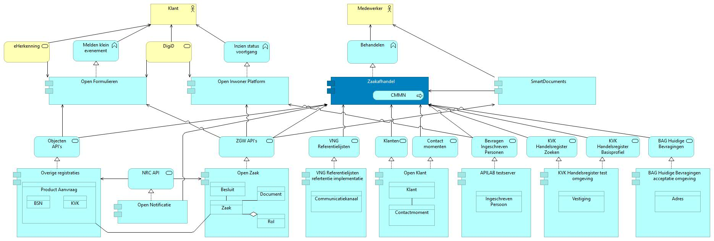

Voorafgaande aan het invullen van het start formulier logt de inwoner aan via DigiD. Na het invullen van het formulier in Open Formulieren gebeurt het volgende:

1. De inhoud van het formulier wordt in gestructureerd formaat (JSON) opgeslagen als _Product Aanvraag_ in Overige Registraties
1. Het via DigiD verkregen BSN van de inwoner wordt opgeslagen in de Product Aanvraag
1. Het ingevulde formulier wordt als PDF document opgeslagen in Open Zaak

Het aanmaken van de Product Aanvraag in Overige Registraties zorgt er voor dat er een notificatie wordt gestuurd naar Open Notificaties. Het Zaakafhandel Component heeft een abonnement op notificaties waardoor Open Notificaties de notificatie weer door stuurt naar het Zaakafhandel Component. Na het ontvangen van de notificatie van het aanmaken van een nieuwe Product Aanvraag in Overige Registraties gebeurt in het Zaakafhandel Component het volgende:

1. De Product Aanvraag wordt opgehaald uit Overige Registraties.
1. Op basis van het type Product Aanvraag wordt het Zaaktype bepaald en wordt een Zaak aangemaakt
1. De Product Aanvraag wordt gekoppeld aan de Zaak
1. Het al bestaande PDF document van het ingevulde formulier wordt gekoppeld aan de Zaak
1. Het BSN of KVK uit de Product Aanvraag wordt gebruikt om een Rol van het type Aanvrager te koppelen aan de Zaak. Het BSN of Vestigingsnummer wordt opgeslagen bij de Rol.
1. Er wordt een CMMN Case gestart voor de zaak. De gestarte CMMN Case wordt afgeleid van het zaaktype en kan worden geconfigureerd in het Zaakafhandel Component middels zaak behandel parameters.

# Identity en Policy

# Open Formulieren aangesloten op Zaakafhandelcomponent

# Open Formulieren aangesloten op e-Suite

