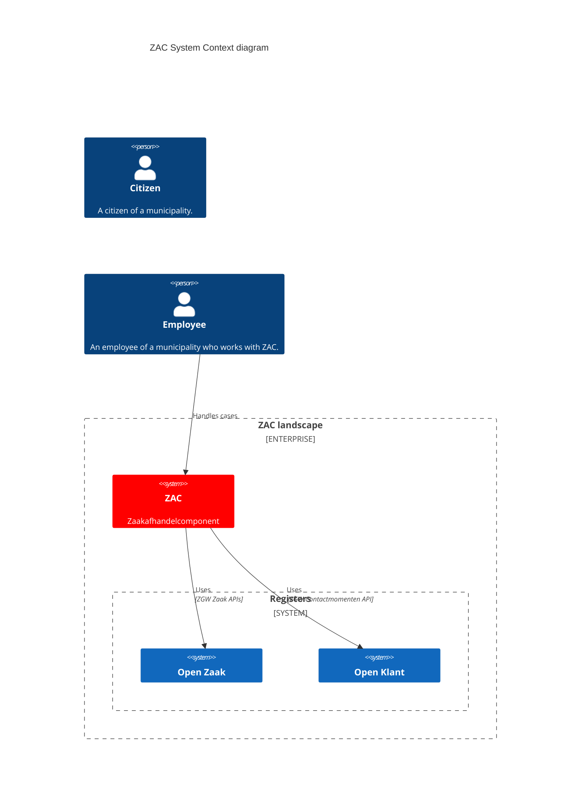

# ZAC solution architecture

These pages describe the solution architecture of ZAC.

The ZAC architecture is documented using the [C4 Model](https://c4model.com/).
Architecture diagrams are created and rendered using [Mermaid](https://mermaid.js.org/).

## ZAC system context

The following System Context diagram illustrates the architectural landscape of ZAC:

The following components are part of the ZAC system context:

| Component  | Description                                                                                                                               |
|------------|-------------------------------------------------------------------------------------------------------------------------------------------|
| Open Zaak  | Manages zaken, zaaktypes, and all related items. Also stores documents.                                                                   |
| Open Klant | Manages 'customers' (= citizens in our context) and customer 'contact moments'. Implements both the Klanten and Contactmomenten ZWG APIs. |

Furthermore, ZAC integrates with the following external services:

..

## Zaak creation flow

The most standard flow for creating a new 'zaak' is done by a citizen filling in a specific 'product aanvraag' form in Open Formulieren.

Upon submitting the form, the following happens:

1. The content of the form is saved in a structured format (JSON) as _Product Request_ in Miscellaneous Registrations.
2. The BSN obtained via DigiD from the citizen is stored in the Product Request.
3. The completed form is saved as a PDF document in Open Case.

Creating the Product Request in Miscellaneous Registrations ensures that a notification is sent to Open Notifications. "Zaak afhandel component" has a subscription to notifications, which means that Open Notifications forwards the notification to "Zaak afhandel component".
After receiving the notification of creating a new Product Request in Miscellaneous Registrations, the following happens in "Zaak afhandel component":

1. The Product Request is retrieved from Miscellaneous Registrations.
2. Based on the type of Product Request, the Case Type is determined, and a Case is created.
3. The Product Request is linked to the Case.
4. The existing PDF document of the completed form is linked to the Case.
5. The BSN or Chamber of Commerce number from the Product Request is used to link a Role of the type Applicant to the Case. The BSN or establishment number is stored with the Role.
6. A CMMN Case is started for the case. The started CMMN Case is derived from the case type and can be configured in "Zaak afhandel component" using case handling parameters.

This flow is visualised in the following sequence diagram:

## Identity and Access Management (IAM)

The IAM architecture of ZAC is shown in the following diagram:

