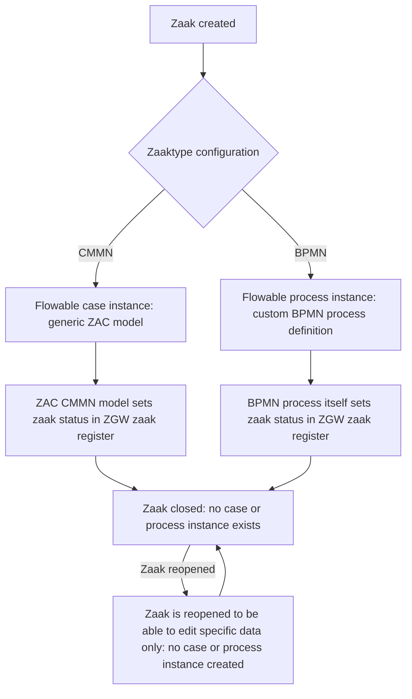
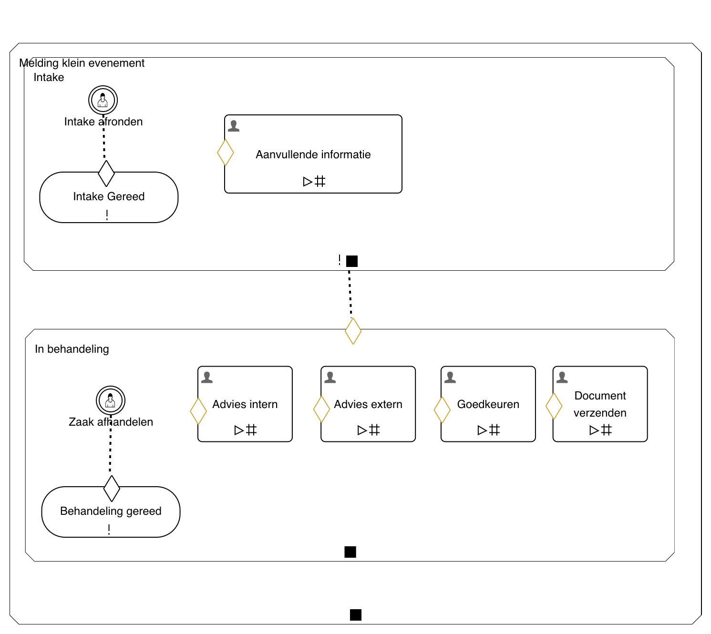

# ZAC Business Process Automation Architecture

The business process automation architecture of ZAC is implemented using the embedded [Flowable](https://www.flowable.com/open-source) business process automation engine, 
and supports both the [CMMN](https://www.omg.org/spec/CMMN/1.1/) and [BPMN](https://www.omg.org/spec/BPMN/2.0/) standards. 

ZAC supports one generic CMMN model to handle zaken. 
This CMMN model can be used for zaaktypes that can be handled by a generic process flow.
These are typically the more 'simple' zaaktypes.

Besides CMMN, ZAC also supports BPMN processes to handle zaken. 
BPMN is used for custom process flows, typically used for more complex zaaktypes.

Every zaaktype which is to be handled in ZAC, needs to be configured to either use the generic CMMN model or a custom BPMN process definition.
This is done using so called `zaakafhandelparameters` (also known as `CMMN` or `BPMN` zaaktype configurations).
Once a zaaktype is configured through it's `zaakafhandelparameters` as being either a CMMN or BPMN zaaktype in ZAC, it can never be changed.

## Zaak life cycle

Both flows run on the embedded Flowable engine, but differ in who sets the final zaak status.
For a BPMN zaak, ZAC starts a Flowable *process instance*. For a CMMN zaak, ZAC starts a Flowable *case instance*.

The ZAC CMMN model itself sets the zaak status in the ZGW zaak register once the CMMN case instance completes.
For BPMN, this is not done by ZAC: the BPMN process definition itself is responsible for setting the zaak status in the ZGW zaak register once the process instance completes.
Once a zaak is "afgehandeld" or "afgebroken" within ZAC, no case instance or process instance exists any more for that zaak, and the zaak is considered closed.

A zaak can also be reopened after it was closed. Reopening a closed zaak does not involve Flowable at all: no new case instance or process instance is created.

## Generic ZAC CMMN model

The generic ZAC CMMN model can be found in [Generiek_zaakafhandelmodel.cmmn.xml](../../src/main/resources/cmmn/Generiek_zaakafhandelmodel.cmmn.xml).
ZAC uses this model to handle the zaak states and related functionality and user interface of ZAC is based on this model.
It is not possible to change this model without changing the related ZAC source code.

The model consists of two main zaak states: `Intake` and `In behandeling` ('in progress') and looks as follows:

Editing of the ZAC CMMN model is not supported for end-users because it is tightly integrated with the ZAC application code.
When a ZAC developer needs to edit the CMMN model, they can use the online Flowable Designer (or edit the model file manually).

## BPMN process flows

ZAC provides BPMN for more complex zaaktypes that cannot be handled by the generic CMMN model.

BPMN support in ZAC uses the open source [Form.io](https://form.io) web form framework to model user task forms.

BPMN process definitions, as well as the corresponding Form.io forms, need to be created outside of ZAC before they can be used.
They can then be imported into ZAC using the ZAC admin interface.
See: [BPMN guide](../manuals/bpmn-guide/README.md) for details.
