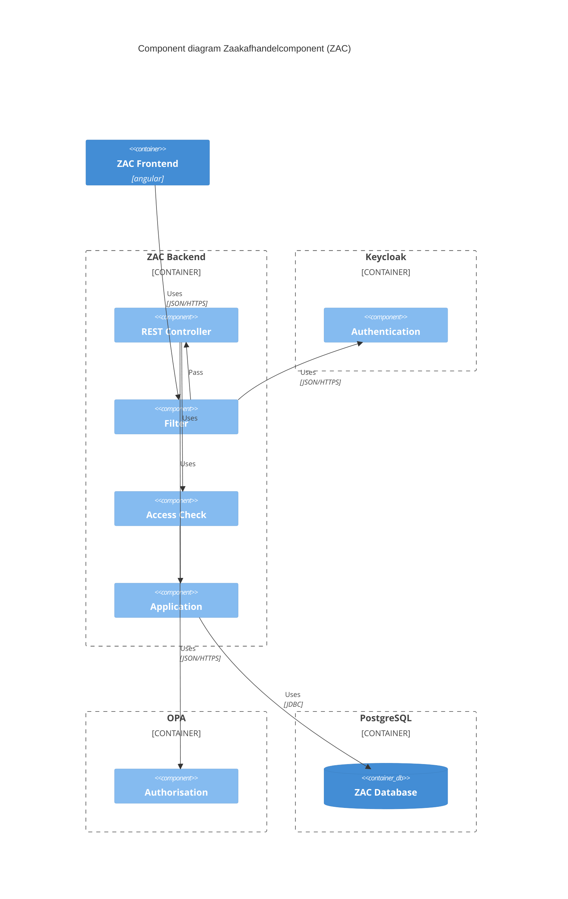

# ZAC Component diagram
A high-level component diagram of ZAC is shown below.

```mermaid
    C4Component
    title Component diagram Zaakafhandelcomponent (ZAC)

    Container(spa, "ZAC Frontend", "angular")

    Container_Boundary(api, "ZAC Backend") {
        Component(rest, "REST Controller")
        Component(filt, "Filter")
        Component(sign, "Access Check")
        Component(app, "Application")

        Rel(filt, rest, "Pass")
        Rel(rest, sign, "Uses")
        Rel(rest, app, "Uses")
    }

    Container_Boundary(kc, "Keycloak") {
        Component(kc, "Authentication")
    }

    Container_Boundary(opa, "OPA") {
        Component(opc, "Authorisation")
    }

    Container_Boundary(dbb, "PostgreSQL") {
        ContainerDb(db, "ZAC Database")
    }
    
    Rel(spa, filt, "Uses", "JSON/HTTPS")
    Rel(filt, kc, "Uses", "JSON/HTTPS")
    Rel(sign, opc, "Uses", "JSON/HTTPS")
    Rel(app, db, "Uses", "JDBC")
```
