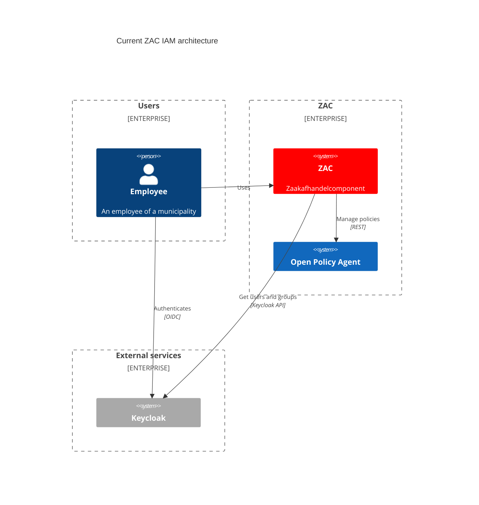
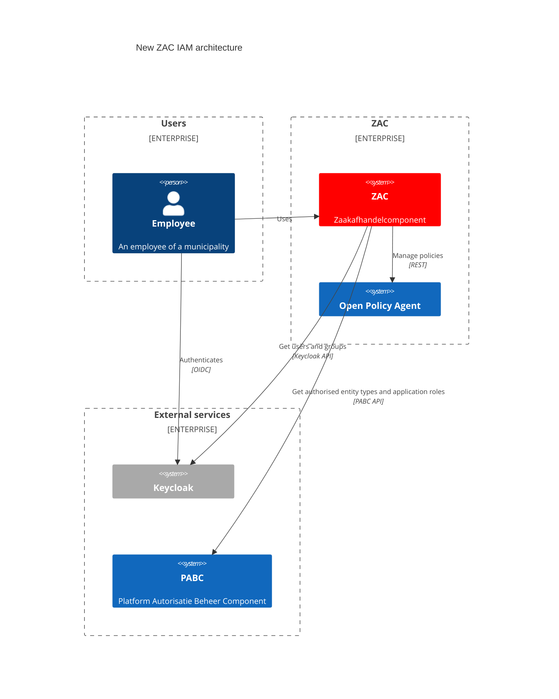

# Identity and Access Management (IAM)

## Current ZAC IAM architecture

The current IAM (Identify and Access Management) architecture of ZAC is illustrated in the following diagram:

The following components are part of the current ZAC IAM architecture:

| Component                                   | Description                                         | ZAC usage                                                                                                                                                                                                       |
|---------------------------------------------|-----------------------------------------------------|-----------------------------------------------------------------------------------------------------------------------------------------------------------------------------------------------------------------|
| [OPA](https://www.openpolicyagent.org//)    | Open Policy Agent. Policy engine that manages security policies. | ZAC manages all security policies (= role-permission mappings) in OPA.                                                                                                                                          |
| [Keycloak](https://www.keycloak.org/)       | Open Source Identity and Access Management product. | ZAC uses Keycloak for authentication and authorization. ZAC authenticates to Keycloak using OIDC (OpenID Connect). ZAC also uses Keycloak to retrieve users and groups, for example to be able to assign zaken. |

For details about the OPA access control policies and roles used by ZAC please see: [access control policies](accessControlPolicies.md).

Two completely disjunct principles are used for authorization in the current ZAC architecture:

- Authorised zaaktypes
- ZAC application roles

Authorised zaaktypes are managed using 'domains', where domains exist both as special Keycloak roles (prepended with `domein_`) and also as configuration parameters in 
the ZAC zaakafhandelparameters which forms the link to a specific zaaktype.

ZAC offers a set of available application roles and the mapping from users (optionally through groups) to these application roles is done in Keycloak.

A logged-in user has one or more ZAC application roles and, completely disjunct from this, can also have one or more authorised zaaktypes. 
Typically, a combination of these two, but sometimes only the application role, is used for authorization checks in ZAC (using OPA).
Some authorization checks are independent of a particular zaaktype, and for these authorizations only the ZAC application roles are used.

## New ZAC IAM architecture

ZAC is in the transition to move to a new IAM architecture. This is currently 'hidden' for normal ZAC usage by the `FEATURE_FLAG_PABC_INTEGRATION` feature flag.
When this feature flag is disabled (which is the default), ZAC uses the current IAM architecture as described above.

The new ZAC IAM architecture is illustrated in the following diagram:

The following components are part of the current ZAC IAM architecture:

| Component                                | Description                           | ZAC usage                                                                                                                                                                                                                   |
|------------------------------------------|---------------------------------------|-----------------------------------------------------------------------------------------------------------------------------------------------------------------------------------------------------------------------------|
| [OPA](https://www.openpolicyagent.org//) | Open Policy Agent. Policy engine that manages security policies. | ZAC manages all security policies (= role-permission mappings) in OPA.                                                                                                                                                      |
| [Keycloak](https://www.keycloak.org/)    | Open Source Identity and Access Management product. | ZAC uses Keycloak for authentication and functional roles mappings. ZAC authenticates to Keycloak using OIDC (OpenID Connect). ZAC also uses Keycloak to retrieve users and groups, for example to be able to assign zaken. |
| [PABC](https://github.com/Platform-Autorisatie-Beheer-Component) | Platform Autorisatie Beheer Component | ZAC uses the PABC to retrieve application roles and zaaktype-application roles combinations from the user's functional roles. In a future version PABC will also integrate with Keycloak.                                   |

The new IAM architecture is quite different from the old IAM architecture in that it allows different application roles _per_ zaaktype per user.
This is implemented using the following concepts which are managed in the PABC:

* Mappings from functional roles to a set of the following:
    * A combination of:
        * Authorised zaaktype
        * ZAC application roles applicable to this zaaktype
    * ZAC application roles that are not zaaktype-specific

In the PABC the concept of `zaaktype` is abstracted as a generic `entity type` concept, allowing for the possibility to use the PABC for authorisations on other entity types in the future.

Internally in the PABC these `entity types` are grouped using `domains`.
In the new IAM architecture `domains` are a PABC-internal concept only. 
ZAC, nor Keycloak, have any knowledge of these `domains`.

The functional roles and mappings from users (typically through groups) to functional roles are managed in Keycloak.

## Internal endpoints

ZAC exposes some 'internal' endpoints (on `/rest/internal/*`) which are not called by the ZAC user interface but rather by other components in the ZAC architecture,
such as Kubernetes cron jobs or scripts which can be run manually.

Because in these system integrations there is no end-user available, these endpoints are secured using a simple built-in API key mechanism. This works as follows:

- The API key is a simple string which needs to be passed with all internal HTTP(S) requests in the `X-API-KEY` HTTP header.
- If the API key is not provided the internal endpoint will return a 401 Unauthorized response.
- On deployment ZAC needs to be configured with a value for this API key. This value is also used to configure specific ZAC Kubernetes cron jobs that use these 
internal endpoints. Please see the [ZAC Helm Chart](../../charts/zac) for details.
