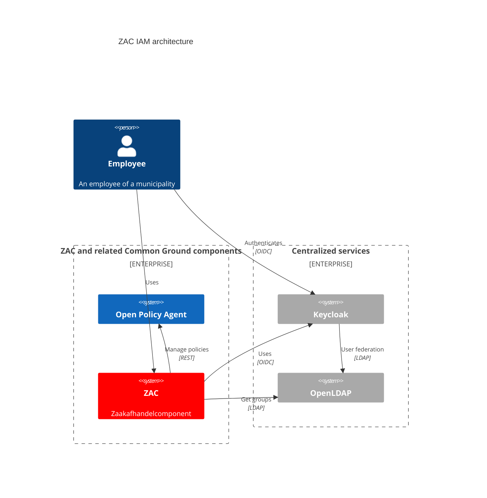

# Identity and Access Management (IAM)

The IAM (Identify and Access Management) architecture of ZAC is illustrated in the following diagram:

The following components are part of the ZAC IAM architecture:

| Component                                   | Description                                                      | ZAC usage                                                                                                                                                                                                                                                               |
|---------------------------------------------|------------------------------------------------------------------|-------------------------------------------------------------------------------------------------------------------------------------------------------------------------------------------------------------------------------------------------------------------------|
| [OPA](https://www.openpolicyagent.org//)    | Open Policy Agent. Policy engine that manages security policies. | ZAC manages all security policies (= role-permission mappings) in OPA.                                                                                                                                                                                                  |
| [Keycloak](https://www.keycloak.org/)       | Open Source Identity and Access Management product.              | ZAC uses Keycloak for authentication and authorization. Both the ZAC frontend (= the browser) as well as the ZAC backend (= Docker container / Kubernetes pod) authenticate to Keycloak using OIDC (OpenID Connect). Keycloak in turn used OpenLDAP for user federated. |
| [OpenLDAP](https://www.openldap.org/)       | Open Source LDAP server.                                         | ZAC retrieves available user groups from OpenLDAP. Keycloak uses OpenLDAP for user federation. OpenLDAP is leading for all users and groups as well as for federated user authentication (user passwords are only stored in OpenLDAP, not in Keycloak).                 |

As can be seen above ZAC currently requires OpenLDAP as user store solution. Integration with Active Directory is foreseen in future but not yet implemented.
