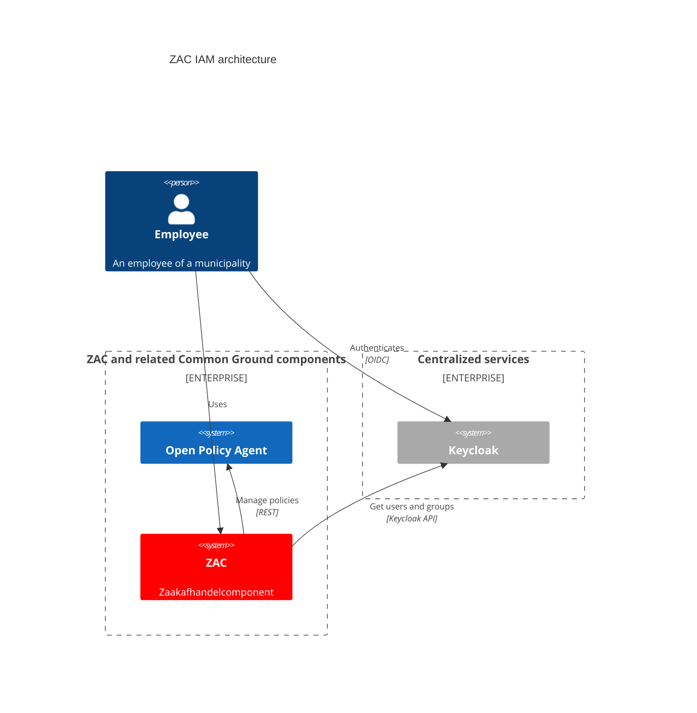

# Identity and Access Management (IAM)

The IAM (Identify and Access Management) architecture of ZAC is illustrated in the following diagram:

The following components are part of the ZAC IAM architecture:

| Component                                   | Description                                         | ZAC usage                                                                                                                                                                                                       |
|---------------------------------------------|-----------------------------------------------------|-----------------------------------------------------------------------------------------------------------------------------------------------------------------------------------------------------------------|
| [OPA](https://www.openpolicyagent.org//)    | Open Policy Agent. Policy engine that manages security policies. | ZAC manages all security policies (= role-permission mappings) in OPA.                                                                                                                                          |
| [Keycloak](https://www.keycloak.org/)       | Open Source Identity and Access Management product. | ZAC uses Keycloak for authentication and authorization. ZAC authenticates to Keycloak using OIDC (OpenID Connect). ZAC also uses Keycloak to retrieve users and groups, for example to be able to assign zaken. |

For details about the OPA access control policies and roles used by ZAC please see: [access control policies](accessControlPolicies.md).
