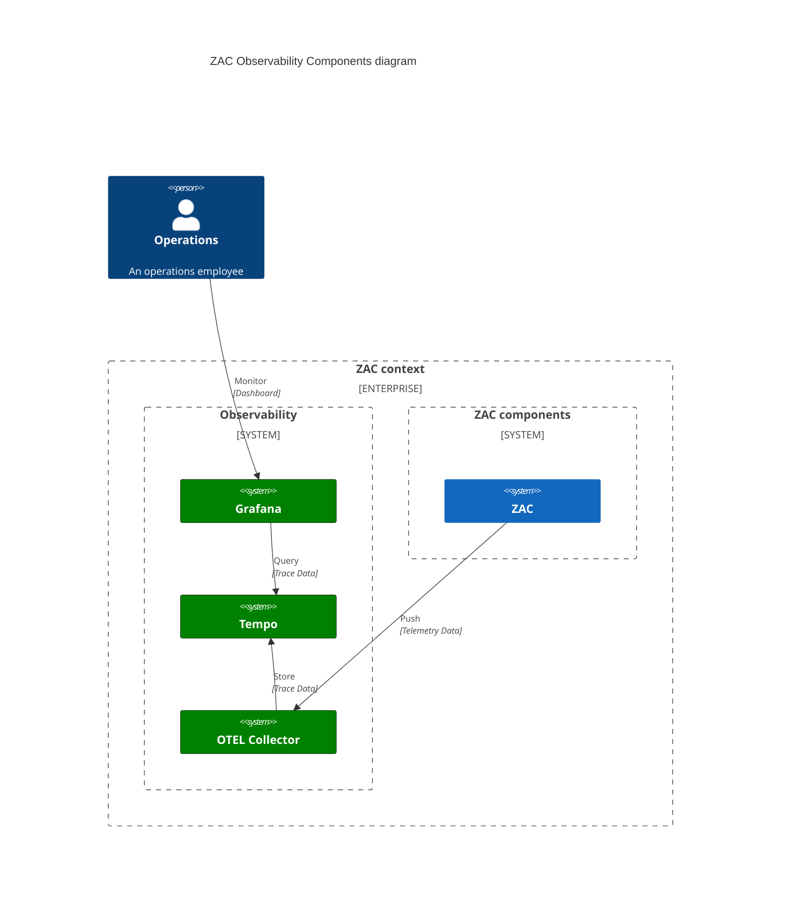

# Observability

The Observability architecture of ZAC is based on [OpenTelemetry](https://opentelemetry.io/) and is illustrated in the following diagram:

The following components are part of the ZAC Observability architecture:

| Component                                                   | Description                                                     | ZAC usage                                                                                                           |
|-------------------------------------------------------------|-----------------------------------------------------------------|---------------------------------------------------------------------------------------------------------------------|
| [Grafana](https://grafana.com/)                             | Grafana monitoring dashboards for visualising monitored data.   | Used to visualise and track performance, usage and working of the ZAC application.  |
| [Tempo](https://grafana.com/docs/tempo/latest/)             | Tempo object database for traces.                               | Used to store the trace data coming from the ZAC application.                                                       |
| [OTEL Collector](https://opentelemetry.io/docs/collector/)  | OTEL Collector receives, processes and exports telemetry data.  | The ZAC application pushes it's telemetry data to the OTEL Collector, that then stores it into the Tempo database. | 

