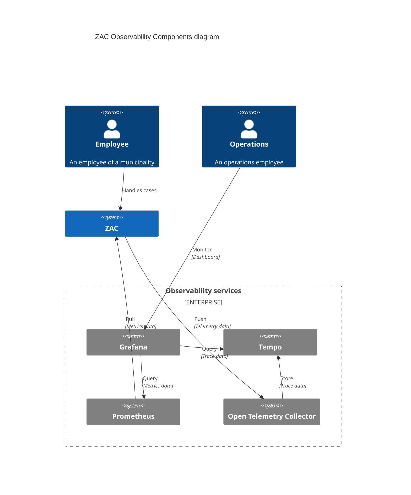

# Observability

The Observability architecture of ZAC is based on [OpenTelemetry](https://opentelemetry.io/) and is illustrated in the following diagram:

Note that there are several ways to set up an observability architecture. 
The above diagram illustrates just one way of doing this, and is used in our local Docker Compose setup.
For example, instead of having Prometheus scrape metrics directly from the ZAC application, the Open Telemetry Collector could also be used to receive metrics data
and pass it on to Prometheus.

The following components are part of the ZAC Observability architecture:

| Component                                                           | Description                                                                | ZAC usage                                                                                                                               |
|---------------------------------------------------------------------|----------------------------------------------------------------------------|-----------------------------------------------------------------------------------------------------------------------------------------|
| [Grafana](https://grafana.com/)                                     | Grafana monitoring dashboards for visualising monitored data.              | Used to visualise and track performance, usage and working of the ZAC application.                                                      |
| [Tempo](https://grafana.com/docs/tempo/latest/)                     | Tempo object database for traces.                                          | Used to store the trace data coming from the ZAC application.                                                                           |
| [Prometheus](https://prometheus.io/)                 | Metrics store (and monitoring solution).               | Used to store metrics coming from the ZAC application.                                                                                  |
| [Open Telemetry Collector](https://opentelemetry.io/docs/collector/) | The Open Telemetry (OTEL) Collector receives and processes telemetry data. | The ZAC application pushes its telemetry data (metrics and traces) to the OTEL Collector, that then stores it into the Tempo database. | 

