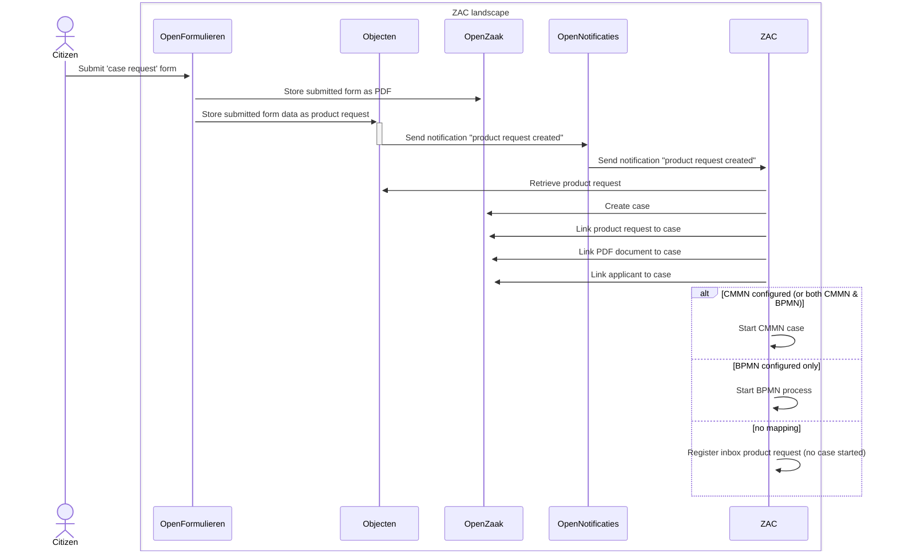

# ZAC integration with Open Formulieren

This page describes the way in which ZAC integrates with the Open Formulieren component.

## Zaak creation flow from Open Formulieren

There are multiple ways to create a new zaak. The most standard way involves Open Formulieren and works as follows:

1. A citizen submits a specific zaak request form (or 'zaakstartformulier') in Open Formulieren.
Technically this submitted form constitutes a 'product request'. Upon submitting the form, the following happens:
   1. The completed form is saved as a PDF document in Open Zaak.
   2. The content of the form is also saved in a structured format (JSON) as _Product Request_ in Objecten.
      1. The BSN obtained via DigiD from the citizen is also stored in the Product Request.
   Creating the Product Request object in Objecten ensures that a notification is sent to Open Notifications.
   Note that Open Formulieren does not make a request to Objecttypes in this scenario.
2. ZAC has a subscription to these Product Request notifications, which means that Open Notifications forwards the notification to ZAC.
After receiving the notification of creating a new Product Request, the following happens in ZAC:
   1. The Product Request is retrieved from Objecten.
   2. Based on the type of Product Request, the zaak type is determined, and a zaak is created in Open Zaak.
      Note that this entails multiple requests to Open Zaak to create the related zaak data like zaakrolle, etcetera.
      For simplicity, this is not shown in the diagram.
   3. The Product Request is linked to the zaak.
   4. The existing PDF document of the completed form is linked to the zaak in Open Zaak.
   5. The BSN or Chamber of Commerce number from the Product Request is used to link a Role of the type Applicant to the zaak. The BSN or establishment number is stored with the Role.
   6. A CMMN Case or BPMN process is started for the zaak.
      1. If a CMMN mapping for the Product Request type exists (via zaak handling parameters), a CMMN Case is started for the zaak.
      2. if a BPMN mapping for the Product Request type exists (via a configured BPMN process for the zaak type), a BPMN process is started for the zaak.
      3. If both CMMN and BPMN are defined for the same Product Request type, CMMN takes precedence: the CMMN Case is started, and the BPMN mapping is ignored (a warning is logged).

This flow is visualised in the following sequence diagram:

