# ZAC integration with Open Formulieren

This page describes the way in which ZAC integrates with the Open Formulieren component.

## Zaak creation flow from Open Formulieren

There are multiple ways to create a new zaak. The most standard way involves Open Formulieren and works as follows:

1. A citizen submits a specific case request form (or 'zaakstartformulier') in Open Formulieren.
Technically this submitted form constitutes a 'product request'. Upon submitting the form, the following happens:
   1. The completed form is saved as a PDF document in Open Zaak.
   2. The content of the form is also saved in a structured format (JSON) as _Product Request_ in Objecten.
      1. The BSN obtained via DigiD from the citizen is also stored in the Product Request.
   Creating the Product Request object in Objecten ensures that a notification is sent to Open Notifications.
2. ZAC has a subscription to these Product Request notifications, which means that Open Notifications forwards the notification to ZAC.
After receiving the notification of creating a new Product Request, the following happens in ZAC:
   1. The Product Request is retrieved from Objecten.
   2. Based on the type of Product Request, the Case Type is determined, and a Case is created.
   3. The Product Request is linked to the Case.
   4. The existing PDF document of the completed form is linked to the Case in Open Zaak.
   5. The BSN or Chamber of Commerce number from the Product Request is used to link a Role of the type Applicant to the Case. The BSN or establishment number is stored with the Role.
   6. A CMMN Case (process) is started for the case. The started CMMN Case is derived from the case type and can be configured in ZAC using case handling parameters.

This flow is visualised in the following sequence diagram:

```mermaid
sequenceDiagram
    actor Citizen
    box ZAC landscape
    participant OpenFormulieren
    participant Objecten
    participant OpenZaak
    participant OpenNotificaties
    participant ZAC
    end

    Citizen->>+OpenFormulieren: Submit 'case request' form
    OpenFormulieren->>+OpenZaak: Store submitted form as PDF
    OpenFormulieren->>+Objecten: Store submitted form data as product request
    Objecten->>-OpenNotificaties: Send notification "product request created"
    OpenNotificaties->>+ZAC: Send notification "product request created"
    ZAC->>+Objecten: Retrieve product request
    ZAC->>+OpenZaak: Create case
    ZAC->>+OpenZaak: Link product request to case
    ZAC->>+OpenZaak: Link PDF document to case
    ZAC->>+OpenZaak: Link applicant to case
    ZAC->>+ZAC: Start CMMN case
```

