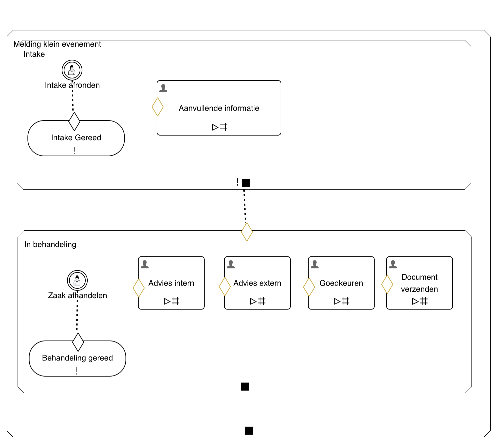

# ZAC Process Automation Architecture

The process automation architecture of ZAC is based on the [CMMN](https://www.omg.org/spec/CMMN/1.1/) and 
[BPMN](https://www.omg.org/spec/BPMN/2.0/) standards.

ZAC currently focuses mostly on CMMN and supports one generic CMMN model for the zaak workflow.
However, ZAC also supports BPMN processes for custom process flows.

## Generic ZAC CMMN model

The generic ZAC CMMN model can be found in [Generiek_zaakafhandelmodel.cmmn.xml](../../src/main/resources/cmmn/Generiek_zaakafhandelmodel.cmmn.xml).
ZAC uses this model to handle the zaak states and related functionality and user interface of ZAC is based on this model.
It is not possible to change this model without changing the related ZAC source code.

The model consists of two main zaak states: `Intake` and `In behandeling` ('in progress') and looks as follows:

If you wish to edit the CMMN model you can use the online Flowable Designer (or edit the model file manually).

## BPMN process flows

:warning: BPMN functionality is still in active development

To have a flexible and user customizable process flow ZAC supports the BPMN standard. 

BPMN process flows make use of the open source [Flowable](https://www.flowable.com/open-source)
process automation engine which is embedded within the ZAC application.

BPMN models can be generated and edited with the online Flowable Designer. Upload of a generated model to ZAC is still in development and currently not available.
