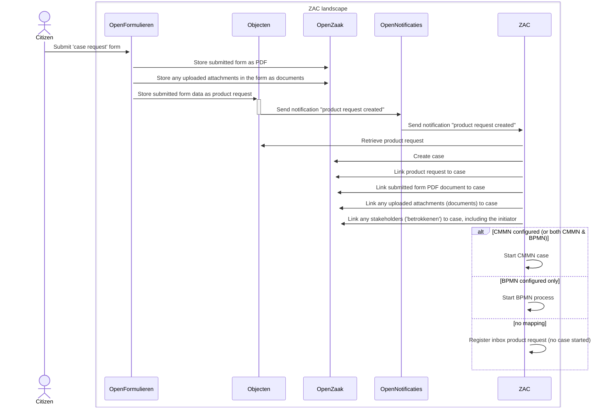

# ZAC productaanvraag support

This page describes the way ZAC supports the product request ('productaanvraag') flow, which is a standardised
cross-component zaakgericht-werken flow allowing applications outside of ZAC to create and start handling a zaak in ZAC.
An example an application that supports creating product requests is Open Formulieren, where you are able 
to create and configure a citizen-facing form in such a way that a product request is created on submitting.

ZAC listens for any newly created product requests (using Open Notifications as notification service), 
and if there is a zaaktype configured to handle a new product request (using zaakafhandelparameters), 
it will automatically create a zaak in Open Zaak based on the submitted product request data and start the
configured CMMN model or BPMN process for handling the zaak.

## Zaak product request flow from Open Formulieren

A typical product request flow involves Open Formulieren, but is nearly identical when the product requests 
originates from a different product than Open Formulieren. It works as follows:

1. A citizen submits a specific productaanvraag form (also known as a 'zaak start formulier') in Open Formulieren.
On submitting this form Open Formulieren creates a product request using the following flow:
   1. The completed form is saved as a PDF document in the ZGW document management system used (typically Open Zaak).
   2. Any uploaded attachments in the form are also saved as separate documents in Open Zaak.
   3. The content of the form is also saved in a structured format (JSON) as _Product Request_ in Objecten.
      1. The BSN obtained via DigiD from the citizen or KVK data in case of a company is also stored in the product request.
   Creating the Product Request object in Objecten ensures that a notification is sent to Open Notifications.
   Note that Open Formulieren does not make a request to Objecttypes in this scenario.
2. ZAC has a subscription to these Product Request notifications, which means that Open Notifications forwards the notification to ZAC.
After receiving the notification of creating a new Product Request, the following happens in ZAC:
   1. The Product Request is retrieved from Objecten.
   2. Based on the type of Product Request, the zaaktype is determined, and a zaak is created in Open Zaak.
      Note that this entails multiple requests to Open Zaak to create the related zaak data like zaakrollen and such.
      For simplicity, this is not shown in the diagram.
   3. The Product Request is linked to the zaak.
   4. The existing PDF document of the completed form is linked to the zaak in Open Zaak.
   5. Any attachments uploaded with the form are also linked as documents to the zaak in Open Zaak.
   6. The BSN or Chamber of Commerce number from the Product Request is used to link a Role of the type Applicant to the zaak. The BSN or establishment number is stored with the Role.
   7. A CMMN Case or BPMN process is started for the zaak.
      1. If a CMMN mapping for the Product Request type exists (via zaak handling parameters), a CMMN Case is started for the zaak.
      2. if a BPMN mapping for the Product Request type exists (via a configured BPMN process for the zaak type), a BPMN process is started for the zaak.
      3. If both CMMN and BPMN are defined for the same Product Request type, CMMN takes precedence: the CMMN Case is started, and the BPMN mapping is ignored (a warning is logged).

This flow is visualised in the following sequence diagram:

