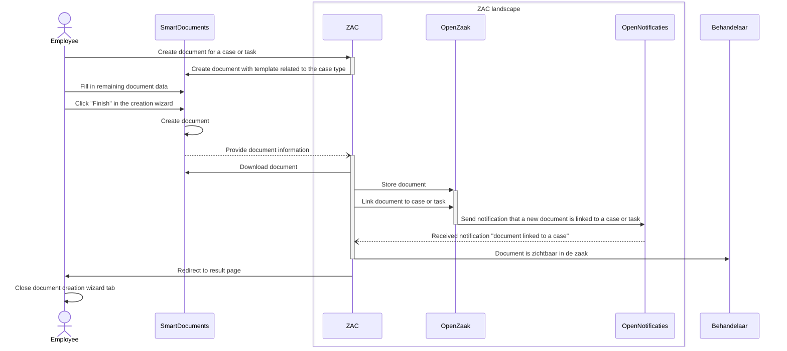

# SmartDocuments

## Case Configurations 

Each case type configuration defines a mapping between SmartDocuments template and document type. This mapping is used to get the correct template and template group with the Document creation flow below.

## Document creation flow

The ZAC - SmartDocuments document creation flow is as follows:

1. User starts SmartDocument wizard from ZAC ('create document'). This can be done either from a case (zaak) or from a task.
2. ZAC sends an HTTPS request to start a document creation wizard to SmartDocuments and sends case- and other information in this request.
3. The document creation wizard is started in SmartDocuments. Case or task information and template type are pre-filled.
4. At the end of the document creation wizard, SmartDocuments:
   1. creates a Word document and stores it on SmartDocuments side for later retrieval
   2. calls a ZAC callback endpoint with information about the created document
5. ZAC callback endpoint in turn:
   1. Downloads the Word document from SmartDocuments 
   2. Creates a document ('enkelvoudiginformatieobject') in the ZRC API implementation (also known as 'zaakregister'; in the context of ZAC this is usually OpenZaak).
   3. Confidentiality of the document is set to PUBLIC and the document status to IN_PROGRESS
   4. Usage permissions ('Gebruiksrechten') are set for the document. Without this step the zaak to which this document belongs cannot be closed nor interrupted.
   5. The document/enkelvoudiginformatieobject is linked to the case or task in question (by creating a ‘zaakinformatieobject’).
6. The zaakregister sends a notification to Open Notificaties that a new document has been linked to a case or task.
7. Open Notificaties sends a callback request to ZAC informing ZAC of this event.
8. Depending on which SmartDocuments environment is used and how it is configured, the user also has the option to download the document to their local computer.
9. When the user returns to the ZAC browser tab, they will see the new document attached to the case or task.

This flow is visualised in the following sequence diagram:

