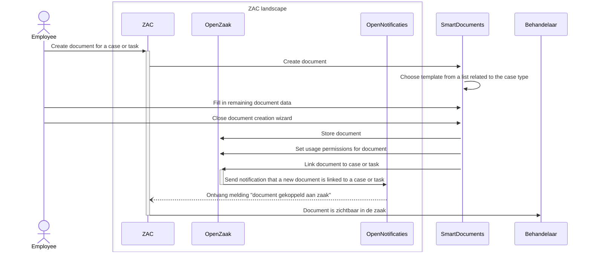

# SmartDocuments document creation flow

The ZAC - SmartDocuments document creation flow is as follows:

1. User starts SmartDocument wizard from ZAC ('create document'). This can be done either from a case (zaak) or from a task.
2. ZAC sends a HTTPS request to start a document creation wizard to SmartDocuments and sends case- and other information in this request.
3. The document creation wizard is started in SmartDocuments. Case or task information is pre-filled.
4. When the user closes the document creation wizard, SmartDocuments does the following by sending the following HTTPS requests using the SmartDocuments 'DMS Plugin' (see below):
    1. A Word document ('enkelvoudiginformatieobject') is created in the ZRC API implementation (also known as 'zaakregister'; in the context of ZAC this is usually OpenZaak).
    2. Usage permissions ('Gebruiksrechten') are set for the document. Without this step the zaak to which this document belongs cannot be closed nor interrupted.  
    3. The document/enkelvoudiginformatieobject is linked to the case or task in question (by creating a ‘zaakinformatieobject’).
5. The zaakregister sends a notification to Open Notificaties that a new document has been linked to a case or task.
6. Open Notificaties sends a callback request to ZAC informing ZAC of this event.
7. Depending on which SmartDocuments environment is used and how it is configured, the user also has the option to download the document to their local computer.
8. When the user returns to the ZAC browser tab, they will see the new document attached to the case or task.

This flow is visualised in the following sequence diagram:



## SmartDocuments DMS Plugin

The SmartDocuments DMS Plugin is a plugin that is installed in the SmartDocuments environment. 
It is used to send HTTPS requests to the ZRC API implementation (OpenZaak) to create a document and link it to a case or task. 
The plugin needs to be configured in every SmartDocuments environment using the script below. 
Note that contents of this script may not necessarily be up-to-date. It is shown here purely as reference. 
Always check with SmartDocuments for the latest information.

In the script below the hardcoded URLs to the specific OpenZaak instance of the Lifely test environment were replaced with `{{OPEN_ZAAK_BASE_URL}}`. 

```
##Token##
JWT 60 ********************
{
  "client_id": "smartdocuments"
}
####

##Informatieobject##
POST https://{{OPEN_ZAAK_BASE_URL}}/documenten/api/v1/enkelvoudiginformatieobjecten
Authorization: Bearer --X|DMS|Finish|Token|//root--
Content-Type: application/json; charset=utf-8

{
  "bronorganisatie" : "--X|//bronorganisatie--",
  "informatieobjecttype": "--X|//informatieobjecttype--",
  "status": "--X|//informatieobjectStatus--",
  "creatiedatum": "--Q|952932A914EE4D7C9BCDBDC3C428D5D1--",
  "titel": "--F|Template.1-----Q|7F0E6052E8BD4F8D8D7CB2D41C7B80D3--",
  "auteur": "--F|Author.4-- --F|Author.1--",
  "taal": "dut",
  "inhoud": "--generated_docx--",
  "bestandsnaam": "--filename--.docx",
  "formaat": "application/vnd.openxmlformats-officedocument.wordprocessingml.document"
}
####

##Gebruiksrechten##
POST {{OPEN_ZAAK_BASE_URL}}/documenten/api/v1/gebruiksrechten
Authorization: Bearer --X|DMS|Finish|Token|//root--
Content-Type: application/json; charset=utf-8

{
  "informatieobject": "--X|DMS|Finish|Informatieobject|//url--",
  "omschrijvingVoorwaarden": "geen",
  "startdatum": "--Q|952932A914EE4D7C9BCDBDC3C428D5D1--T00:00:00+01:00"
}
####

{
  "informatieobject": "--X|DMS|Finish|Informatieobject|//url--",
  "titel": "--filename--",
  "zaak": "--X|//zaak--"
}

```
