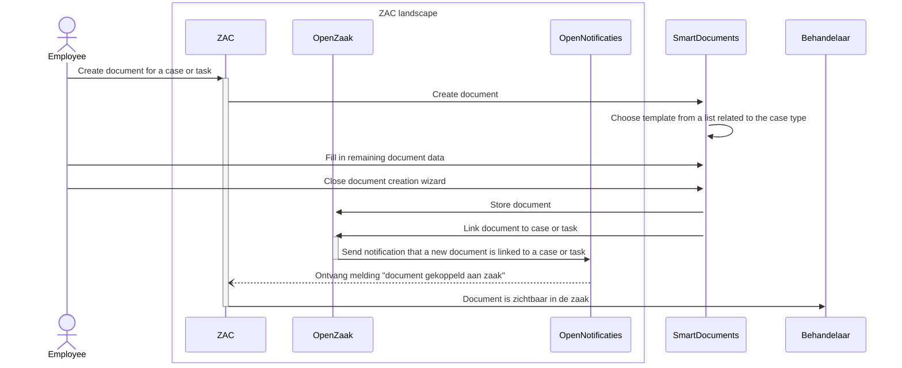

# SmartDocuments document creation flow

The ZAC - SmartDocuments document creation flow is as follows:

1. User starts SmartDocument wizard from ZAC ('create document'). This can be done either from a case (zaak) or from a task.
2. ZAC sends a HTTPS request to start a document creation wizard to SmartDocuments and sends case- and other information in this request.
3. The document creation wizard is started in SmartDocuments. Case or task information is pre-filled.
4. When the user closes the document creation wizard, SmartDocuments does the following by sending two HTTPS requests:
    1. A Word document ('enkelvoudig informatie object') is created in OpenZaak.
    2. This document is linked to the case or task in question (by creating a ‘zaakinformatieobject’).
5. Open Zaak sends a notification to Open Notificaties that a new document has been linked to a case or task.
6. Open Notificaties sends a callback request to ZAC informing ZAC of this event.
7. Depending on which SmartDocuments environment is used, the user also has the option to download the document to their local computer.
   However this part of the standard flow.
8. When the user returns to the ZAC browser tab, they will see the new document attached to the case or task.

This flow is visualised in the following sequence diagram:

