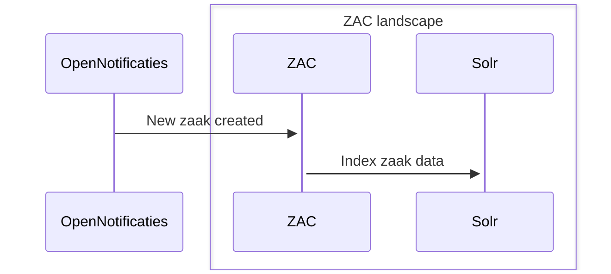

# Solr indexing in ZAC

ZAC uses the Solr search engine to be able to quickly retrieve and search in zaak-related information.
The Solr index is used in multiple places within ZAC, most notably for the various 'workload' ('werkvoorraad') screens.

The Solr index contains both data from Open Zaak (zaak data) as well as 'ZAC-internal' data (such as task data).

## ZAC startup

When ZAC starts up, it will check if the ZAC Solr index is available. If not, it will try to create the Solr index.
ZAC requires that the `zac` Solr core is available. If it is not, ZAC will fail to start.

## Solr indexing flow

The standard flow for Solr indexing in ZAC is as follows:

1. ZAC either receives a specific notification from Open Notifications for data
which is part of the Solr index (e.g. a new zaak is created) or ZAC internally identified that certain
data in the Solr index is stale and needs to be re-indexed (e.g. a task is created).
2. ZAC indexes the relevant data in Solr.

This is illustrated in the following sequence diagram showing the example of a new zaak being created:

## Reindexing

Besides the standard flow for Solr indexing, ZAC also has a 'reindexing' feature, which can be used to reindex all data in the Solr index.
This can be useful in case of issues with the Solr index, or when the Solr schema has been updated and all data needs to be reindexed to be compatible with the new schema.

When the reindexing feature is triggered, ZAC will first delete all data in the Solr index and then reindex all relevant data from Open Zaak and ZAC-internal data.
Be aware that this can take considerable time, depending on the amount of data that needs to be indexed.

Reindexing can be using the [reindexing script](../../scripts/solr/reindex-zac-solr-data.sh) or be calling the indexing ZAC API endpoint directly.
