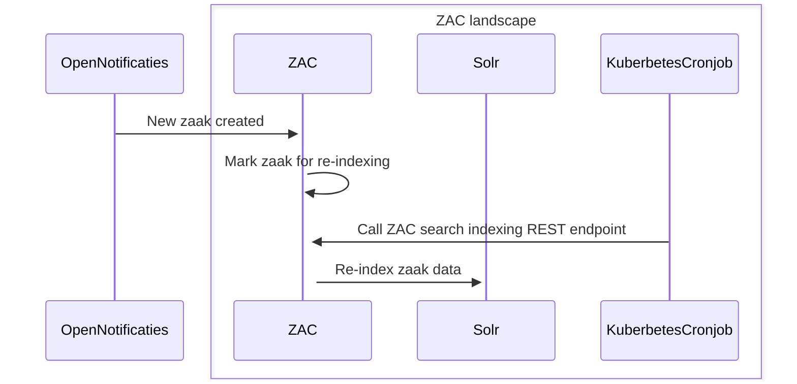

# Solr indexing in ZAC

ZAC uses the Solr search engine to be able to quickly retrieve and search in zaak-related information.
The Solr index is used in multiple places within ZAC, most notably for the various 'workload' ('werkvoorraad') screens.

The Solr index contains both data from Open Zaak (zaak data) as well as 'ZAC-internal' data (such as task data).

## ZAC startup

When ZAC starts up, it will check if the ZAC Solr index is available. If not, it will try to create the Solr index.
ZAC requires that the `zac` Solr core is available. If it is not, ZAC will fail to start.

## Solr indexing flow

The most standard flow for Solr indexing in ZAC is as follows:

1. ZAC either receives a specific notification from Open Notifications for data
which is part of the Solr index (e.g. a new zaak is created) or ZAC internally identified that certain
data in the Solr index is stale and needs to be re-indexed (e.g. a task is created).
2. ZAC indicates that the Solr index needs to be re-indexed for the data object in question (e.g. zaak, task).
Internally this process is known as 'mark object for indexing'. Technically ZAC does this by writing a
record in the `zoek_index` database table (a somewhat misleading name, because this is not a search index).
3. The actual Solr indexing is done when the ZAC search indexing REST endpoint is called
(for the data object type in question and for a certain maximum amount of objects).
This is normally done by a Kubernetes cronjob which runs every once in a while (e.g. every minute).
   1. ZAC will now reindex all data objects that were previously 'marked for reindexing'

This is illustrated in the following sequence diagram:

