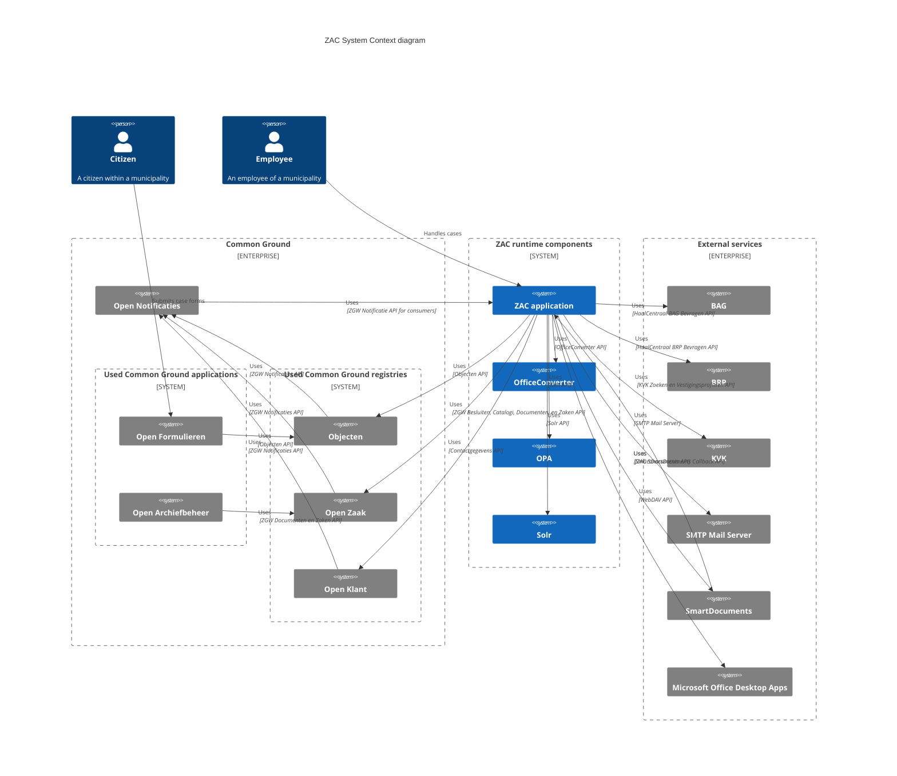

# ZAC system context

The following System Context diagram illustrates the architectural landscape of ZAC:



TODO: test using PlantUML instead of Mermaid.

```plantuml
@startuml
!include https://raw.githubusercontent.com/plantuml-stdlib/C4-PlantUML/master/C4_Context.puml
TITLE ZAC System Context diagram

Person(citizen, "Citizen", "A citizen within a municipality")
Person(employee, "Employee", "An employee of a municipality")

Enterprise_Boundary(commonGround, "Other Common Ground components") {
    System_Boundary(components, "Common Ground applications") {
        System_Ext(openForms, "Open Formulieren")
        System_Ext(openArchief, "Open Archiefbeheer")
    }

    System_Boundary(utilities, "Common Ground utilities") {
        System_Ext(openNotificaties, "Open Notificaties")
        System_Ext(pabc, "PABC") 
        System_Ext(keycloak, "Keycloak")             
    }

    System_Boundary(registries, "Common Ground registries") {
        System_Ext(objecten, "Objecten")
        System_Ext(openZaak, "Open Zaak")
        System_Ext(openKlant, "Open Klant")
    }
}

System_Boundary(zacRuntime, "ZAC runtime components") {
    System(zac, "ZAC application\n\n\n")
    System(officeConverter, "OfficeConverter")
    System(opa, "OPA")
    System(solr, "Solr")
}

Enterprise_Boundary(external, "External services") {
    System_Ext(bag, "BAG")
    System_Ext(brp, "BRP")
    System_Ext(kvk, "KVK")
    System_Ext(smtpServer, "SMTP Mail Server")
    System_Ext(smartDocs, "SmartDocuments")
    System_Ext(msOffice, "Microsoft Office Desktop Apps")
}

Rel(citizen, openForms, "Submits case forms")
Rel(employee, zac, "Handles cases")

Rel(openForms, objecten, "Read productaanvraag", "Objecten API")
Rel(openKlant, openNotificaties, "Uses", "ZGW Notificaties API")
Rel(objecten, openNotificaties, "Uses", "ZGW Notificaties API")
Rel(openZaak, openNotificaties, "Uses", "ZGW Notificaties API")

Rel(openArchief, openZaak, "Uses", "ZGW Documenten en Zaken API")

Rel(openNotificaties, zac, "Uses", "ZGW Notificatie API for consumers")

Rel(zac, officeConverter, "Convert to PDF", "OfficeConverter API")
Rel(zac, opa, "Authorisation policies", "OPA API")
Rel(zac, solr, "Search", "Solr API")

Rel(zac, objecten, "Uses", "Objecten API")
Rel(zac, openZaak, "Uses", "ZGW Besluiten, Catalogi, Documenten, en Zaken API")
Rel(zac, openKlant, "Uses", "Klantinteracties API")
Rel(zac, openKlant, "Uses", "Contactgegevens API")
Rel(zac, pabc, "Get employee and group authorisation mappings", "PABC authorisations API")
Rel(zac, keycloak, "Authenticates employees and gets users and groups", "Keycloak API")

Rel(zac, bag, "Get BAG objects", "HaalCentraal BAG Bevragen API")
Rel(zac, brp, "Get personal data", "HaalCentraal BRP Bevragen API")
Rel(zac, kvk, "Get KVK registrations", "KVK Zoeken en Vestigingsprofielen API")
Rel(zac, smtpServer, "Sends mail", "SMTP Mail Server")
Rel(zac, smartDocs, "Creates Office documents", "SmartDocuments API")
Rel(zac, msOffice, "Open and edit documents in Office", "WebDAV API")
Rel(smartDocs, zac, "Uses", "ZAC SmartDocuments Callback API")

Lay_Down(bag, brp)
Lay_Down(brp, kvk)
Lay_Down(kvk, smtpServer)
Lay_Down(smtpServer, smartDocs)
Lay_Down(smartDocs, msOffice)
@enduml
```

## ZAC runtime components

The following runtime components are part of the 'ZAC subsystem':

| Component                                                        | Description                                                                       | ZAC usage                                                          | API(s) used                                |
|------------------------------------------------------------------|-----------------------------------------------------------------------------------|--------------------------------------------------------------------|--------------------------------------------|
| [ZAC](https://github.com/infonl/dimpact-zaakafhandelcomponent)   | The Zaakafhandelcomponent. Consists of both the ZAC backend as well as frontend.  | -                                                                  | -                                          |
| [OfficeConverter](https://github.com/EugenMayer/officeconverter) | Document conversion service.                                                      | Convert office documents (like .docx) to PDF for preview purposes. | <ul><li>OfficeConverter REST API</li></ul> |
| [Open Policy Agent (OPA)](https://www.openpolicyagent.org//)     | Open Policy Agent server                                                          | See [ZAC IAM architecture](iamArchitecture.md).                    | <ul><li>OPA REST API </li></ul>            |
| [Solr](https://solr.apache.org/)                                 | Solr search engine                                                                | See [ZAC Solr architecture](solrArchitecture.md)                   | <ul><li>Solr REST API </li></ul>           |

## Common Ground Components

The following Common Ground components are used by ZAC, either using a direct system integration or indirectly through other components:

| Component                                                     | Description                                                                                                                                                                       | ZAC usage                                                                                                                                                               | API(s) used                                                                                                                                                                                                                                                                                                                               |
|---------------------------------------------------------------|-----------------------------------------------------------------------------------------------------------------------------------------------------------------------------------|-------------------------------------------------------------------------------------------------------------------------------------------------------------------------|-------------------------------------------------------------------------------------------------------------------------------------------------------------------------------------------------------------------------------------------------------------------------------------------------------------------------------------------|
| [Objecten](https://github.com/maykinmedia/objects-api/)       | Manages objects including 'productaanvragen'. Implements the ZGW Objecten API.                                                                                                     | For example 'productaanvragen' which are created from Open Formulieren and used by ZAC to create a new 'zaak'.                                                          | <ul><li>[Objects API](../../src/main/resources/api-specs/or/objects-openapi.yaml)</li></ul>                                                                                                                                                                                                                                               |
| [Open Formulieren](https://github.com/maykinmedia/open-forms) | Manages and renders forms. A citizen or company can submit a so-called 'zaakstartformulier' which results in a productaanvraag and is used to create and start a new zaak in ZAC. | Citizens can start a new zaak by submitting a 'zaakstartformulier'.                                                                                                     | <ul><li>n/a (see below)</li></ul>                                                                                                                                                                                                                                                                                                         |
| [Open Klant](https://github.com/maykinmedia/open-klant)       | Manages 'customers' (= citizens in our context) and customer 'contact moments'. Implements both the ZWG Klantinteracties and Contactgegevens APIs.                                | Retrieve customer or company data and customer contact data (e.g. email address) of a citizen or company linked to a zaak.                                              | <ul><li>[Klanten API](../../src/main/resources/api-specs/klanten/klanten-openapi.yaml)</li></ul>                                                                                                                                                                                                                                          |
| [Open Notificaties](https://github.com/open-zaak/open-notificaties) | The central messaging / system notification component. Implements the ZWG Notificaties APIs.                                                                                      | ZAC needs to get notified of changes in related to zaken from various other components.                                                                                 | <ul><li>[Notificaties API for consumers](https://vng-realisatie.github.io/gemma-zaken/standaard/notificaties-consumer/)</li></ul>                                                                                                                                                                                                         |
| [Open Zaak](https://github.com/open-zaak/open-zaak)           | Manages zaken, zaaktypes, and all related items. Also stores documents.                                                                                                           | Used by ZAC to store and retrieve zaken, documents and related data.                                                                                                    | <ul><li>[Besluiten API](../../src/main/resources/api-specs/zgw/brc-openapi.yaml)</li><li>[Documenten API](../../src/main/resources/api-specs/zgw/drc-openapi.yaml)</li><li>[Zaken API](../../src/main/resources/api-specs/zgw/zrc-openapi.yaml)</li><li>[Catalogi API](../../src/main/resources/api-specs/zgw/ztc-openapi.yaml)</li></ul> |
| [Open Archiefbeheer](https://github.com/maykinmedia/open-archiefbeheer) | Manages archiving and record destruction.                                                                                                                                         | Will trigger record destruction in various registers, such as Open Zaak. ZAC in turn reacts on received zaak destruction notifications and will delete associated data. |                                                                                                                                                                                                                                                                                                                                           |

The 'APIs used' column indicates which APIs offered by the various components is used by ZAC to integrate with each component including which version of the API is used.
Most APIs are defined using [OpenAPI](https://www.openapis.org/) definitions as part of the [Zaakgerichtwerken (ZGW) API specifications](https://vng-realisatie.github.io/gemma-zaken/standaard/).

Notes:
- ZAC integrates only indirectly with Open Formulieren using the 'productaanvraag-flow'. For details please see: [ZAC integration with Open Formulieren](openFormulierenIntegration.md).
- Components belonging to the [IAM architecture](iamArchitecture.md) such as Keycloak are not listed here to keep things relatively simple.

## External services

Furthermore, ZAC integrates with the following external services:

| Service                                                                                   | Description                                                                        | ZAC Usage                                                                                                                                                                                        | API(s) used                                                                                                                                                                                                                                                                  |
|-------------------------------------------------------------------------------------------|------------------------------------------------------------------------------------|--------------------------------------------------------------------------------------------------------------------------------------------------------------------------------------------------|------------------------------------------------------------------------------------------------------------------------------------------------------------------------------------------------------------------------------------------------------------------------------|
| [Haal Centraal BAG](https://lvbag.github.io/BAG-Gemeentelijke-wensen-tav-BAG-Bevragingen) | Centralized address and location data service by the Dutch government.             | Retrieve address and location data related to a zaak.                                                                                                                                            | <ul><li>[IMBAG API](../../src/main/resources/api-specs/bag/bag-openapi.yaml)</li></ul>                                                                                                                                                                                       |
| [Haal Centraal BRP](https://github.com/BRP-API/Haal-Centraal-BRP-bevragen)                | Centralized personal data service by the Dutch government.                         | Retrieve personal data for citizens related to a zaak (the initiator of a zaak).                                                                                                                 | <ul><li>[BRP Personen Bevragen API](../../src/main/resources/api-specs/brp/brp-openapi.yaml)</li></ul>                                                                                                                                                                       |
| [KVK](https://developers.kvk.nl/)                                                         | Centralized company data service.                                                  | Retrieve company data for companies related to a zaak.                                                                                                                                           | <ul><li>[Vestigingsprofiel API](../../src/main/resources/api-specs/kvk/vestigingsprofiel-openapi.yaml)</li><li>[Zoeken API](../../src/main/resources/api-specs/kvk/zoeken-openapi.yaml)</li></ul> |
| [SMTP Server](https://www.mailjet.com/)                                                   | SMTP server. Services like MailJet can also be used.                               | Send emails to employees. Only used for sending e-mails, not for managing e-mail templates (this is done in ZAC itself).                                                                         | <ul><li>SMTP Protocol</li></ul>                                                                                                                                                                                                                                              |
| [SmartDocuments](https://www.smartdocuments.eu/)                                          | Document creation service. Maybe used to create documents in your own look & feel. | Start a document creation 'wizard' with pre-filled zaak data where the resulting document is stored by SmartDocuments in Open Zaak.                                                              | <ul><li>SmartDocuments REST API</li></ul>                                                                                                                                                                                                                                    |
| [Microsoft Office Desktop Apps](https://www.microsoft.com/en-us/microsoft-365/download-office)         | Microsoft Office desktop applications.                                              | ZAC offers functionality to open Office documents in Office Desktop Apps to open and edit Office documemts and automatically update saved edits by creating a new document version in Open Zaak. | <ul><li>WebDAV Protocol</li></ul>                                                                                                                                                                                                                                            |

For some of these external services ZAC uses mocks when running ZAC locally (please see: [development](../development/README.md)) and (optionally) also when running ZAC on a test environment.

### KVK integration

ZAC integrates with the Dutch Chamber of Commerce (KVK) to search for and retrieve information for organisations (businesses, legal entities and other organisations) 
that are related to a zaak.
This information is used to link a zaak to an organisation in the ZGW API zaakregister (e.g. Open Zaak) and to retrieve contact details for an organisation from the Klantinteracties API (e.g. Open Klant).

Notes:
- RSIN = Rechtspersonen Samenwerkingsverbanden Informatie Nummer
- The KVK APIs only support two main types of organisations: vestingen and rechtpersonen. Other types of organisations (like 'verenigingen', 'stichtingen', 'overheidsinstellingen', etc.) are all treated as rechtspersonen by the KVK APIs.

#### KVK organisation identifiers

ZAC supports the following KVK organisation identifiers in the ZGW ZRC API to integrate with the zaakregister (e.g. Open Zaak):

| Organisation type                                      | Identifier type               | ZGW API read supported | ZGW API write supported | Remarks                                                                                                                                           |
|--------------------------------------------------------|-------------------------------|------------------------|-------------------------|---------------------------------------------------------------------------------------------------------------------------------------------------|
| Vestiging ('branch')                                   | KVK nummer + vestigingsnummer | yes                    | yes                     | Preferred option: only the combination of the two uniquely identifies a vestiging.                                                                |
| -                                                      | vestigingsnummer              | yes                    | no                      | ZAC supports this for legacy reasons only and shows a warning to the end-user. The vestigingsnummer alone does not uniquely identify a vestiging. |
| Rechtspersoon ('legal entity') and other organisations | KVK nummer                    | yes                    | yes                     | Preferred option: the KVK number uniquely identifies these types of organisations.                                                                |
| -                                                      | RSIN                          | yes                    | no                      | ZAC supports this for legacy reasons only and shows a warning to the end-user. ZAC prefers to use the KVK number instead.                         |

Notes:
- ZAC also provides functionality to search for organisations using the KVK Zoeken API. This is unrelated to how organisation data is written to and read from the ZGW API zaakregister.

#### KVK organisation identifiers used in the Klantinteracties API

ZAC supports the following KVK organisation identifiers in the Klantinteracties API to integrate with the customer register (e.g. Open Klant):

| Organisation type                                      | Identifier type               | Klantinteracties API read supported | Remarks                                                                                                       |
|--------------------------------------------------------|-------------------------------|-------------------------------------|---------------------------------------------------------------------------------------------------------------|
| Vestiging ('branch')                                   | KVK nummer + vestigingsnummer | yes                                 | Preferred option: only the combination of the two uniquely identifies a vestiging.                            |
| -                                                      | vestigingsnummer              | yes                                 | ZAC supports this for legacy reasons only. The vestigingsnummer alone does not uniquely identify a vestiging. |
| Rechtspersoon ('legal entity') and other organisations | KVK nummer                    | yes                                 | Preferred option: the KVK number uniquely identifies these types of organisations.                            |
| -                                                      | RSIN                          | yes                                 | ZAC supports this for legacy reasons only. ZAC prefers to use the KVK number instead.                         |

Notes:
- ZAC currently only reads data (like 'contact details') from the Klantinteracties API. It does not write any data to the Klantinteracties API.


