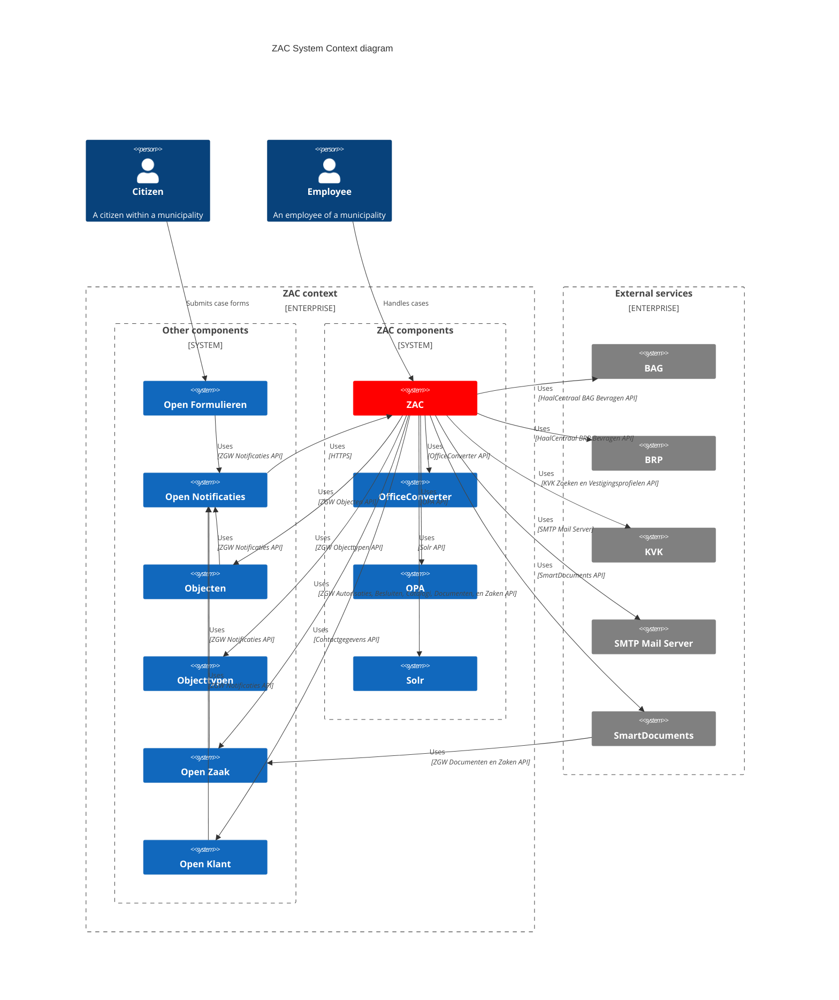

# ZAC system context

The following System Context diagram illustrates the architectural landscape of ZAC:

## Components

The following components are part of the 'ZAC subsystem':

| Component                                                        | Description                                                                       | ZAC usage                                                          | API(s) used                                |
|------------------------------------------------------------------|-----------------------------------------------------------------------------------|--------------------------------------------------------------------|--------------------------------------------|
| [ZAC](https://github.com/infonl/dimpact-zaakafhandelcomponent)   | The Zaakafhandelcomponent. Consists of both the ZAC backend as well as frontend.  | -                                                                  | -                                          |
| [OfficeConverter](https://github.com/EugenMayer/officeconverter) | Document conversion service.                                                      | Convert office documents (like .docx) to PDF for preview purposes. | <ul><li>OfficeConverter REST API</li></ul> |
| [Open Policy Agent (OPA)](https://www.openpolicyagent.org//)     | Open Policy Agent server                                                          | See [ZAC IAM architecture](iamArchitecture.md).                    | <ul><li>OPA REST API </li></ul>            |
| [Solr](https://solr.apache.org/)                                 | Solr search engine                                                                | See [ZAC Solr architecture](solrArchitecture.md)                   | <ul><li>Solr REST API </li></ul>           |

The following components are part of the broader context of ZAC (='PodiumD Zaak' in the context of Dimpact).

| Component                                                                  | Description                                                                                                                                        | ZAC usage                                                                                                                  | API(s) used                                                                                                                                                                                                                                                                                                                               |
|----------------------------------------------------------------------------|----------------------------------------------------------------------------------------------------------------------------------------------------|----------------------------------------------------------------------------------------------------------------------------|-------------------------------------------------------------------------------------------------------------------------------------------------------------------------------------------------------------------------------------------------------------------------------------------------------------------------------------------|
| [Objecten](https://github.com/maykinmedia/objects-api/)                    | Manages objects. Implements the ZGW Objecten API.                                                                                                  | For example 'productaanvragen' which are created from Open Formulieren and used by ZAC to create a new 'zaak'.             | <ul><li>[Objects API](../../src/main/resources/api-specs/or/objects-openapi.yaml)</li></ul>                                                                                                                                                                                                                                               |
| [Objecttypen](https://github.com/maykinmedia/objecttypes-api)              | Object types. Required for Objecten. Implements the ZGW Objecttypen API.                                                                           | ZAC uses a specific 'productaanvraag' type for Open Formulieren data used to create a new 'zaak'                           | <ul><li>[Objecttypen API](../../src/main/resources/api-specs/or/objecttypes-openapi.yaml)</li></ul>                                                                                                                                                                                                                                       |
| [Open Forms / Open Formulieren](https://github.com/maykinmedia/open-forms) | Manages and renders forms. In this context a citizen can submit a so-called 'zaakstartformulier' which is used to create a new 'zaak'.             | Citizens can start a new zaak by submitting a 'zaakstartformulier'.                                                        | <ul><li>n/a (see below)</li></ul>                                                                                                                                                                                                                                                                                                         |
| [Open Klant](https://github.com/maykinmedia/open-klant)                    | Manages 'customers' (= citizens in our context) and customer 'contact moments'. Implements both the ZWG Klantinteracties and Contactgegevens APIs. | Retrieve customer or company data and customer contact data (e.g. email address) of a citizen or company linked to a zaak. | <ul><li>[Klanten API](../../src/main/resources/api-specs/klanten/klanten-openapi.yaml)</li><li>[Contactgegevens API](../../src/main/resources/api-specs/contactgegevens/contactgegevens-openapi.yaml)</li></ul>                                                                                                                           |
| [Open Notificaties](https://github.com/open-zaak/open-notificaties)        | The central messaging / system notification component. Implements the ZWG Notificaties APIs.                                                       | ZAC needs to get notified of changes in related to zaken from various other components.                                    | <ul><li>n/a (see below)</li></ul>                                                                                                                                                                                                                                                                                                         |
| [Open Zaak](https://github.com/open-zaak/open-zaak)                        | Manages zaken, zaaktypes, and all related items. Also stores documents.                                                                            | Used by ZAC to store and retrieve zaken, documents and related data.                                                       | <ul><li>[Besluiten API](../../src/main/resources/api-specs/zgw/brc-openapi.yaml)</li><li>[Documenten API](../../src/main/resources/api-specs/zgw/drc-openapi.yaml)</li><li>[Zaken API](../../src/main/resources/api-specs/zgw/zrc-openapi.yaml)</li><li>[Catalogi API](../../src/main/resources/api-specs/zgw/ztc-openapi.yaml)</li></ul> |

The 'APIs used' column indicates which APIs offered by the various components is used by ZAC to integrate with each component including which version of the API is used.
Most APIs are defined using [OpenAPI](https://www.openapis.org/) definitions as part of the [Zaakgerichtwerken (ZGW) API specifications](https://vng-realisatie.github.io/gemma-zaken/standaard/).

Notes:
- ZAC does not integrate with Open Formulieren. For details please see: [ZAC integration with Open Formulieren](openFormulierenIntegration.md).
- ZAC does not integrate with Open Notificaties using an API. Rather Open Notificaties performs callback HTTP requests to ZAC when events have been received to which has subscribed.
- Components belonging to the [IAM architecture](iamArchitecture.md) such as Keycloak and OpenLDAP are not listed here to keep things relatively simple.

## External services

Furthermore, ZAC integrates with the following external services:

| Service                                                                              | Description                                                                        | ZAC Usage                                                                                                                           | API(s) used                                                                                                                                                                                                                                                                                    |
|--------------------------------------------------------------------------------------|------------------------------------------------------------------------------------|-------------------------------------------------------------------------------------------------------------------------------------|------------------------------------------------------------------------------------------------------------------------------------------------------------------------------------------------------------------------------------------------------------------------------------------------|
| [Haal Centraal BAG](https://vng-realisatie.github.io/Haal-Centraal-BAG-bevragen/)    | Centralized address and location data service by the Dutch government.             | Retrieve address and location data related to a zaak.                                                                               | <ul><li>[IMBAG API](../../src/main/resources/api-specs/bag/bag-openapi.yaml)</li></ul>                                                                                                                                                                                                         |
| [Haal Centraal BRP](https://github.com/BRP-API/Haal-Centraal-BRP-bevragen)           | Centralized personal data service by the Dutch government.                         | Retrieve personal data for citizens related to a zaak (the initiator of a zaak).                                                    | <ul><li>[BRP Personen Bevragen API](../../src/main/resources/api-specs/brp/brp-openapi.yaml)</li></ul>                                                                                                                                                                                         |
| [KVK](https://developers.kvk.nl/)                                                    | Centralized company data service.                                                  | Retrieve company data for companies related to a zaak.                                                                              | <ul><li>[Basisprofiel API](../../src/main/resources/api-specs/kvk/basisprofiel-openapi.yaml)</li><li>[Vestigingsprofiel API](../../src/main/resources/api-specs/kvk/vestigingsprofiel-openapi.yaml)</li><li>[Zoeken API](../../src/main/resources/api-specs/kvk/zoeken-openapi.yaml)</li></ul> |
| [SMTP Server](https://www.mailjet.com/)                                              | SMTP server. Services like MailJet can also be used.                               | Send emails to employees. Only used for sending e-mails, not for managing e-mail templates (this is done in ZAC itself).            | <ul><li>SMTP Protocol</li></ul>                                                                                                                                                                                                                                                                |
| [SmartDocuments](https://www.smartdocuments.eu/)                                     | Document creation service. Maybe used to create documents in your own look & feel. | Start a document creation 'wizard' with pre-filled zaak data where the resulting document is stored by SmartDocuments in Open Zaak. | <ul><li>SmartDocuments REST API (latest version)</li></ul>                                                                                                                                                                                                                                     |

For some of these external services ZAC uses mocks when running ZAC locally (please see: [development](../development/)) and (optionally) also when running ZAC on a test environment.
