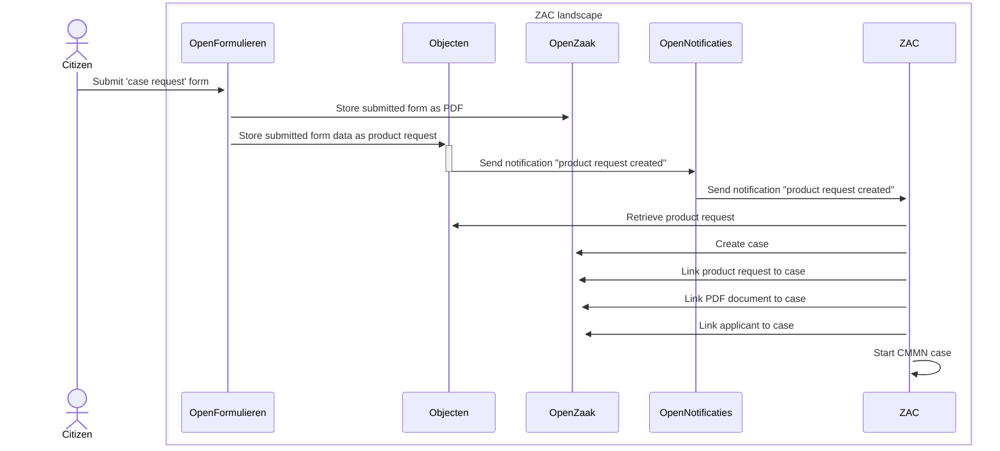
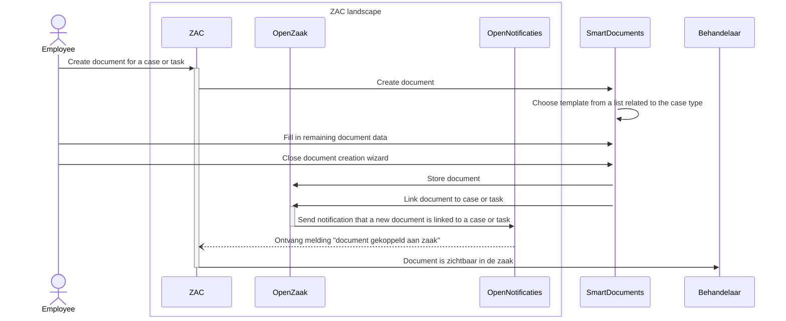

# ZAC Technical Flows

Some of the most important technical flows involving ZAC and other components and external service are documented
in this document.

## Zaak creation flow from Open Formulieren

There are multiple ways to create a new zaak. The most standard way involves Open Formulieren and is as follows:

1. A citizen submits a specific case request form (or 'zaakstartformulier') in Open Formulieren.
Technically this submitted form constitutes a 'product request'. Upon submitting the form, the following happens:
   1. The completed form is saved as a PDF document in Open Zaak.
   2. The content of the form is also saved in a structured format (JSON) as _Product Request_ in Objecten.
      1. The BSN obtained via DigiD from the citizen is also stored in the Product Request.
   Creating the Product Request object in Objecten ensures that a notification is sent to Open Notifications.
2. ZAC has a subscription to these Product Request notifications, which means that Open Notifications forwards the notification to ZAC.
After receiving the notification of creating a new Product Request, the following happens in ZAC:
   1. The Product Request is retrieved from Objecten.
   2. Based on the type of Product Request, the Case Type is determined, and a Case is created.
   3. The Product Request is linked to the Case.
   4. The existing PDF document of the completed form is linked to the Case in Open Zaak.
   5. The BSN or Chamber of Commerce number from the Product Request is used to link a Role of the type Applicant to the Case. The BSN or establishment number is stored with the Role.
   6. A CMMN Case (process) is started for the case. The started CMMN Case is derived from the case type and can be configured in ZAC using case handling parameters.

This flow is visualised in the following sequence diagram:

## SmartDocuments document creation flow

The ZAC - SmartDocuments document creation flow is as follows:

1. User starts SmartDocument wizard from ZAC ('create document'). This can be done either from a case (zaak) or from a task.
2. ZAC sends a HTTPS request to start a document creation wizard to SmartDocuments and sends case- and other information in this request.
3. The document creation wizard is started in SmartDocuments. Case or task information is pre-filled.
4. When the user closes the document creation wizard, SmartDocuments does the following by sending two HTTPS requests:
   1. A Word document ('enkelvoudig informatie object') is created in OpenZaak.
   2. This document is linked to the case or task in question (by creating a ‘zaakinformatieobject’).
5. Open Zaak sends a notification to Open Notificaties that a new document has been linked to a case or task.
6. Open Notificaties sends a callback request to ZAC informing ZAC of this event.
7. Depending on which SmartDocuments environment is used, the user also has the option to download the document to their local computer.
However this part of the standard flow.
8. When the user returns to the ZAC browser tab, they will see the new document attached to the case or task.

This flow is visualised in the following sequence diagram:

