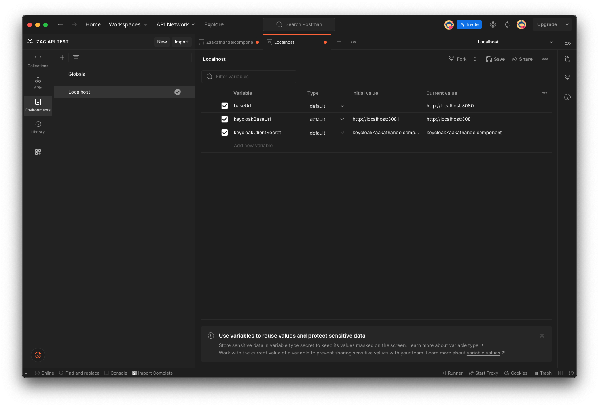
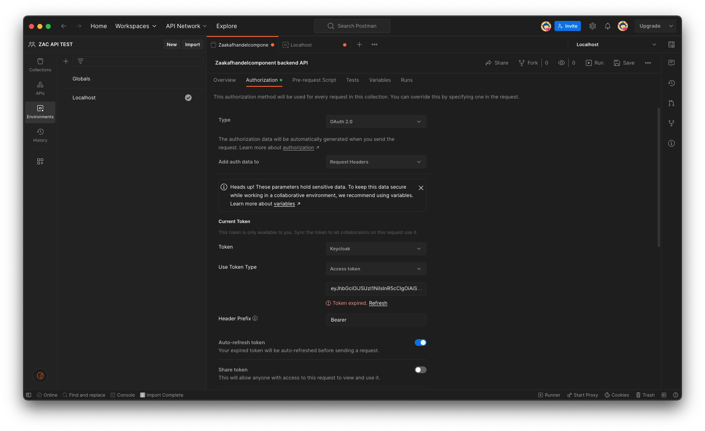
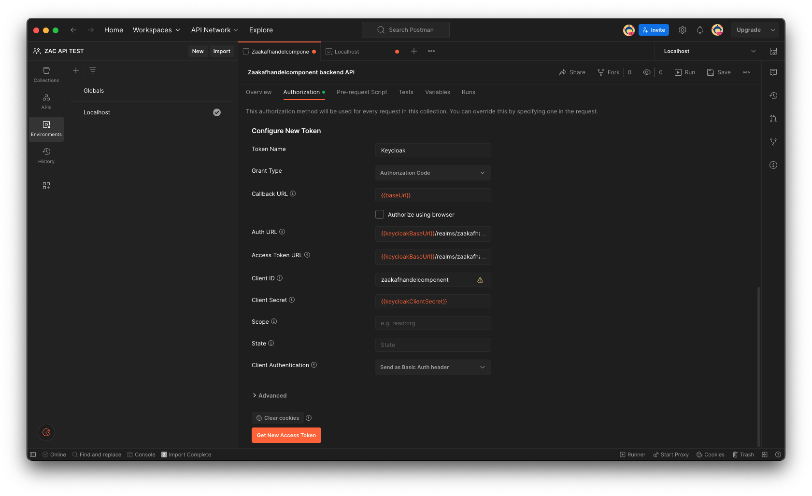

# Using Postman to test ZAC

Using [Postman](https://www.postman.com/) you can test ZAC by sending HTTP requests to the ZAC backend API.
This way you can test a locally running ZAC or you can test ZAC running on e.g. the TEST environment. Be aware that by doing so you are depending on the requests you send, of course changing data and state in ZAC.

## Set up Postman for ZAC

As a Lifely developer you can use our shared Postman ZAC collection in our [ZAC API TEST Postman team workspace](https://zaakafhandelcomponent.postman.co/workspace/aec6c5c4-affd-490b-9c81-e8b1cf339d22).
Alternatively you can set up a Postman collection yourself using the instructions below.

To use our shared Postman collection you need to be a member of our Zaakafhandelcomponent Postman team (max 3 members for the free Postman version).

### Import ZAC OpenAPI spec

1. Make sure your locally cloned ZAC Git repo is up-to-date and you have recently run a build (see [INSTALL.md](INSTALL.md) for instructions).
2. In Postman click ‘import’ and select the generated OpenAPI YAML spec file in the ZAC Git project in the folder: `build/generated/openapi/META-INF/openapi/`
3. Select to create a new Postman Collection.

### Create environment(s)

Create a Postman environment (e.g. “Localhost”) with the following variables:

| Variable             |        Description         |        Value for ZAC on localhost         |
|----------------------|:--------------------------:|:-----------------------------------------:|
| baseUrl              |        ZAC base URL        |           http://localhost:8080           |
| keycloakBaseUrl      |     Keycloak base URL      |           http://localhost:8081           |
| keycloakClientSecret | Keycloak ZAC client secret | keycloakZaakafhandelcomponentClientSecret |

Also see:

When testing ZAC running on a different environment please set the values accordingly.

### Set up OAuth2 authorization using Keycloak

Next in the collection you have created set up authorization at the top level of this collection. Use the following settings in the Authorization tab:

| Variable              |                                     Value                                      |
|-----------------------|:------------------------------------------------------------------------------:|
| Type                  |                                     Oauth2                                     |
| Add auth data to      |                                Request headers                                 |
| Header prefix         |                                     Bearer                                     |
| Auto-refresh token    |                                    enabled                                     |
| Use token type        |                                  Access token                                  |
| Token name            |                                    Keycloak                                    |
| Grant type            |                               Authorization code                               |
| Callback URL          |                                  {{baseUrl}}                                   |
| Auth URL              | {{keycloakBaseUrl}}/realms/zaakafhandelcomponent/protocol/openid-connect/auth  |
| Access Token URL      | {{keycloakBaseUrl}}/realms/zaakafhandelcomponent/protocol/openid-connect/token |
| Client ID             |                             zaakafhandelcomponent                              |
| Client secret         |                            {{keycloakClientSecret}}                            |
| Scope                 |                                     openid                                     |
| State                 |                                    (empty)                                     |
| Client authentication |                           Send as basic auth header                            |

Also see:

### Generate access token

1. In the authorization tab click ‘Get New Access Token’
2. Log in to ZAC using the appropriate (test) user account.
3. Now you should be able to any send requests to ZAC defined in the Postman collection.
